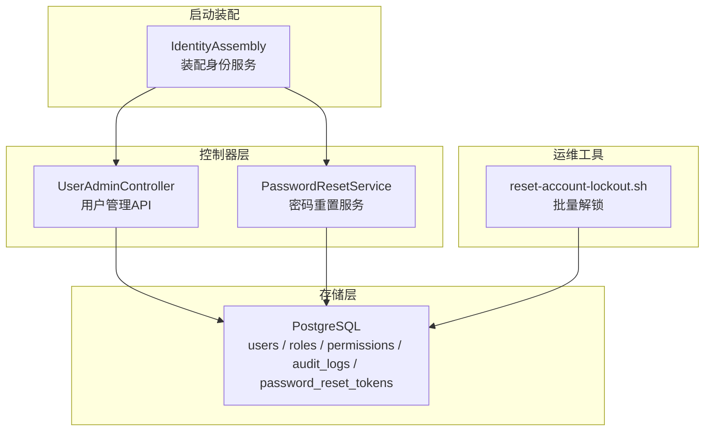
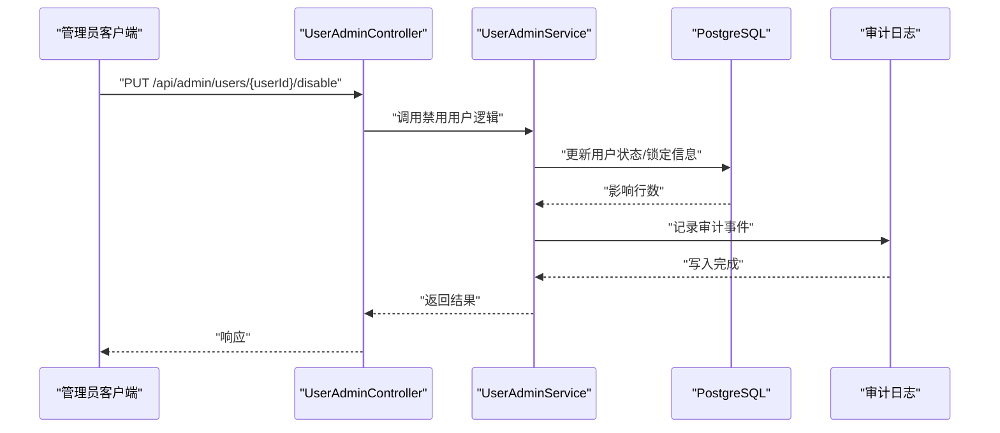
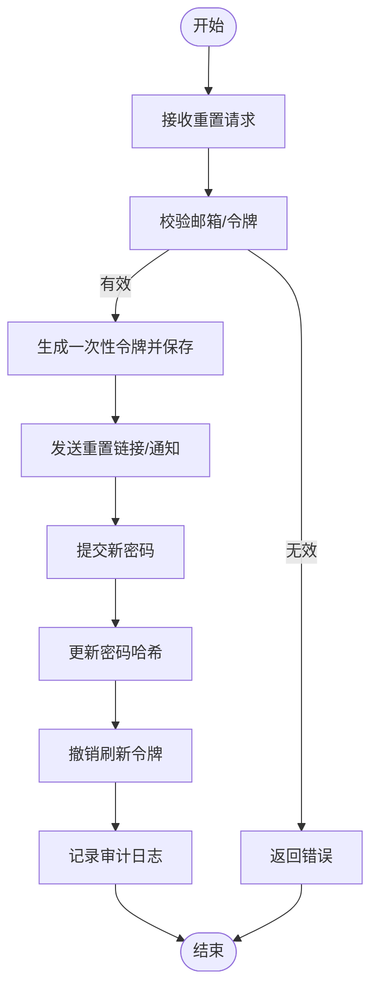
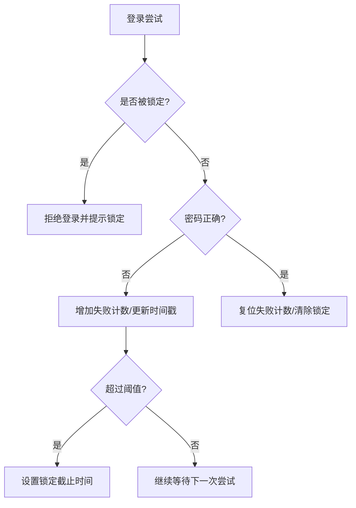
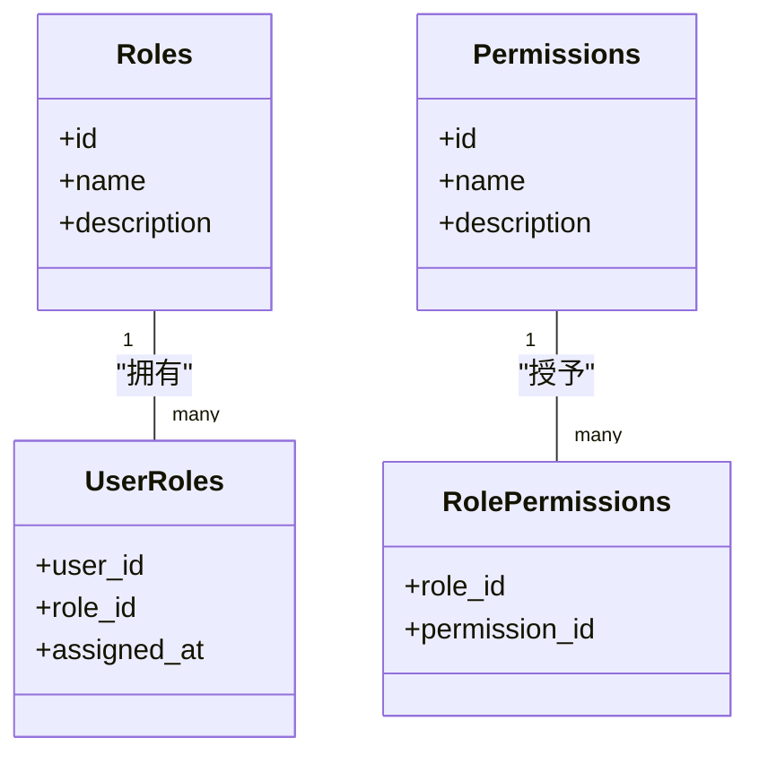
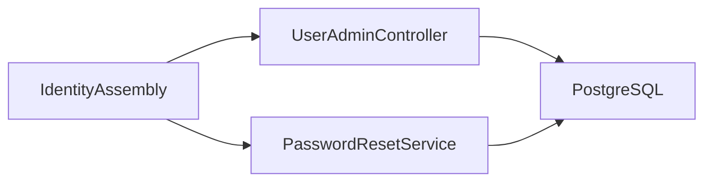

# 账户管理

<cite>
**本文引用的文件**
- [IdentityAssembly.h](file://apps/server/src/bootstrap/IdentityAssembly.h)
- [IdentityAssembly.cc](file://apps/server/src/bootstrap/IdentityAssembly.cc)
- [UserAdminController.h](file://libs/drogon/include/authforge/drogon/controllers/UserAdminController.h)
- [UserAdminController.cc](file://libs/drogon/src/controllers/UserAdminController.cc)
- [PasswordResetService.h](file://libs/drogon/include/authforge/drogon/services/PasswordResetService.h)
- [PasswordResetService.cc](file://libs/drogon/src/services/PasswordResetService.cc)
- [V013__account_lockout.sql](file://apps/server/migrations/V013__account_lockout.sql)
- [V012__audit_logs.sql](file://apps/server/migrations/V012__audit_logs.sql)
- [V005__rbac_schema.sql](file://apps/server/migrations/V005__rbac_schema.sql)
- [V009__password_reset_tokens.sql](file://apps/server/migrations/V009__password_reset_tokens.sql)
- [reset-account-lockout.sh](file://scripts/backend/reset-account-lockout.sh)
- [StorageSeed.h](file://tests/common/StorageSeed.h)
- [AuthServiceTest.cc](file://libs/identity/test/AuthServiceTest.cc)
- [rbac-guide.md](file://docs/backend/rbac-guide.md)
</cite>

## 目录
1. [简介](#简介)
2. [项目结构](#项目结构)
3. [核心组件](#核心组件)
4. [架构总览](#架构总览)
5. [详细组件分析](#详细组件分析)
6. [依赖关系分析](#依赖关系分析)
7. [性能考虑](#性能考虑)
8. [故障排查指南](#故障排查指南)
9. [结论](#结论)
10. [附录](#附录)

## 简介
本操作手册面向管理员与运维人员，说明 AuthForge 的账户管理能力，包括：
- 管理员账户的创建、修改与删除流程（通过管理端 API）
- 密码重置功能（管理员为用户重置、用户自助重置）
- 账户锁定机制（触发条件、解锁方式、批量解锁）
- 用户权限管理（角色分配、权限验证、访问控制）
- 审计日志查看与分析方法
- 常见账户问题的解决方案

## 项目结构
与账户管理相关的后端能力主要分布在以下位置：
- 身份服务装配：apps/server/src/bootstrap/IdentityAssembly.*
- 管理端用户接口：libs/drogon/include/authforge/drogon/controllers/UserAdminController.{h,cc}
- 密码重置服务：libs/drogon/include/authforge/drogon/services/PasswordResetService.{h,cc}
- 数据库迁移：apps/server/migrations/V005__rbac_schema.sql、V009__password_reset_tokens.sql、V012__audit_logs.sql、V013__account_lockout.sql
- 运维脚本：scripts/backend/reset-account-lockout.sh
- 测试初始化：tests/common/StorageSeed.h
- RBAC 文档：docs/backend/rbac-guide.md

图表来源
- [IdentityAssembly.cc:61-213](file://apps/server/src/bootstrap/IdentityAssembly.cc#L61-L213)
- [UserAdminController.cc:91-165](file://libs/drogon/src/controllers/UserAdminController.cc#L91-L165)
- [PasswordResetService.cc:64-332](file://libs/drogon/src/services/PasswordResetService.cc#L64-L332)
- [V012__audit_logs.sql:4-22](file://apps/server/migrations/V012__audit_logs.sql#L4-L22)
- [V013__account_lockout.sql:4-6](file://apps/server/migrations/V013__account_lockout.sql#L4-L6)
- [reset-account-lockout.sh:15-32](file://scripts/backend/reset-account-lockout.sh#L15-L32)

章节来源
- [IdentityAssembly.h:19-38](file://apps/server/src/bootstrap/IdentityAssembly.h#L19-L38)
- [IdentityAssembly.cc:61-213](file://apps/server/src/bootstrap/IdentityAssembly.cc#L61-L213)
- [UserAdminController.h:14-60](file://libs/drogon/include/authforge/drogon/controllers/UserAdminController.h#L14-L60)
- [UserAdminController.cc:18-86](file://libs/drogon/src/controllers/UserAdminController.cc#L18-L86)

## 核心组件
- 身份服务装配器：在应用启动时构造并注入 AuthService、SessionManager、MfaService、WebAuthnService 等，供控制器使用。
- 用户管理控制器：提供用户列表、详情、启用/禁用、更新、角色查询与分配等管理端 API。
- 密码重置服务：实现“请求重置”和“确认重置”流程，包含一次性令牌校验、密码更新与会话失效。
- 账户锁定：基于 users 表的失败登录计数与锁定截止时间字段，配合成功登录复位。
- RBAC 权限模型：roles、permissions、user_roles、role_permissions 四表构成角色与权限的多对多关系。
- 审计日志：记录安全相关事件，支持按时间、行为、结果等维度检索。

章节来源
- [IdentityAssembly.cc:91-141](file://apps/server/src/bootstrap/IdentityAssembly.cc#L91-L141)
- [UserAdminController.cc:91-165](file://libs/drogon/src/controllers/UserAdminController.cc#L91-L165)
- [PasswordResetService.cc:64-332](file://libs/drogon/src/services/PasswordResetService.cc#L64-L332)
- [V013__account_lockout.sql:4-6](file://apps/server/migrations/V013__account_lockout.sql#L4-L6)
- [V005__rbac_schema.sql:3-58](file://apps/server/migrations/V005__rbac_schema.sql#L3-L58)
- [V012__audit_logs.sql:4-22](file://apps/server/migrations/V012__audit_logs.sql#L4-L22)

## 架构总览
下图展示了从请求到数据落库的关键路径，涵盖用户管理与密码重置两大场景。

图表来源
- [UserAdminController.cc:101-110](file://libs/drogon/src/controllers/UserAdminController.cc#L101-L110)
- [V012__audit_logs.sql:4-22](file://apps/server/migrations/V012__audit_logs.sql#L4-L22)

## 详细组件分析

### 管理员账户的创建、修改与删除
- 创建管理员账户
  - 建议通过初始种子或数据库迁移在首次部署时创建超级管理员账号，并为其分配 admin 角色。
  - 参考默认角色与权限初始化：[V005__rbac_schema.sql:35-58](file://apps/server/migrations/V005__rbac_schema.sql#L35-L58)
- 修改管理员账户
  - 使用管理端 API 更新用户基本信息（如邮箱、邮箱验证状态）。
  - 路由定义见：[UserAdminController.h:30-35](file://libs/drogon/include/authforge/drogon/controllers/UserAdminController.h#L30-L35)
  - 处理逻辑委托至服务层：[UserAdminController.cc:134-143](file://libs/drogon/src/controllers/UserAdminController.cc#L134-L143)
- 删除管理员账户
  - 系统提供“注销/删除账户”的用户自服务流程，会清理会话与令牌；管理员可通过禁用与后续清理策略进行管控。
  - 自服务删除涉及令牌撤销与审计记录：[UserSelfServiceController.cc:646-657](file://libs/drogon/src/controllers/UserSelfServiceController.cc#L646-L657)

章节来源
- [V005__rbac_schema.sql:35-58](file://apps/server/migrations/V005__rbac_schema.sql#L35-L58)
- [UserAdminController.h:30-35](file://libs/drogon/include/authforge/drogon/controllers/UserAdminController.h#L30-L35)
- [UserAdminController.cc:134-143](file://libs/drogon/src/controllers/UserAdminController.cc#L134-L143)
- [UserSelfServiceController.cc:646-657](file://libs/drogon/src/controllers/UserSelfServiceController.cc#L646-L657)

### 密码重置功能
- 用户自助重置
  - 请求重置：POST /api/password-reset/request
    - 服务入口与参数解析：[PasswordResetService.cc:64-99](file://libs/drogon/src/services/PasswordResetService.cc#L64-L99)
    - 生成一次性重置令牌并持久化：[V009__password_reset_tokens.sql:4-13](file://apps/server/migrations/V009__password_reset_tokens.sql#L4-L13)
  - 确认重置：POST /api/password-reset/confirm
    - 校验令牌、更新密码、撤销刷新令牌、记录审计日志：[PasswordResetService.cc:285-332](file://libs/drogon/src/services/PasswordResetService.cc#L285-L332)
- 管理员为用户重置
  - 通过管理端更新用户密码（若存在对应接口），或在必要时结合后台脚本直接重置密码哈希并记录审计事件。
  - 建议在变更前后记录审计日志，便于追踪。

图表来源
- [PasswordResetService.cc:64-99](file://libs/drogon/src/services/PasswordResetService.cc#L64-L99)
- [PasswordResetService.cc:285-332](file://libs/drogon/src/services/PasswordResetService.cc#L285-L332)
- [V009__password_reset_tokens.sql:4-13](file://apps/server/migrations/V009__password_reset_tokens.sql#L4-L13)

章节来源
- [PasswordResetService.h:22-33](file://libs/drogon/include/authforge/drogon/services/PasswordResetService.h#L22-L33)
- [PasswordResetService.cc:64-99](file://libs/drogon/src/services/PasswordResetService.cc#L64-L99)
- [PasswordResetService.cc:285-332](file://libs/drogon/src/services/PasswordResetService.cc#L285-L332)
- [V009__password_reset_tokens.sql:4-13](file://apps/server/migrations/V009__password_reset_tokens.sql#L4-L13)

### 账户锁定机制
- 锁定条件
  - 基于 users 表的 failed_login_count、locked_until、last_failed_login 字段累计失败登录次数并在达到阈值后设置锁定截止时间。
  - 参考字段定义：[V013__account_lockout.sql:4-6](file://apps/server/migrations/V013__account_lockout.sql#L4-L6)
- 解锁流程
  - 成功登录后自动复位失败计数与锁定状态：[AuthServiceTest.cc:445-468](file://libs/identity/test/AuthServiceTest.cc#L445-L468)
  - 管理员可手动解锁单个用户或批量解锁所有用户：
    - 单用户解锁：[reset-account-lockout.sh:15-23](file://scripts/backend/reset-account-lockout.sh#L15-L23)
    - 批量解锁：[reset-account-lockout.sh:20-23](file://scripts/backend/reset-account-lockout.sh#L20-L23)
- 测试环境初始化
  - 测试种子会重置 admin 账户的锁定状态，避免中断测试导致后续用例失败：[StorageSeed.h:169-190](file://tests/common/StorageSeed.h#L169-L190)

图表来源
- [V013__account_lockout.sql:4-6](file://apps/server/migrations/V013__account_lockout.sql#L4-L6)
- [AuthServiceTest.cc:445-468](file://libs/identity/test/AuthServiceTest.cc#L445-L468)
- [reset-account-lockout.sh:15-23](file://scripts/backend/reset-account-lockout.sh#L15-L23)

章节来源
- [V013__account_lockout.sql:4-6](file://apps/server/migrations/V013__account_lockout.sql#L4-L6)
- [AuthServiceTest.cc:445-468](file://libs/identity/test/AuthServiceTest.cc#L445-L468)
- [reset-account-lockout.sh:15-23](file://scripts/backend/reset-account-lockout.sh#L15-L23)
- [StorageSeed.h:169-190](file://tests/common/StorageSeed.h#L169-L190)

### 用户权限管理（RBAC）
- 角色与权限模型
  - roles、permissions、user_roles、role_permissions 四表构成 RBAC 基础。
  - 默认角色与权限初始化：[V005__rbac_schema.sql:35-58](file://apps/server/migrations/V005__rbac_schema.sql#L35-L58)
- 角色分配与管理
  - 通过管理端 API 为指定用户分配/查询角色：
    - 路由定义：[UserAdminController.h:48-59](file://libs/drogon/include/authforge/drogon/controllers/UserAdminController.h#L48-L59)
    - 处理转发：[UserAdminController.cc:112-121](file://libs/drogon/src/controllers/UserAdminController.cc#L112-L121)
- 权限验证与访问控制
  - 基于 URL 路径的正则规则匹配所需角色，未命中返回 403。
  - 配置示例与流程说明：[rbac-guide.md:41-70](file://docs/backend/rbac-guide.md#L41-L70)

图表来源
- [V005__rbac_schema.sql:3-29](file://apps/server/migrations/V005__rbac_schema.sql#L3-L29)

章节来源
- [V005__rbac_schema.sql:3-58](file://apps/server/migrations/V005__rbac_schema.sql#L3-L58)
- [UserAdminController.h:48-59](file://libs/drogon/include/authforge/drogon/controllers/UserAdminController.h#L48-L59)
- [UserAdminController.cc:112-121](file://libs/drogon/src/controllers/UserAdminController.cc#L112-L121)
- [rbac-guide.md:41-70](file://docs/backend/rbac-guide.md#L41-L70)

### 审计日志查看与分析
- 数据结构
  - audit_logs 表记录 actor、action、target、outcome、ip、user_agent、request_id、details 等字段，并提供常用索引。
  - 建表语句与索引：[V012__audit_logs.sql:4-22](file://apps/server/migrations/V012__audit_logs.sql#L4-L22)
- 典型事件
  - 密码重置成功、账户删除、令牌撤销等操作均会写入审计日志。
  - 参考写入点：[PasswordResetService.cc:285-332](file://libs/drogon/src/services/PasswordResetService.cc#L285-L332)
- 分析方法
  - 按时间范围筛选：timestamp 索引
  - 按主体筛选：actor_type + actor_id 索引
  - 按行为筛选：action 索引
  - 按结果筛选：outcome + timestamp 复合索引

章节来源
- [V012__audit_logs.sql:4-22](file://apps/server/migrations/V012__audit_logs.sql#L4-L22)
- [PasswordResetService.cc:285-332](file://libs/drogon/src/services/PasswordResetService.cc#L285-L332)

## 依赖关系分析
- 启动装配依赖
  - IdentityAssembly 在应用启动时根据存储类型决定是否注入 Postgres 身份服务；若无默认 DB 客户端，控制器回退到旧路径。
  - 关键判断与注入：[IdentityAssembly.cc:61-90](file://apps/server/src/bootstrap/IdentityAssembly.cc#L61-L90)
- 控制器与服务解耦
  - UserAdminController 仅做 HTTP 适配，业务逻辑下沉至 UserAdminService（由任务拆分引入）。
  - 路由注册与转发：[UserAdminController.h:14-60](file://libs/drogon/include/authforge/drogon/controllers/UserAdminController.h#L14-L60)、[UserAdminController.cc:91-165](file://libs/drogon/src/controllers/UserAdminController.cc#L91-L165)
- 密码重置与令牌表
  - PasswordResetService 依赖 password_reset_tokens 表进行一次性令牌校验与过期管理。
  - 表结构与索引：[V009__password_reset_tokens.sql:4-13](file://apps/server/migrations/V009__password_reset_tokens.sql#L4-L13)

图表来源
- [IdentityAssembly.cc:61-90](file://apps/server/src/bootstrap/IdentityAssembly.cc#L61-L90)
- [UserAdminController.cc:91-165](file://libs/drogon/src/controllers/UserAdminController.cc#L91-L165)
- [PasswordResetService.cc:64-99](file://libs/drogon/src/services/PasswordResetService.cc#L64-L99)
- [V009__password_reset_tokens.sql:4-13](file://apps/server/migrations/V009__password_reset_tokens.sql#L4-L13)

章节来源
- [IdentityAssembly.cc:61-90](file://apps/server/src/bootstrap/IdentityAssembly.cc#L61-L90)
- [UserAdminController.cc:91-165](file://libs/drogon/src/controllers/UserAdminController.cc#L91-L165)
- [PasswordResetService.cc:64-99](file://libs/drogon/src/services/PasswordResetService.cc#L64-L99)
- [V009__password_reset_tokens.sql:4-13](file://apps/server/migrations/V009__password_reset_tokens.sql#L4-L13)

## 性能考虑
- 审计日志索引优化：利用 timestamp、actor、action、outcome 索引提升查询效率。
- 账户锁定字段：failed_login_count、locked_until 应配合合理阈值与缓存策略，减少频繁写锁。
- 密码重置令牌：expires_at 索引用于快速过期清理与校验。
- 管理端分页：用户列表建议使用分页查询以降低单次响应体积。

## 故障排查指南
- 管理员账户被锁定
  - 现象：登录返回锁定错误。
  - 处理：使用脚本重置失败计数与锁定时间；单用户或批量均可。
  - 参考：[reset-account-lockout.sh:15-23](file://scripts/backend/reset-account-lockout.sh#L15-L23)
- 密码重置失败
  - 可能原因：令牌无效/过期/已使用。
  - 处理：检查 token_hash 是否存在且未过期；重新发起重置请求。
  - 参考：[PasswordResetService.cc:285-332](file://libs/drogon/src/services/PasswordResetService.cc#L285-L332)
- 权限不足（403）
  - 检查 rbac_rules 配置与用户角色分配是否正确。
  - 参考：[rbac-guide.md:41-70](file://docs/backend/rbac-guide.md#L41-L70)
- 审计日志缺失
  - 确认审计写入路径是否执行；核对 audit_logs 表结构与索引。
  - 参考：[V012__audit_logs.sql:4-22](file://apps/server/migrations/V012__audit_logs.sql#L4-L22)

章节来源
- [reset-account-lockout.sh:15-23](file://scripts/backend/reset-account-lockout.sh#L15-L23)
- [PasswordResetService.cc:285-332](file://libs/drogon/src/services/PasswordResetService.cc#L285-L332)
- [rbac-guide.md:41-70](file://docs/backend/rbac-guide.md#L41-L70)
- [V012__audit_logs.sql:4-22](file://apps/server/migrations/V012__audit_logs.sql#L4-L22)

## 结论
AuthForge 提供了完善的管理员账户管理能力，覆盖账户生命周期、密码重置、锁定机制、RBAC 权限与审计日志。通过标准化的管理端 API、清晰的数据库模型与运维脚本，管理员可以高效地维护系统安全与合规性。建议在生产环境中：
- 严格管理 admin 角色分配
- 定期审查审计日志
- 合理配置账户锁定阈值
- 使用脚本与自动化流程进行批量解锁与维护

## 附录
- 常用管理端 API（需认证）
  - GET /api/admin/users：列出用户
  - GET /api/admin/users/{userId}：获取用户详情
  - PUT /api/admin/users/{userId}：更新用户信息
  - PUT /api/admin/users/{userId}/disable：禁用用户
  - POST /api/admin/users/{userId}/enable：启用用户
  - GET /api/admin/users/{userId}/roles：查询用户角色
  - PUT /api/admin/users/{userId}/roles：分配用户角色
  - 参考：[UserAdminController.h:14-60](file://libs/drogon/include/authforge/drogon/controllers/UserAdminController.h#L14-L60)
- 密码重置 API
  - POST /api/password-reset/request：请求重置
  - POST /api/password-reset/confirm：确认重置
  - 参考：[PasswordResetService.h:22-33](file://libs/drogon/include/authforge/drogon/services/PasswordResetService.h#L22-L33)