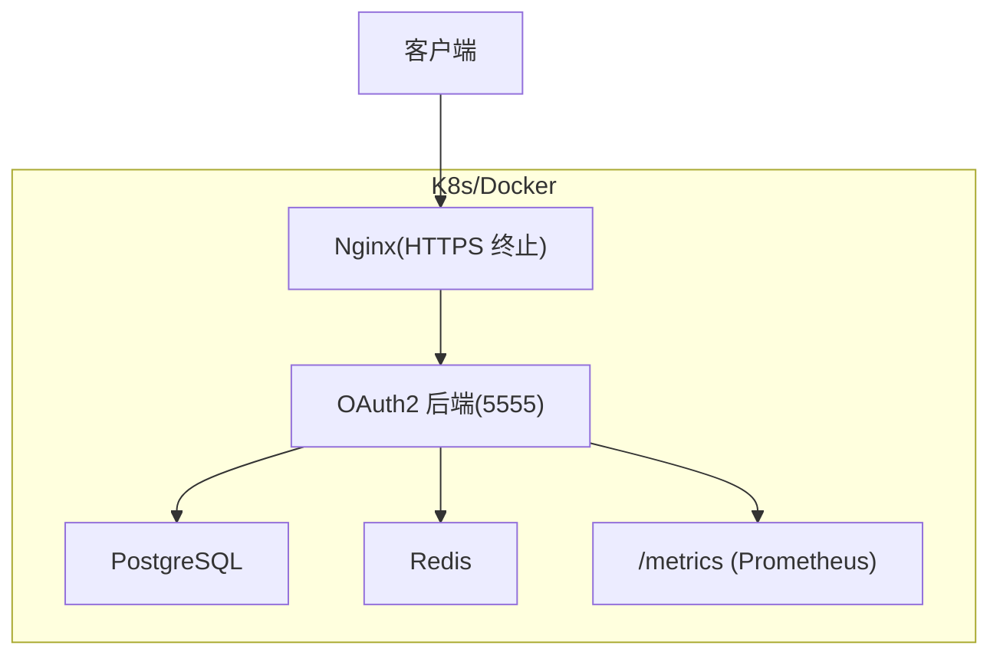
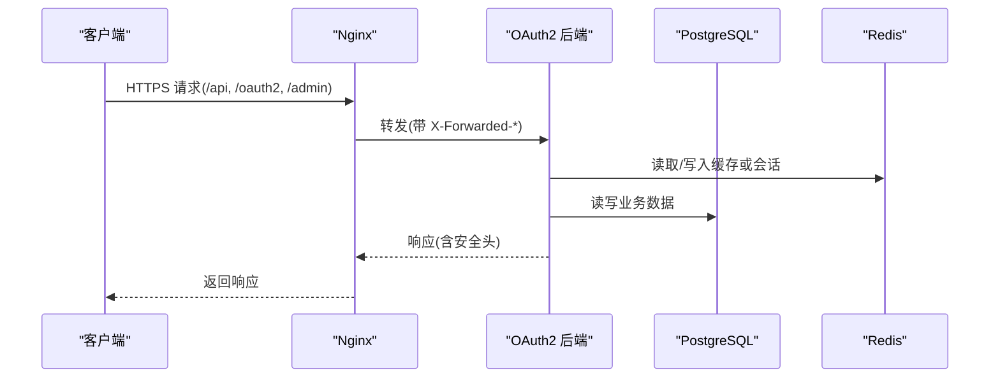
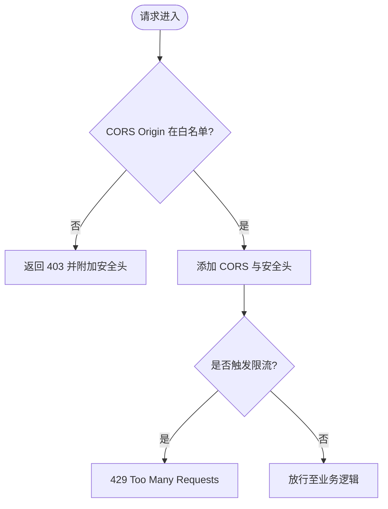
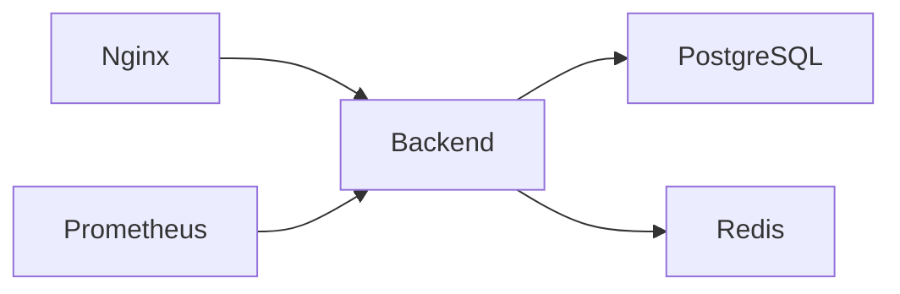

# 生产环境配置

<cite>
**本文引用的文件**
- [apps/server/config/config.prod.json](file://apps/server/config/config.prod.json)
- [deploy/env/server.env.example](file://deploy/env/server.env.example)
- [deploy/docker/docker-compose.prod.yml](file://deploy/docker/docker-compose.prod.yml)
- [deploy/helm/authforge/values.yaml](file://deploy/helm/authforge/values.yaml)
- [deploy/nginx/nginx.conf](file://deploy/nginx/nginx.conf)
- [apps/server/src/bootstrap/SecurityHeaders.cc](file://apps/server/src/bootstrap/SecurityHeaders.cc)
- [apps/server/src/bootstrap/CorsSetup.cc](file://apps/server/src/bootstrap/CorsSetup.cc)
- [scripts/generate-certs.sh](file://scripts/generate-certs.sh)
- [docs/backend/configuration-guide.md](file://docs/backend/configuration-guide.md)
- [docs/backend/security-hardening.md](file://docs/backend/security-hardening.md)
</cite>

## 目录
1. [简介](#简介)
2. [项目结构](#项目结构)
3. [核心组件](#核心组件)
4. [架构总览](#架构总览)
5. [详细组件分析](#详细组件分析)
6. [依赖关系分析](#依赖关系分析)
7. [性能调优建议](#性能调优建议)
8. [故障排查指南](#故障排查指南)
9. [结论](#结论)
10. [附录](#附录)

## 简介
本指南面向在生产环境中部署和运维 AuthForge 授权服务器。内容覆盖：
- 完整的生产配置流程（服务器、数据库、Redis、SSL/TLS）
- 安全加固措施（网络安全、访问控制、输入验证、输出编码等）
- 性能调优建议（内存管理、连接池、缓存策略、数据库优化）
- 资源规划要求（CPU、内存、存储）
- 环境变量最佳实践与常见错误排查

## 项目结构
生产环境由以下关键部分组成：
- Nginx 反向代理与 TLS 终止
- OAuth2 后端服务（Drogon + OAuth2Plugin）
- PostgreSQL 持久化存储
- Redis 缓存与会话/限流支撑
- Prometheus 监控采集
- Helm Chart / Docker Compose 编排

图表来源
- [deploy/nginx/nginx.conf:34-114](file://deploy/nginx/nginx.conf#L34-L114)
- [deploy/docker/docker-compose.prod.yml:13-211](file://deploy/docker/docker-compose.prod.yml#L13-L211)

章节来源
- [deploy/docker/docker-compose.prod.yml:1-221](file://deploy/docker/docker-compose.prod.yml#L1-L221)
- [deploy/nginx/nginx.conf:1-116](file://deploy/nginx/nginx.conf#L1-L116)

## 核心组件
- 服务器监听与静态资源：端口、压缩、并发、请求体大小等
- 数据库连接池：PostgreSQL 连接数、超时、批处理
- Redis 客户端：连接数、超时、密码
- 插件：Hodor 速率限制、Prometheus 指标导出、OAuth2Plugin（令牌、客户端、RBAC、清理间隔）
- 安全头与 CORS：CSP/HSTS/X-Frame-Options、严格白名单源校验
- 环境变量注入：运行时覆盖 config.json，避免硬编码密钥

章节来源
- [apps/server/config/config.prod.json:1-264](file://apps/server/config/config.prod.json#L1-L264)
- [deploy/env/server.env.example:1-70](file://deploy/env/server.env.example#L1-L70)
- [docs/backend/configuration-guide.md:1-58](file://docs/backend/configuration-guide.md#L1-L58)

## 架构总览
生产入口统一经 Nginx 暴露 80/443，强制 HTTPS，按路径路由到后端 API、OAuth2 端点、Admin 控制台与前端 SPA；后端通过配置加载数据库与 Redis 连接，启用 Hodor 做应用层限流，并通过 Prometheus 暴露指标。

图表来源
- [deploy/nginx/nginx.conf:57-113](file://deploy/nginx/nginx.conf#L57-L113)
- [apps/server/config/config.prod.json:9-39](file://apps/server/config/config.prod.json#L9-L39)

## 详细组件分析

### 服务器与网络配置
- 监听地址与端口：默认 0.0.0.0:5555（容器内暴露），对外由 Nginx 暴露 80/443
- 并发与连接：最大连接数、keepalive、管道化请求、复用端口
- 请求体限制：最大 body、内存 body、WebSocket 消息大小
- 压缩：Gzip/Brotli 开关与静态预压缩
- 日志：日志路径、轮转大小与数量、级别

章节来源
- [apps/server/config/config.prod.json:1-132](file://apps/server/config/config.prod.json#L1-L132)
- [deploy/nginx/nginx.conf:1-27](file://deploy/nginx/nginx.conf#L1-L27)

### 数据库连接（PostgreSQL）
- 连接池大小：number_of_connections（生产建议根据负载与 PG 参数调整）
- 超时：连接与语句级超时
- 自动批处理：auto_batch 提升吞吐
- 字符集与连接选项：client_encoding、statement_timeout
- 迁移：生产建议使用独立 Job 执行迁移，启动时仅自检

章节来源
- [apps/server/config/config.prod.json:9-27](file://apps/server/config/config.prod.json#L9-L27)
- [deploy/docker/docker-compose.prod.yml:141-169](file://deploy/docker/docker-compose.prod.yml#L141-L169)
- [deploy/helm/authforge/values.yaml:76-82](file://deploy/helm/authforge/values.yaml#L76-L82)

### Redis 缓存与会话
- 连接池大小与超时：number_of_connections、timeout
- 认证：username/password
- 用途：会话、限流状态、缓存等（具体由插件与业务决定）

章节来源
- [apps/server/config/config.prod.json:28-39](file://apps/server/config/config.prod.json#L28-L39)
- [deploy/docker/docker-compose.prod.yml:189-197](file://deploy/docker/docker-compose.prod.yml#L189-L197)

### SSL/TLS 证书设置
- Nginx 作为 TLS 终止点，配置 TLS 协议版本、加密套件、会话缓存与超时
- 证书挂载：fullchain.pem 与 privkey.pem
- 自签名证书生成脚本用于开发测试；生产请使用受信任 CA（如 Let's Encrypt）

章节来源
- [deploy/nginx/nginx.conf:41-55](file://deploy/nginx/nginx.conf#L41-L55)
- [scripts/generate-certs.sh:1-24](file://scripts/generate-certs.sh#L1-L24)

### 安全加固
- 安全响应头：X-Content-Type-Options、X-Frame-Options、CSP（主站严格，/docs 宽松）、HSTS（仅 HTTPS 或经反向代理透传）
- CORS：严格白名单匹配，禁止通配符，OPTIONS 预检拒绝未授权源
- 速率限制：Hodor 令牌桶算法，支持全局/IP/用户多级限制，登录/令牌/注册接口更严格
- 健康检查与指标：/health 公开，/metrics 限制内网访问

图表来源
- [apps/server/src/bootstrap/CorsSetup.cc:8-80](file://apps/server/src/bootstrap/CorsSetup.cc#L8-L80)
- [apps/server/src/bootstrap/SecurityHeaders.cc:8-61](file://apps/server/src/bootstrap/SecurityHeaders.cc#L8-L61)
- [docs/backend/security-hardening.md:5-33](file://docs/backend/security-hardening.md#L5-L33)

章节来源
- [apps/server/src/bootstrap/SecurityHeaders.cc:1-64](file://apps/server/src/bootstrap/SecurityHeaders.cc#L1-L64)
- [apps/server/src/bootstrap/CorsSetup.cc:1-83](file://apps/server/src/bootstrap/CorsSetup.cc#L1-L83)
- [docs/backend/security-hardening.md:1-120](file://docs/backend/security-hardening.md#L1-L120)

### 环境变量与配置注入
- 优先级：.env > 系统环境变量 > config.json 默认值
- 关键变量：DB/Redis 连接、JWT 密钥路径、监听端口、前端 URL、CORS 允许源、重定向 URI、SMTP、外部认证客户端 ID/Secret
- 生产模式：OAUTH2_ENV=production 会强制 issuer 为 https、非默认密码等校验

章节来源
- [deploy/env/server.env.example:1-70](file://deploy/env/server.env.example#L1-L70)
- [docs/backend/configuration-guide.md:1-58](file://docs/backend/configuration-guide.md#L1-L58)

### 部署编排（Docker Compose 与 Helm）
- Compose 生产版：定义 nginx、frontend、admin、backend、postgres、redis、prometheus，使用只读卷挂载密钥与配置
- Helm values：副本数、资源请求/限制、外部数据库/Redis、Ingress、迁移 Job、敏感值通过 Secret 注入

章节来源
- [deploy/docker/docker-compose.prod.yml:1-221](file://deploy/docker/docker-compose.prod.yml#L1-L221)
- [deploy/helm/authforge/values.yaml:1-145](file://deploy/helm/authforge/values.yaml#L1-L145)

## 依赖关系分析
- Nginx 依赖后端健康检查通过后才提供服务
- 后端依赖 Postgres 与 Redis 就绪
- Prometheus 通过 /metrics 抓取后端指标
- Helm 中通过 ConfigMap/Secret 注入配置与密钥

图表来源
- [deploy/docker/docker-compose.prod.yml:23-139](file://deploy/docker/docker-compose.prod.yml#L23-L139)
- [deploy/docker/docker-compose.prod.yml:199-211](file://deploy/docker/docker-compose.prod.yml#L199-L211)

章节来源
- [deploy/docker/docker-compose.prod.yml:1-221](file://deploy/docker/docker-compose.prod.yml#L1-L221)

## 性能调优建议
- 连接池
  - PostgreSQL：根据并发与查询复杂度调整 number_of_connections，配合 statement_timeout 防止长事务阻塞
  - Redis：合理设置 number_of_connections 与 timeout，避免连接耗尽
- 缓存策略
  - 利用 Redis 缓存热点数据与会话，减少 DB 压力
  - 关注缓存一致性（写后失效/广播）
- 数据库优化
  - 合理索引与分页查询
  - 开启 auto_batch 提升批量操作效率
  - 定期统计信息与 VACUUM
- 内存与并发
  - 调整 max_connections、keepalive_requests、pipelining_requests
  - 合理设置 client_max_body_size 与内存 body 上限，防止大请求拖垮进程
- 压缩与静态资源
  - 启用 Gzip/Brotli，必要时使用静态预压缩
  - 合理设置静态资源缓存时间
- 监控与可观测性
  - 通过 /metrics 暴露指标，结合 Prometheus/Grafana 观察 QPS、延迟、错误率、连接池使用率

章节来源
- [apps/server/config/config.prod.json:88-132](file://apps/server/config/config.prod.json#L88-L132)
- [apps/server/config/config.prod.json:9-39](file://apps/server/config/config.prod.json#L9-L39)
- [deploy/nginx/nginx.conf:17-27](file://deploy/nginx/nginx.conf#L17-L27)

## 故障排查指南
- 启动失败
  - 检查 OAUTH2_ENV=production 下 issuer 是否为 https，且 DB/Redis 密码非默认
  - 确认 JWT 密钥路径或内联密钥已正确提供
- 无法连接数据库/Redis
  - 核对环境变量与 compose/Helm 中的 host/port/password
  - 查看健康检查与 readiness/liveness
- 登录/令牌接口被限流
  - 检查 Hodor 子规则与 trust_ips，确认未误将本机加入白名单导致无法复现
- 跨域失败
  - 确认 allow_origins 精确匹配，且浏览器发送的 Origin 一致
- 安全头缺失
  - 确认 Nginx 与后端均正确设置，HSTS 仅在 HTTPS 或经反向代理透传时生效
- 指标不可见
  - /metrics 默认仅内网可访问，需从内部网络或通过隧道访问

章节来源
- [deploy/env/server.env.example:1-70](file://deploy/env/server.env.example#L1-L70)
- [deploy/docker/docker-compose.prod.yml:132-139](file://deploy/docker/docker-compose.prod.yml#L132-L139)
- [deploy/nginx/nginx.conf:95-101](file://deploy/nginx/nginx.conf#L95-L101)
- [apps/server/src/bootstrap/CorsSetup.cc:8-80](file://apps/server/src/bootstrap/CorsSetup.cc#L8-L80)
- [apps/server/src/bootstrap/SecurityHeaders.cc:8-61](file://apps/server/src/bootstrap/SecurityHeaders.cc#L8-L61)

## 结论
AuthForge 生产环境以 Nginx 作为统一入口并提供 TLS 终止，后端通过配置化的数据库与 Redis 连接、严格的 CORS 与安全头、以及 Hodor 多层级限流保障安全性与稳定性。借助 Docker Compose 与 Helm 实现可重复部署，配合 Prometheus 进行可观测性建设。按本指南完成配置、安全加固与性能调优后，即可满足生产上线要求。

## 附录

### 环境变量清单与最佳实践
- 必须项
  - OAUTH2_DB_HOST/PORT/NAME/USER/PASSWORD
  - OAUTH2_REDIS_HOST/PORT/PASSWORD
  - OAUTH2_LISTEN_PORT
  - OAUTH2_FRONTEND_URL
  - OAUTH2_CORS_ALLOW_ORIGINS
  - OAUTH2_VUE_REDIRECT_URI
  - OAUTH2_VUE_CLIENT_SECRET（如需）
  - OAUTH2_SMTP_*（生产邮件必需）
  - OAUTH2_GITHUB_* / OAUTH2_GOOGLE_*（按需）
- 推荐实践
  - 使用 .env 或 K8s Secret 注入，不硬编码在 config.json
  - 生产模式强制 https issuer 与非默认密码
  - 对敏感字段使用最小权限原则（DB/Redis 账号）

章节来源
- [deploy/env/server.env.example:1-70](file://deploy/env/server.env.example#L1-L70)
- [docs/backend/configuration-guide.md:1-58](file://docs/backend/configuration-guide.md#L1-L58)

### 资源规划建议
- 后端（oauth2-backend）
  - CPU：2 vCPU（可根据 QPS 与 GC/锁竞争情况调整）
  - 内存：512Mi~1Gi（视连接池与缓存命中率）
- 前端/管理后台
  - CPU：0.5 vCPU，内存：128Mi
- PostgreSQL
  - 建议独立实例或托管服务，按连接数与 IOPS 评估
- Redis
  - 建议独立实例，内存按会话与缓存规模评估
- Nginx
  - 轻量，通常共享宿主或低配容器即可

章节来源
- [deploy/docker/docker-compose.prod.yml:49-88](file://deploy/docker/docker-compose.prod.yml#L49-L88)
- [deploy/helm/authforge/values.yaml:48-74](file://deploy/helm/authforge/values.yaml#L48-L74)