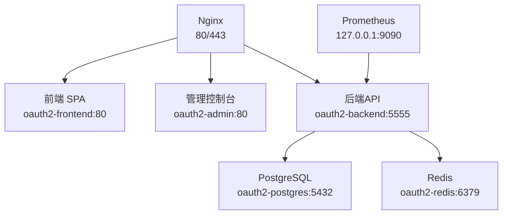
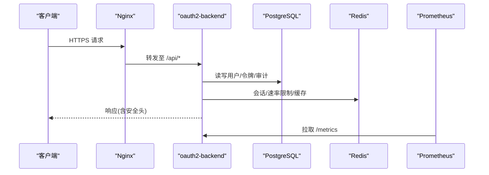
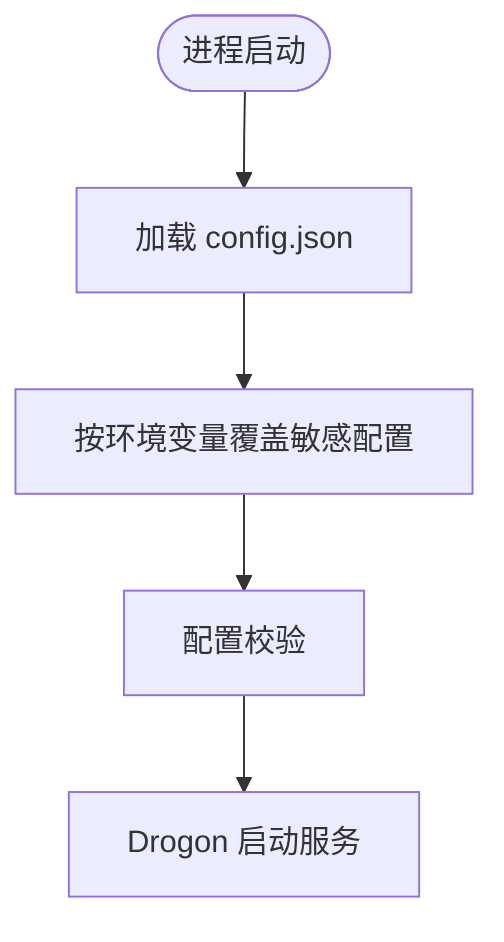
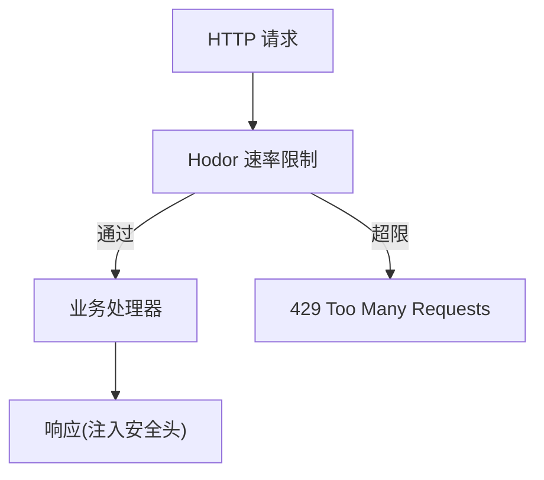
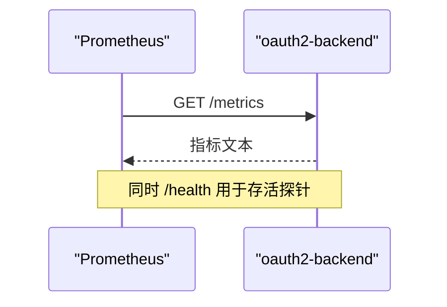
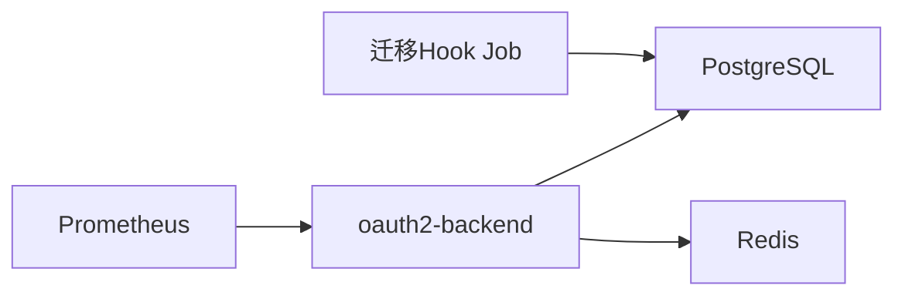
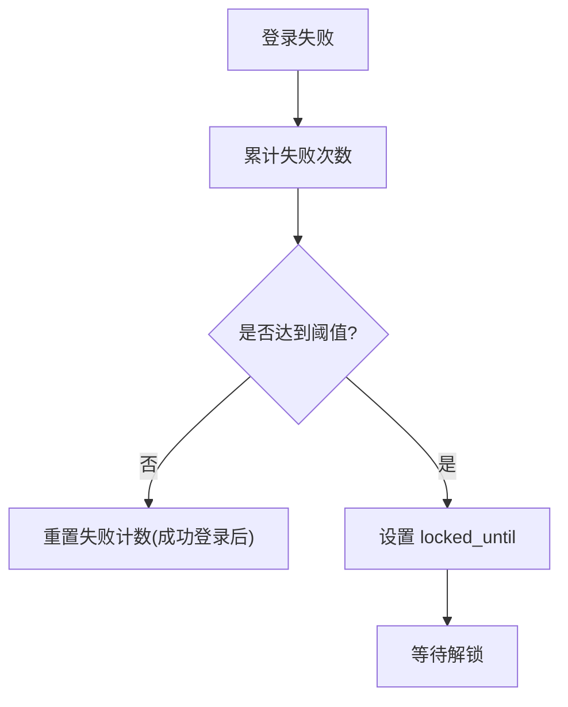
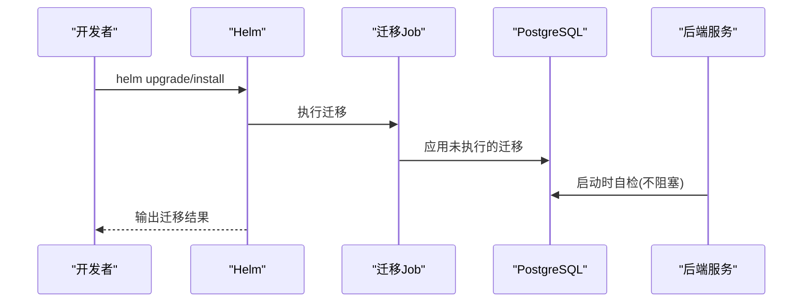
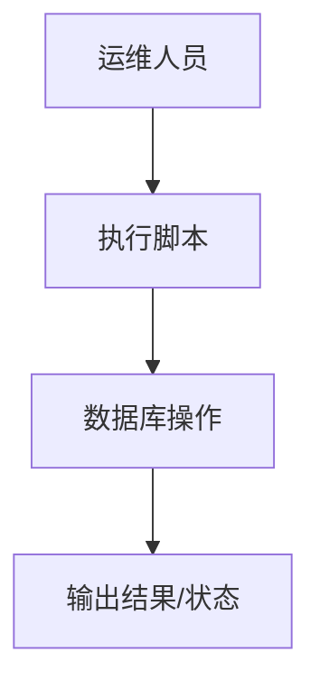

# 运维手册

<cite>
**本文引用的文件**
- [apps/server/config/config.prod.json](file://apps/server/config/config.prod.json)
- [deploy/docker/docker-compose.prod.yml](file://deploy/docker/docker-compose.prod.yml)
- [deploy/helm/authforge/values.yaml](file://deploy/helm/authforge/values.yaml)
- [docs/backend/configuration-guide.md](file://docs/backend/configuration-guide.md)
- [docs/backend/security-hardening.md](file://docs/backend/security-hardening.md)
- [docs/ops/account-lockout.md](file://docs/ops/account-lockout.md)
- [scripts/backend/reset-account-lockout.sh](file://scripts/backend/reset-account-lockout.sh)
- [deploy/observability/prometheus.yml](file://deploy/observability/prometheus.yml)
- [libs/drogon/src/observability/Metrics.cc](file://libs/drogon/src/observability/Metrics.cc)
- [libs/drogon/include/authforge/drogon/observability/Metrics.h](file://libs/drogon/include/authforge/drogon/observability/Metrics.h)
- [libs/drogon/include/authforge/drogon/adapters/DrogonMetrics.h](file://libs/drogon/include/authforge/drogon/adapters/DrogonMetrics.h)
- [apps/server/src/bootstrap/MigrationRunner.h](file://apps/server/src/bootstrap/MigrationRunner.h)
- [apps/server/src/bootstrap/MigrationRunner.cc](file://apps/server/src/bootstrap/MigrationRunner.cc)
- [apps/server/src/schema_manager.cc](file://apps/server/src/schema_manager.cc)
- [apps/server/src/bootstrap/MigrationRunner.cc](file://apps/server/src/bootstrap/MigrationRunner.cc)
- [apps/server/migrations/V013__account_lockout.sql](file://apps/server/migrations/V013__account_lockout.sql)
- [scripts/backend/setup-database.sh](file://scripts/backend/setup-database.sh)
- [tools/migration-check/baseline.json](file://tools/migration-check/baseline.json)
- [deploy/helm/authforge/templates/migration-job.yaml](file://deploy/helm/authforge/templates/migration-job.yaml)
- [libs/drogon/src/AuthService.cc](file://libs/drogon/src/AuthService.cc)
- [libs/storage-postgres/src/models/Users.cc](file://libs/storage-postgres/src/models/Users.cc)
- [libs/drogon/src/controllers/HealthController.cc](file://libs/drogon/src/controllers/HealthController.cc)
</cite>

## 目录
1. [简介](#简介)
2. [项目结构](#项目结构)
3. [核心组件](#核心组件)
4. [架构总览](#架构总览)
5. [详细组件分析](#详细组件分析)
6. [依赖关系分析](#依赖关系分析)
7. [性能与容量规划](#性能与容量规划)
8. [日常运维任务](#日常运维任务)
9. [故障排查指南](#故障排查指南)
10. [账户锁定与密码重置](#账户锁定与密码重置)
11. [数据库维护](#数据库维护)
12. [灾难恢复与业务连续性](#灾难恢复与业务连续性)
13. [升级与迁移](#升级与迁移)
14. [运维自动化脚本](#运维自动化脚本)
15. [结论](#结论)

## 简介
本手册面向生产环境下的 AuthForge 运维工程师，提供从配置、安全加固、性能调优到监控、日志、备份恢复、故障排查、账户锁定机制、数据库维护、灾难恢复、升级迁移以及自动化脚本的完整操作指南。内容基于仓库中的配置文件、部署编排、迁移脚本和源码实现整理而成，确保在生产环境中可落地执行。

## 项目结构
AuthForge 的生产部署由后端服务（Drogon）、前端 SPA、管理控制台、Nginx 反向代理、PostgreSQL、Redis、Prometheus 组成，通过 Docker Compose 或 Helm 进行编排。关键路径：
- 后端配置：apps/server/config/config.prod.json
- 生产编排：deploy/docker/docker-compose.prod.yml
- Helm 值：deploy/helm/authforge/values.yaml
- 环境变量注入说明：docs/backend/configuration-guide.md
- 安全加固：docs/backend/security-hardening.md
- 可观测性：deploy/observability/prometheus.yml

**图表来源**
- [deploy/docker/docker-compose.prod.yml:13-139](file://deploy/docker/docker-compose.prod.yml#L13-L139)
- [deploy/observability/prometheus.yml:1-8](file://deploy/observability/prometheus.yml#L1-L8)

**章节来源**
- [deploy/docker/docker-compose.prod.yml:1-221](file://deploy/docker/docker-compose.prod.yml#L1-L221)
- [docs/backend/configuration-guide.md:1-58](file://docs/backend/configuration-guide.md#L1-L58)

## 核心组件
- 后端服务（oauth2-backend）：承载 OAuth2/OIDC 能力，暴露 /health、/metrics 等端点；通过 Drogon 插件体系加载限流、指标导出等能力。
- 前端与管理控制台：静态资源由 Nginx 分发，SPA 构建产物内嵌 API 基础地址。
- 数据层：PostgreSQL 持久化核心数据；Redis 用于会话/缓存/令牌族等。
- 可观测性：Prometheus 抓取后端指标端点，结合应用日志集中采集。

**章节来源**
- [apps/server/config/config.prod.json:1-264](file://apps/server/config/config.prod.json#L1-L264)
- [deploy/docker/docker-compose.prod.yml:74-139](file://deploy/docker/docker-compose.prod.yml#L74-L139)
- [deploy/observability/prometheus.yml:1-8](file://deploy/observability/prometheus.yml#L1-L8)

## 架构总览
生产环境采用“反向代理 + 多容器”架构，后端通过环境变量覆盖配置文件中的敏感项，避免硬编码密钥。Helm Chart 将敏感信息以 Secret 形式注入，并通过 Hook Job 在升级前执行迁移。

**图表来源**
- [deploy/docker/docker-compose.prod.yml:13-139](file://deploy/docker/docker-compose.prod.yml#L13-L139)
- [apps/server/config/config.prod.json:133-218](file://apps/server/config/config.prod.json#L133-L218)
- [deploy/observability/prometheus.yml:1-8](file://deploy/observability/prometheus.yml#L1-L8)

## 详细组件分析

### 生产配置与环境变量注入
- 监听端口、数据库/Redis 连接池、线程数、日志、压缩、上传大小等均在配置文件中定义。
- 敏感字段（数据库密码、Redis 密码、第三方客户端密钥、SMTP 密码等）通过环境变量覆盖，不在磁盘落盘。
- 启动流程会先加载 config.json，再按环境变量注入并校验，最后交给 Drogon 运行。

**图表来源**
- [docs/backend/configuration-guide.md:1-58](file://docs/backend/configuration-guide.md#L1-L58)
- [apps/server/config/config.prod.json:1-264](file://apps/server/config/config.prod.json#L1-L264)

**章节来源**
- [docs/backend/configuration-guide.md:1-58](file://docs/backend/configuration-guide.md#L1-L58)
- [apps/server/config/config.prod.json:1-264](file://apps/server/config/config.prod.json#L1-L264)

### 安全加固
- 速率限制：使用 Hodor 插件，令牌桶算法，支持全局/IP/用户维度限制，登录/令牌/注册接口有严格子限制。
- 安全响应头：强制 X-Content-Type-Options、X-Frame-Options、CSP、HSTS 等。
- 建议：仅允许受信任源访问 /metrics，生产启用 HTTPS，最小化 CORS 白名单。

**图表来源**
- [apps/server/config/config.prod.json:133-218](file://apps/server/config/config.prod.json#L133-L218)
- [docs/backend/security-hardening.md:1-120](file://docs/backend/security-hardening.md#L1-L120)

**章节来源**
- [docs/backend/security-hardening.md:1-120](file://docs/backend/security-hardening.md#L1-L120)
- [apps/server/config/config.prod.json:133-218](file://apps/server/config/config.prod.json#L133-L218)

### 可观测性与监控
- 指标端点：后端暴露 /metrics，Prometheus 每 15s 抓取一次。
- 指标类型：请求计数、登录失败计数、延迟直方图、活跃令牌数、Token 探测/撤销计数等。
- 健康检查：/health 返回服务状态，包含数据库可用性探测。

**图表来源**
- [deploy/observability/prometheus.yml:1-8](file://deploy/observability/prometheus.yml#L1-L8)
- [libs/drogon/src/observability/Metrics.cc:1-76](file://libs/drogon/src/observability/Metrics.cc#L1-L76)
- [libs/drogon/src/controllers/HealthController.cc:156-172](file://libs/drogon/src/controllers/HealthController.cc#L156-L172)

**章节来源**
- [deploy/observability/prometheus.yml:1-8](file://deploy/observability/prometheus.yml#L1-L8)
- [libs/drogon/src/observability/Metrics.cc:1-76](file://libs/drogon/src/observability/Metrics.cc#L1-L76)
- [libs/drogon/src/controllers/HealthController.cc:156-172](file://libs/drogon/src/controllers/HealthController.cc#L156-L172)

## 依赖关系分析
- 后端依赖 PostgreSQL 与 Redis，二者通过 docker-compose 或 Helm 管理。
- Prometheus 依赖后端 /metrics 端点。
- Helm 通过 Hook Job 在升级前执行迁移，保证 schema 一致性。

**图表来源**
- [deploy/docker/docker-compose.prod.yml:171-221](file://deploy/docker/docker-compose.prod.yml#L171-L221)
- [deploy/helm/authforge/templates/migration-job.yaml:1-36](file://deploy/helm/authforge/templates/migration-job.yaml#L1-L36)

**章节来源**
- [deploy/docker/docker-compose.prod.yml:171-221](file://deploy/docker/docker-compose.prod.yml#L171-L221)
- [deploy/helm/authforge/templates/migration-job.yaml:1-36](file://deploy/helm/authforge/templates/migration-job.yaml#L1-L36)

## 性能与容量规划
- 连接池与超时：PostgreSQL/Redis 连接池数量与超时时间需根据 QPS 与并发调整。
- 线程与并发：app.number_of_threads=0 表示跟随 CPU 核数；max_connections、keepalive_requests、pipelining_requests 影响高并发吞吐。
- 压缩与静态缓存：开启 gzip/brotli 与静态缓存可降低带宽与延迟。
- 限流策略：对登录/令牌/注册等敏感接口设置更严格的 IP/用户级限制，防止暴力破解与滥用。
- 资源配额：Helm values 中为各组件设定 requests/limits，建议按实际压测结果调整。

**章节来源**
- [apps/server/config/config.prod.json:41-132](file://apps/server/config/config.prod.json#L41-L132)
- [apps/server/config/config.prod.json:133-218](file://apps/server/config/config.prod.json#L133-L218)
- [deploy/helm/authforge/values.yaml:18-74](file://deploy/helm/authforge/values.yaml#L18-L74)

## 日常运维任务

### 服务监控
- 健康检查：定期调用 /health，确认后端与数据库连通性。
- 指标采集：Prometheus 抓取 /metrics，关注 oauth2_requests_total、oauth2_login_failures_total、oauth2_latency_seconds、oauth2_active_tokens 等。
- 告警建议：登录失败率突增、延迟升高、活跃令牌异常、数据库不可用。

**章节来源**
- [libs/drogon/src/observability/Metrics.cc:1-76](file://libs/drogon/src/observability/Metrics.cc#L1-L76)
- [deploy/observability/prometheus.yml:1-8](file://deploy/observability/prometheus.yml#L1-L8)

### 日志分析
- 日志级别：生产建议 INFO，必要时临时提升 DEBUG 定位问题。
- 关键日志：[METRIC] 开头的指标日志、Schema 自检日志、迁移执行日志、错误堆栈。
- 集中化：建议接入 ELK/Loki，配合 Prometheus 统一检索。

**章节来源**
- [apps/server/config/config.prod.json:101-109](file://apps/server/config/config.prod.json#L101-L109)
- [libs/drogon/src/observability/Metrics.cc:1-76](file://libs/drogon/src/observability/Metrics.cc#L1-L76)

### 备份与恢复
- 数据库：对 PostgreSQL 卷进行快照或逻辑备份（pg_dump），保留迁移基线。
- Redis：启用 RDB/AOF，定期持久化快照。
- 配置与密钥：Helm Secrets、Nginx SSL 证书、JWT 私钥应纳入外部密钥管理。

**章节来源**
- [deploy/docker/docker-compose.prod.yml:171-221](file://deploy/docker/docker-compose.prod.yml#L171-L221)
- [deploy/helm/authforge/values.yaml:83-95](file://deploy/helm/authforge/values.yaml#L83-L95)

## 故障排查指南

### 常见问题诊断
- 无法连接数据库：检查 OAUTH2_DB_* 环境变量、网络连通、角色权限。
- 指标未上报：确认 /metrics 可达、Prometheus 目标配置正确。
- 登录失败频繁：查看登录失败计数与账号锁定状态，排查弱口令或自动化脚本。

**章节来源**
- [docs/backend/configuration-guide.md:1-58](file://docs/backend/configuration-guide.md#L1-L58)
- [deploy/observability/prometheus.yml:1-8](file://deploy/observability/prometheus.yml#L1-L8)
- [docs/ops/account-lockout.md:1-238](file://docs/ops/account-lockout.md#L1-L238)

### 错误日志分析
- 登录失败：关注 oauth2_login_failures_total 及对应 reason。
- 数据库异常：关注 DrogonDbException 相关日志。
- 迁移失败：关注 SchemaManager 迁移失败日志与 pending 数量。

**章节来源**
- [libs/drogon/src/observability/Metrics.cc:1-76](file://libs/drogon/src/observability/Metrics.cc#L1-L76)
- [apps/server/src/bootstrap/MigrationRunner.cc:105-140](file://apps/server/src/bootstrap/MigrationRunner.cc#L105-L140)

### 性能问题定位
- 慢查询：结合数据库慢查询日志与 Prometheus 延迟直方图定位瓶颈。
- 连接池耗尽：观察数据库/Redis 连接数与超时，适当扩容或优化 SQL。
- 限流触发：检查 Hodor 规则是否过严，必要时调整 capacity/ip_capacity/user_capacity。

**章节来源**
- [apps/server/config/config.prod.json:133-218](file://apps/server/config/config.prod.json#L133-L218)
- [libs/drogon/src/observability/Metrics.cc:1-76](file://libs/drogon/src/observability/Metrics.cc#L1-L76)

## 账户锁定与密码重置

### 账户锁定机制
- 渐进式锁定：失败次数达到阈值后，锁定时长递增（1分钟、5分钟、30分钟、1小时）。
- 存储字段：users.failed_login_count、users.locked_until、users.last_failed_login。
- 监控建议：对 admin/superuser 等关键账号锁定事件设置告警。

**图表来源**
- [libs/drogon/src/AuthService.cc:148-176](file://libs/drogon/src/AuthService.cc#L148-L176)
- [apps/server/migrations/V013__account_lockout.sql:1-7](file://apps/server/migrations/V013__account_lockout.sql#L1-L7)

**章节来源**
- [docs/ops/account-lockout.md:1-238](file://docs/ops/account-lockout.md#L1-L238)
- [libs/drogon/src/AuthService.cc:148-176](file://libs/drogon/src/AuthService.cc#L148-L176)
- [apps/server/migrations/V013__account_lockout.sql:1-7](file://apps/server/migrations/V013__account_lockout.sql#L1-L7)

### 密码重置流程
- 生成一次性重置令牌并记录到数据库。
- 用户点击链接后验证令牌有效性并更新密码。
- 成功后清理令牌并记录审计日志。

**章节来源**
- [libs/drogon/src/services/PasswordResetService.cc:331-375](file://libs/drogon/src/services/PasswordResetService.cc#L331-L375)

## 数据库维护

### 数据清理
- 定期清理过期令牌、刷新令牌族、审计日志等，可通过定时任务或后台清理服务完成。
- 关注 users 表中的锁定字段，必要时批量重置测试账号。

**章节来源**
- [apps/server/config/config.prod.json:211-217](file://apps/server/config/config.prod.json#L211-L217)
- [scripts/backend/reset-account-lockout.sh:1-36](file://scripts/backend/reset-account-lockout.sh#L1-L36)

### 索引优化
- 依据查询热点创建/重建索引，如 token、client_id、expires_at、revoked 等。
- 使用 pg_stat_statements 分析慢查询，针对性优化。

**章节来源**
- [docs/history/design/superpowers/specs/2026-05-11-p1-P1_TECHNICAL_DESIGN.md:661-704](file://docs/history/design/superpowers/specs/2026-05-11-p1-P1_TECHNICAL_DESIGN.md#L661-L704)

### 存储空间管理
- 监控 PostgreSQL 与 Redis 数据卷使用率，设置阈值告警。
- 归档历史数据，清理无用对象，定期 VACUUM/ANALYZE。

**章节来源**
- [deploy/docker/docker-compose.prod.yml:171-221](file://deploy/docker/docker-compose.prod.yml#L171-L221)

## 灾难恢复与业务连续性
- 多副本与滚动升级：Helm 支持多副本部署与滚动更新，迁移通过 Hook Job 保证一致性。
- 回滚策略：迁移向前兼容，应用版本可回滚，无需 schema 降级。
- 故障切换：数据库与 Redis 建议使用托管服务的高可用方案；Nginx 可配置多实例与健康检查。

**章节来源**
- [deploy/helm/authforge/templates/migration-job.yaml:1-36](file://deploy/helm/authforge/templates/migration-job.yaml#L1-L36)
- [deploy/helm/authforge/values.yaml:18-74](file://deploy/helm/authforge/values.yaml#L18-L74)

## 升级与迁移

### 迁移流程
- 前置条件：确保数据库连接、迁移目录存在、Helm Secrets 已配置。
- 执行迁移：通过 Helm Hook Job 运行 authforge-server --migrate-only，或使用独立 migrate profile。
- 自检查：服务启动时进行 schema 自检，若存在 pending 迁移则记录错误日志。

**图表来源**
- [deploy/helm/authforge/templates/migration-job.yaml:1-36](file://deploy/helm/authforge/templates/migration-job.yaml#L1-L36)
- [apps/server/src/bootstrap/MigrationRunner.h:31-45](file://apps/server/src/bootstrap/MigrationRunner.h#L31-L45)
- [apps/server/src/bootstrap/MigrationRunner.cc:105-140](file://apps/server/src/bootstrap/MigrationRunner.cc#L105-L140)

**章节来源**
- [apps/server/src/bootstrap/MigrationRunner.h:31-45](file://apps/server/src/bootstrap/MigrationRunner.h#L31-L45)
- [apps/server/src/bootstrap/MigrationRunner.cc:105-140](file://apps/server/src/bootstrap/MigrationRunner.cc#L105-L140)
- [deploy/helm/authforge/templates/migration-job.yaml:1-36](file://deploy/helm/authforge/templates/migration-job.yaml#L1-L36)

## 运维自动化脚本

### 常用脚本
- 数据库初始化：setup-database.sh 自动创建库、执行迁移与种子数据。
- 账户锁定重置：reset-account-lockout.sh 支持重置单个或全部用户的锁定状态。
- 迁移基线校验：tools/migration-check/baseline.json 用于校验迁移文件变更。

**图表来源**
- [scripts/backend/setup-database.sh:1-66](file://scripts/backend/setup-database.sh#L1-L66)
- [scripts/backend/reset-account-lockout.sh:1-36](file://scripts/backend/reset-account-lockout.sh#L1-L36)
- [tools/migration-check/baseline.json:1-15](file://tools/migration-check/baseline.json#L1-L15)

**章节来源**
- [scripts/backend/setup-database.sh:1-66](file://scripts/backend/setup-database.sh#L1-L66)
- [scripts/backend/reset-account-lockout.sh:1-36](file://scripts/backend/reset-account-lockout.sh#L1-L36)
- [tools/migration-check/baseline.json:1-15](file://tools/migration-check/baseline.json#L1-L15)

## 结论
本手册围绕生产环境的配置、安全、监控、日志、备份恢复、故障排查、账户锁定、数据库维护、灾难恢复、升级迁移与自动化脚本提供了系统化指导。建议结合 Prometheus 与集中式日志平台建立完善的可观测体系，并通过 Helm Hook Job 与脚本实现标准化的发布与维护流程。持续完善告警与演练计划，保障业务连续性与数据安全。