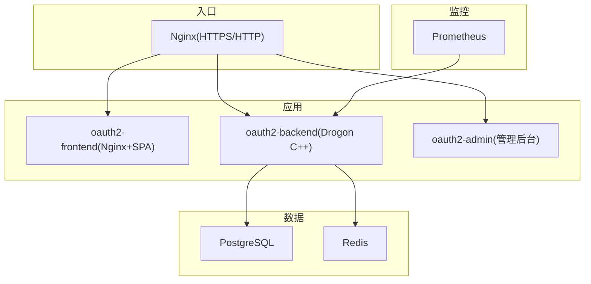
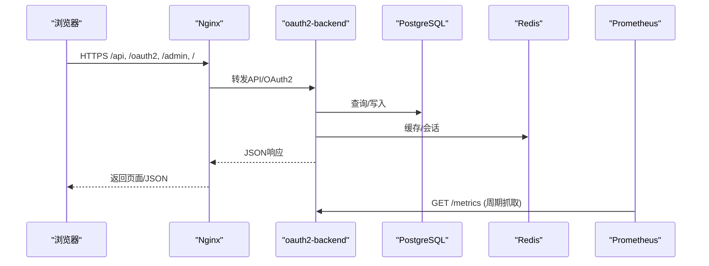
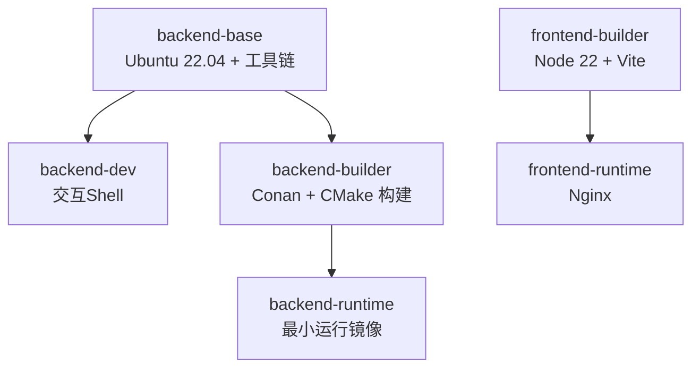
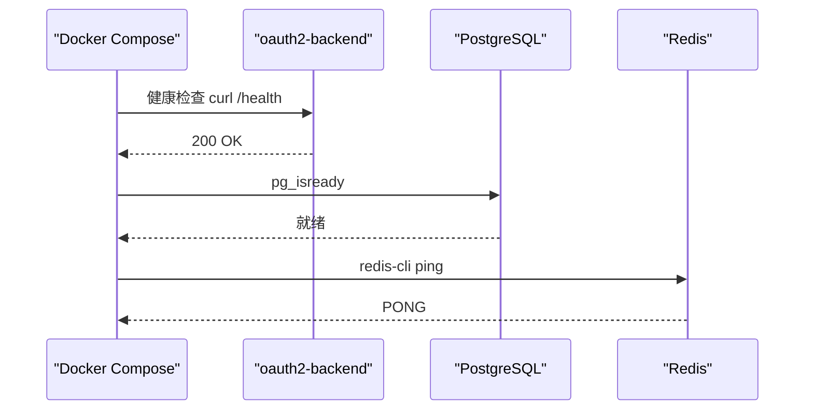
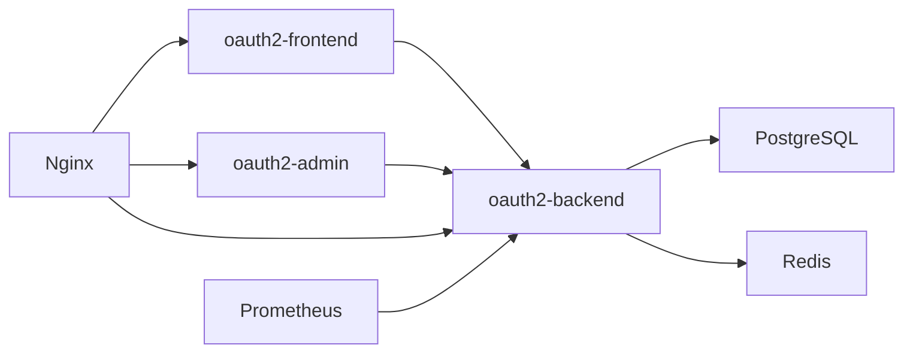

# Docker部署

<cite>
**本文引用的文件**
- [deploy/docker/Dockerfile](file://deploy/docker/Dockerfile)
- [deploy/docker/docker-compose.yml](file://deploy/docker/docker-compose.yml)
- [deploy/docker/docker-compose.prod.yml](file://deploy/docker/docker-compose.prod.yml)
- [deploy/docker/docker-compose.debug.yml](file://deploy/docker/docker-compose.debug.yml)
- [deploy/env/docker.env.example](file://deploy/env/docker.env.example)
- [deploy/env/server.env.example](file://deploy/env/server.env.example)
- [deploy/nginx/nginx.conf](file://deploy/nginx/nginx.conf)
- [deploy/observability/prometheus.yml](file://deploy/observability/prometheus.yml)
- [scripts/backend/build.sh](file://scripts/backend/build.sh)
- [scripts/generate-jwt-keys.sh](file://scripts/generate-jwt-keys.sh)
- [docs/backend/docker-deployment.md](file://docs/backend/docker-deployment.md)
- [tests/integration/controllers/HealthEndpointHttpTest.cc](file://tests/integration/controllers/HealthEndpointHttpTest.cc)
</cite>

## 目录
1. [简介](#简介)
2. [项目结构](#项目结构)
3. [核心组件](#核心组件)
4. [架构总览](#架构总览)
5. [详细组件分析](#详细组件分析)
6. [依赖关系分析](#依赖关系分析)
7. [性能考虑](#性能考虑)
8. [故障排查指南](#故障排查指南)
9. [结论](#结论)
10. [附录](#附录)

## 简介
本指南面向使用Docker与Docker Compose部署AuthForge的工程师，覆盖镜像构建、多阶段优化、Compose编排（开发/生产/调试）、环境变量与密钥管理、健康检查、日志与监控集成、常见问题与调优建议。内容严格基于仓库中的Dockerfile、Compose文件、Nginx配置、Prometheus配置及脚本实现。

## 项目结构
- 后端服务：C++ Drogon应用，通过Conan+CMake在容器内构建并静态链接依赖，运行期仅依赖基础系统库与TLS根证书。
- 前端服务：Vue SPA由Node构建后由Nginx托管；另有独立的管理后台前端。
- 数据层：PostgreSQL与Redis作为持久化与缓存。
- 网关与反向代理：生产环境使用Nginx进行HTTPS终结、限流与路由转发。
- 可观测性：内置Prometheus抓取后端指标。

图表来源
- [deploy/docker/docker-compose.prod.yml:13-139](file://deploy/docker/docker-compose.prod.yml#L13-L139)
- [deploy/nginx/nginx.conf:28-113](file://deploy/nginx/nginx.conf#L28-L113)
- [deploy/observability/prometheus.yml:4-8](file://deploy/observability/prometheus.yml#L4-L8)

章节来源
- [deploy/docker/docker-compose.yml:1-127](file://deploy/docker/docker-compose.yml#L1-L127)
- [deploy/docker/docker-compose.prod.yml:1-221](file://deploy/docker/docker-compose.prod.yml#L1-L221)
- [deploy/docker/docker-compose.debug.yml:1-85](file://deploy/docker/docker-compose.debug.yml#L1-L85)
- [deploy/nginx/nginx.conf:1-116](file://deploy/nginx/nginx.conf#L1-L116)
- [deploy/observability/prometheus.yml:1-8](file://deploy/observability/prometheus.yml#L1-L8)

## 核心组件
- 多阶段Dockerfile：统一后端构建/运行与前端构建/运行，复用Conan缓存，最小化运行镜像体积。
- Compose编排：
  - 开发：本地快速启动，端口映射到宿主机，挂载源码与配置便于热更新。
  - 生产：固定版本镜像、资源限制、健康检查、只读密钥卷、迁移Job。
  - 调试：独立网络与数据库实例，交互式Shell，便于断点与复现问题。
- 环境变量与密钥：集中示例与环境注入，支持JWT私钥路径或内联PEM、数据库/Redis连接、SMTP、CORS与重定向URI等。
- 健康检查与监控：后端提供健康端点，Compose对PG/BE做健康检查；Prometheus采集指标。

章节来源
- [deploy/docker/Dockerfile:1-99](file://deploy/docker/Dockerfile#L1-L99)
- [deploy/docker/docker-compose.yml:30-66](file://deploy/docker/docker-compose.yml#L30-L66)
- [deploy/docker/docker-compose.prod.yml:74-139](file://deploy/docker/docker-compose.prod.yml#L74-L139)
- [deploy/docker/docker-compose.debug.yml:39-72](file://deploy/docker/docker-compose.debug.yml#L39-L72)
- [deploy/env/docker.env.example:1-89](file://deploy/env/docker.env.example#L1-L89)
- [deploy/env/server.env.example:1-70](file://deploy/env/server.env.example#L1-L70)
- [tests/integration/controllers/HealthEndpointHttpTest.cc:1-32](file://tests/integration/controllers/HealthEndpointHttpTest.cc#L1-L32)

## 架构总览
- 请求路径：浏览器访问Nginx（HTTPS），API/OAuth2路由至后端，管理后台与用户前端分别由对应服务提供。
- 数据路径：后端连接PostgreSQL执行迁移与读写，使用Redis缓存会话/令牌族等。
- 监控路径：Prometheus定期抓取后端/metrics。

图表来源
- [deploy/nginx/nginx.conf:57-113](file://deploy/nginx/nginx.conf#L57-L113)
- [deploy/docker/docker-compose.prod.yml:74-139](file://deploy/docker/docker-compose.prod.yml#L74-L139)
- [deploy/observability/prometheus.yml:4-8](file://deploy/observability/prometheus.yml#L4-L8)

## 详细组件分析

### 镜像构建与多阶段优化
- 后端构建阶段：
  - 基础镜像Ubuntu 22.04，安装编译工具链与客户端工具。
  - 通过pip安装Conan 2.x与CMake，确保与CI一致。
  - 使用scripts/backend/build.sh执行conan install与cmake --preset构建，输出二进制位于build/linux-release/apps/server/authforge-server。
  - BuildKit缓存挂载/root/.conan2，避免重复下载与编译依赖。
- 后端运行阶段：
  - 仅复制二进制、生产配置文件、视图、迁移与种子目录，创建logs/uploads目录，暴露5555端口。
  - 依赖全部静态链接，运行镜像仅保留TLS根证书与curl用于健康检查。
- 前端构建阶段：
  - Node 22 Alpine镜像，Vite构建时通过ARG注入VITE_*变量，生成静态资源。
- 前端运行阶段：
  - Nginx稳定版Alpine镜像，托管dist并加载自定义nginx.conf。

图表来源
- [deploy/docker/Dockerfile:9-71](file://deploy/docker/Dockerfile#L9-L71)
- [deploy/docker/Dockerfile:73-99](file://deploy/docker/Dockerfile#L73-L99)
- [scripts/backend/build.sh:119-168](file://scripts/backend/build.sh#L119-L168)

章节来源
- [deploy/docker/Dockerfile:1-99](file://deploy/docker/Dockerfile#L1-L99)
- [scripts/backend/build.sh:1-168](file://scripts/backend/build.sh#L1-L168)

### Docker Compose：开发环境
- 服务组成：
  - oauth2-frontend：从根目录Dockerfile构建frontend-runtime，映射8080:80。
  - oauth2-admin：独立管理后台前端，映射8081:80。
  - oauth2-backend：从Dockerfile构建backend-runtime，映射5555:5555，依赖Postgres与Redis。
  - oauth2-postgres：postgres:15-alpine，映射5433:5432，命名卷pgdata。
  - oauth2-redis：redis:7-alpine，映射6380:6379，命名卷redisdata。
  - oauth2-prometheus：prom/prometheus，映射9090:9090，挂载prometheus.yml与数据卷。
- 关键特性：
  - 通过environment注入数据库、Redis、Vue客户端密钥、自动迁移开关、前端URL与SMTP参数。
  - 将config.json、migrations、seed以只读方式挂载到后端容器。
  - 所有服务加入oauth2-net网络。

章节来源
- [deploy/docker/docker-compose.yml:1-127](file://deploy/docker/docker-compose.yml#L1-L127)

### Docker Compose：生产环境
- 服务组成：
  - nginx：对外80/443，挂载nginx.conf与ssl目录，反向代理到后端、前端与管理后台。
  - oauth2-frontend/oauth2-admin：使用ghcr.io发布的版本镜像，可通过AUTHFORGE_VERSION固定版本。
  - oauth2-backend：使用ghcr.io发布的版本镜像，暴露5555（不直接对外），设置CPU/内存限制，健康检查调用/health。
  - migrate：一次性Profile任务，执行--migrate-only完成数据库迁移。
  - oauth2-postgres/oauth2-redis：命名卷持久化，健康检查就绪。
  - oauth2-prometheus：仅监听127.0.0.1:9090，挂载prometheus.yml与数据卷。
- 关键特性：
  - 通过.env.docker批量注入敏感配置（数据库、Redis、JWT密钥路径、CORS、重定向URI、SMTP等）。
  - 密钥目录../../deploy/keys以只读方式挂载到后端与migrate。
  - 默认OAUTH2_AUTO_MIGRATE=false，迁移通过单独profile执行。

章节来源
- [deploy/docker/docker-compose.prod.yml:1-221](file://deploy/docker/docker-compose.prod.yml#L1-L221)
- [deploy/env/docker.env.example:1-89](file://deploy/env/docker.env.example#L1-L89)

### Docker Compose：调试环境
- 服务组成：
  - oauth2-postgres-debug：独立Postgres实例，端口5432，命名卷pgdata。
  - oauth2-redis-debug：独立Redis实例，端口6379，命名卷redisdata。
  - debug-env：基于已构建的debug镜像，挂载整个项目目录为cached卷，提供交互式Shell，依赖上述两个数据库。
- 适用场景：
  - 需要断点调试、逐步构建、复现问题时使用。
  - 与开发/生产隔离的网络oauth2-debug-net。

章节来源
- [deploy/docker/docker-compose.debug.yml:1-85](file://deploy/docker/docker-compose.debug.yml#L1-L85)

### 环境变量与密钥管理
- 运行时模式与签发者：
  - OAUTH2_ENV=production时需配置HTTPS的OAUTH2_ISSUER，否则拒绝启动。
- JWT密钥：
  - 支持两种方式：OAUTH2_JWT_KEY_PATH指向RSA私钥文件（推荐），或OAUTH2_SIGNING_KEY内联PEM。
  - 未配置时将生成临时密钥，重启后旧令牌失效。
  - 密钥文件通过../../deploy/keys挂载到容器，权限受控。
- 数据库与缓存：
  - POSTGRES_*用于初始化Postgres容器；OAUTH2_DB_*被后端读取。两者需保持一致。
  - Redis密码通过REDIS_PASSWORD注入，后端通过OAUTH2_REDIS_*连接。
- 前端与CORS：
  - OAUTH2_FRONTEND_URL、OAUTH2_CORS_ALLOW_ORIGINS、OAUTH2_VUE_REDIRECT_URI、OAUTH2_GOOGLE_REDIRECT_URI等控制跨域与回调。
  - 生产环境VITE_API_BASE_URL应保持为空，SPA同域访问。
- SMTP：
  - 留空则邮件走控制台模式；配置后启用真实SMTP发送。
- 安全建议：
  - 不要将真实密码提交到Git；使用.env文件或外部密钥管理服务。
  - 生产环境关闭详细验证错误信息（DETAILED_VALIDATION_ERRORS=false）。

章节来源
- [deploy/env/docker.env.example:1-89](file://deploy/env/docker.env.example#L1-L89)
- [deploy/env/server.env.example:1-70](file://deploy/env/server.env.example#L1-L70)
- [scripts/generate-jwt-keys.sh:1-26](file://scripts/generate-jwt-keys.sh#L1-L26)

### 容器健康检查与就绪探针
- PostgreSQL：
  - 使用pg_isready检测可用性，间隔/超时/重试合理配置。
- Redis：
  - 使用redis-cli ping检测。
- 后端：
  - 生产环境通过curl访问/health进行存活检查；测试用例表明存在/live与/ready端点，/live无副作用且始终200，/ready会探测DB/Redis。
- Nginx：
  - 作为反向代理，依赖后端健康状态再提供服务。

图表来源
- [deploy/docker/docker-compose.prod.yml:132-137](file://deploy/docker/docker-compose.prod.yml#L132-L137)
- [deploy/docker/docker-compose.yml:67-90](file://deploy/docker/docker-compose.yml#L67-L90)
- [deploy/docker/docker-compose.debug.yml:14-18](file://deploy/docker/docker-compose.debug.yml#L14-L18)
- [tests/integration/controllers/HealthEndpointHttpTest.cc:1-32](file://tests/integration/controllers/HealthEndpointHttpTest.cc#L1-L32)

### 日志收集与监控集成
- 日志：
  - Nginx访问/错误日志输出到容器标准位置；后端日志可通过docker logs查看。
- 监控：
  - Prometheus配置抓取oauth2-backend:5555的/metrics。
  - 生产环境Prometheus仅绑定127.0.0.1，避免公网暴露。

章节来源
- [deploy/nginx/nginx.conf:13-22](file://deploy/nginx/nginx.conf#L13-L22)
- [deploy/observability/prometheus.yml:1-8](file://deploy/observability/prometheus.yml#L1-L8)
- [deploy/docker/docker-compose.prod.yml:199-211](file://deploy/docker/docker-compose.prod.yml#L199-L211)

## 依赖关系分析
- 服务依赖：
  - 后端依赖Postgres与Redis；前端与管理后台依赖后端API。
  - Nginx依赖后端与前端/管理后台可用。
- 网络：
  - 开发/生产共用oauth2-net；调试使用oauth2-debug-net隔离。
- 数据卷：
  - pgdata、redisdata、promdata持久化；密钥目录只读挂载。

图表来源
- [deploy/docker/docker-compose.yml:3-66](file://deploy/docker/docker-compose.yml#L3-L66)
- [deploy/docker/docker-compose.prod.yml:13-139](file://deploy/docker/docker-compose.prod.yml#L13-L139)

章节来源
- [deploy/docker/docker-compose.yml:1-127](file://deploy/docker/docker-compose.yml#L1-L127)
- [deploy/docker/docker-compose.prod.yml:1-221](file://deploy/docker/docker-compose.prod.yml#L1-L221)

## 性能考虑
- 构建优化：
  - 使用BuildKit缓存Conan依赖，减少重复下载与编译时间。
  - 多阶段构建分离开发与运行镜像，运行镜像仅包含必要依赖。
- 运行期优化：
  - 生产环境为各服务设置CPU/内存限制，避免资源争用。
  - Nginx开启gzip、keepalive与限流策略，保护后端。
  - 数据库连接池大小可根据并发量调整（参考文档建议）。
- 监控与限流：
  - 通过Prometheus持续采集指标，结合Nginx限流保护登录等敏感接口。

章节来源
- [deploy/docker/Dockerfile:44-46](file://deploy/docker/Dockerfile#L44-L46)
- [deploy/docker/docker-compose.prod.yml:49-88](file://deploy/docker/docker-compose.prod.yml#L49-L88)
- [deploy/nginx/nginx.conf:17-27](file://deploy/nginx/nginx.conf#L17-L27)
- [docs/backend/docker-deployment.md:197-200](file://docs/backend/docker-deployment.md#L197-L200)

## 故障排查指南
- 启动失败：
  - 检查OAUTH2_ENV与OAUTH2_ISSUER是否匹配（生产要求HTTPS）。
  - 确认JWT密钥路径或内联PEM正确挂载/配置。
  - 核对POSTGRES_*与OAUTH2_DB_*一致性。
- 数据库/缓存不可用：
  - 查看Postgres/Redis健康检查日志；确认端口映射与密码。
  - 使用docker exec进入容器执行pg_isready/redis-cli ping验证。
- 迁移问题：
  - 生产环境默认关闭自动迁移，使用--profile migrate执行一次性迁移。
  - 若仍失败，检查后端日志与数据库连接参数。
- 前端无法访问：
  - 确认Nginx SSL证书挂载正确，域名与重定向URI一致。
  - 检查VITE_*构建时变量是否正确传入。
- 监控不可达：
  - 生产环境Prometheus仅监听127.0.0.1，需通过SSH隧道或内部网络访问。

章节来源
- [deploy/env/docker.env.example:8-23](file://deploy/env/docker.env.example#L8-L23)
- [deploy/docker/docker-compose.prod.yml:141-169](file://deploy/docker/docker-compose.prod.yml#L141-L169)
- [deploy/docker/docker-compose.prod.yml:199-211](file://deploy/docker/docker-compose.prod.yml#L199-L211)
- [docs/backend/docker-deployment.md:139-153](file://docs/backend/docker-deployment.md#L139-L153)

## 结论
AuthForge的Docker部署方案采用多阶段构建与Compose编排，兼顾开发效率与生产稳定性。通过环境变量与密钥管理实现灵活配置，配合健康检查与监控保障可观测性。按本指南操作，可在本地快速验证，在生产中安全、可控地发布与运维。

## 附录
- 常用命令（开发）：
  - 首次构建并启动：docker-compose -f deploy/docker/docker-compose.yml up -d --build
  - 查看日志：docker-compose -f deploy/docker/docker-compose.yml logs -f oauth2-backend
  - 停止并清理数据：docker-compose -f deploy/docker/docker-compose.yml down -v
- 常用命令（生产）：
  - 准备.env.docker并启动：docker compose -f deploy/docker/docker-compose.prod.yml --env-file .env.docker up -d
  - 执行迁移：docker compose -f deploy/docker/docker-compose.prod.yml --env-file .env.docker --profile migrate run --rm migrate
- 密钥生成：
  - 使用scripts/generate-jwt-keys.sh生成RSA密钥对，并将私钥路径配置为OAUTH2_JWT_KEY_PATH。

章节来源
- [docs/backend/docker-deployment.md:49-71](file://docs/backend/docker-deployment.md#L49-L71)
- [deploy/docker/docker-compose.prod.yml:1-10](file://deploy/docker/docker-compose.prod.yml#L1-L10)
- [scripts/generate-jwt-keys.sh:1-26](file://scripts/generate-jwt-keys.sh#L1-L26)