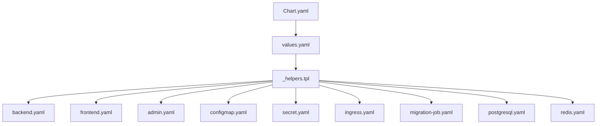
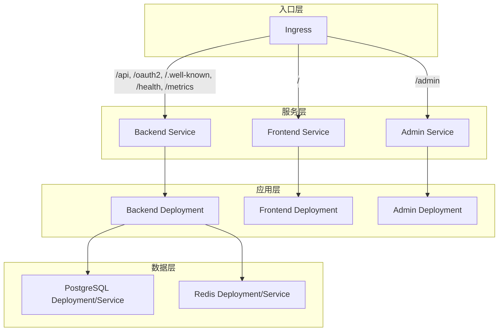
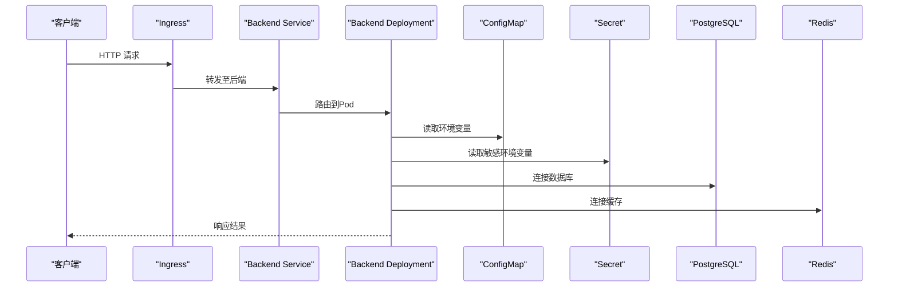
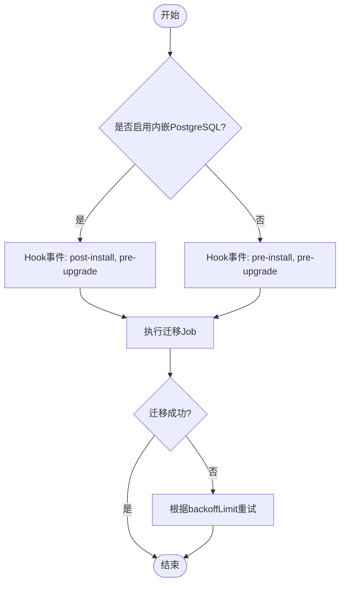
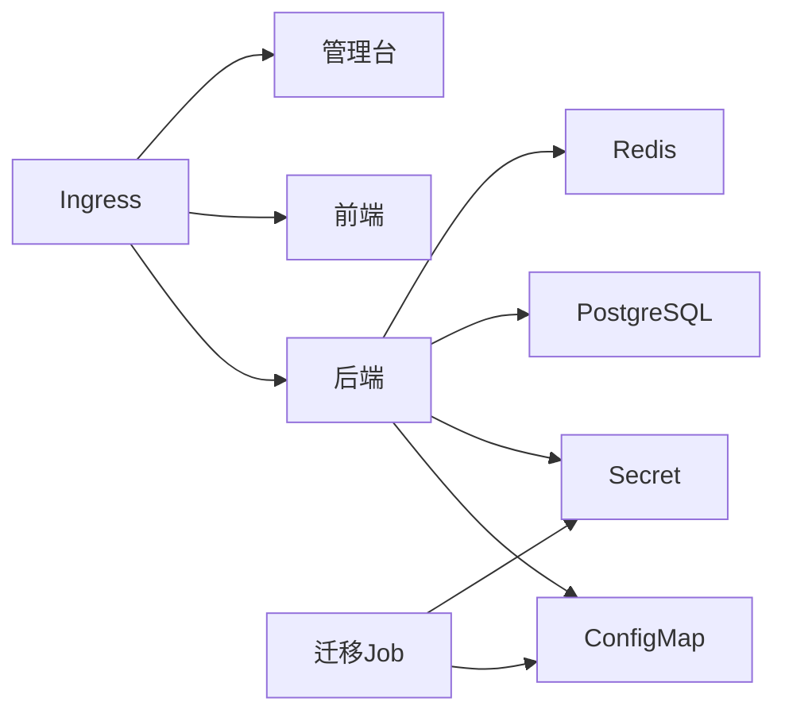

# Kubernetes部署

<cite>
**本文引用的文件**
- [Chart.yaml](file://deploy/helm/authforge/Chart.yaml)
- [values.yaml](file://deploy/helm/authforge/values.yaml)
- [values-local.yaml](file://deploy/helm/values-local.yaml)
- [_helpers.tpl](file://deploy/helm/authforge/templates/_helpers.tpl)
- [backend.yaml](file://deploy/helm/authforge/templates/backend.yaml)
- [frontend.yaml](file://deploy/helm/authforge/templates/frontend.yaml)
- [admin.yaml](file://deploy/helm/authforge/templates/admin.yaml)
- [configmap.yaml](file://deploy/helm/authforge/templates/configmap.yaml)
- [secret.yaml](file://deploy/helm/authforge/templates/secret.yaml)
- [ingress.yaml](file://deploy/helm/authforge/templates/ingress.yaml)
- [migration-job.yaml](file://deploy/helm/authforge/templates/migration-job.yaml)
- [postgresql.yaml](file://deploy/helm/authforge/templates/postgresql.yaml)
- [redis.yaml](file://deploy/helm/authforge/templates/redis.yaml)
- [NOTES.txt](file://deploy/helm/authforge/templates/NOTES.txt)
- [config.prod.json](file://apps/server/config/config.prod.json)
</cite>

## 目录
1. [简介](#简介)
2. [项目结构](#项目结构)
3. [核心组件](#核心组件)
4. [架构总览](#架构总览)
5. [详细组件分析](#详细组件分析)
6. [依赖关系分析](#依赖关系分析)
7. [性能与扩缩容](#性能与扩缩容)
8. [故障排查指南](#故障排查指南)
9. [结论](#结论)
10. [附录：环境与持久化配置](#附录：环境与持久化配置)

## 简介
本指南面向在Kubernetes上部署AuthForge的工程师与运维人员，基于仓库中的Helm Chart（位于 deploy/helm/authforge）提供完整说明。内容涵盖Chart结构与参数化、Kubernetes资源定义（Deployment/Service/ConfigMap/Secret/Ingress）、命名空间隔离、服务发现、滚动更新与回滚、扩缩容策略、持久化存储（PostgreSQL/Redis），以及生产环境的安全加固建议。

## 项目结构
Helm Chart采用“应用+依赖”的组合方式：
- Chart元数据与默认值：Chart.yaml、values.yaml、values-local.yaml
- 模板组织：templates下按组件拆分（backend/frontend/admin/postgresql/redis/ingress/migration-job/configmap/secret）
- 辅助模板：_helpers.tpl集中管理名称、标签、镜像、环境变量渲染等复用逻辑
- 安装后提示：NOTES.txt用于输出访问方式与健康检查命令

图表来源
- [Chart.yaml:1-17](file://deploy/helm/authforge/Chart.yaml#L1-L17)
- [values.yaml:1-145](file://deploy/helm/authforge/values.yaml#L1-L145)
- [_helpers.tpl:1-130](file://deploy/helm/authforge/templates/_helpers.tpl#L1-L130)

章节来源
- [Chart.yaml:1-17](file://deploy/helm/authforge/Chart.yaml#L1-L17)
- [values.yaml:1-145](file://deploy/helm/authforge/values.yaml#L1-L145)

## 核心组件
- 后端服务（backend）：无状态API服务，暴露健康端点，通过ConfigMap/Secret注入运行参数与敏感信息，支持JWT密钥挂载。
- 前端与管理台（frontend/admin）：静态页面Nginx容器，分别对外提供用户界面与管理员控制台。
- 数据库（postgresql）：可选内嵌PostgreSQL或外部数据库；支持PVC持久化。
- 缓存（redis）：可选内嵌Redis或外部Redis；通过Secret注入密码。
- 迁移任务（migration-job）：Helm Hook Job，执行schema迁移，确保升级前后一致性。
- 入口（ingress）：将/api、/oauth2、/.well-known、/health、/metrics路由到后端，/admin路由到管理台，其余到前端。

章节来源
- [backend.yaml:1-114](file://deploy/helm/authforge/templates/backend.yaml#L1-L114)
- [frontend.yaml:1-64](file://deploy/helm/authforge/templates/frontend.yaml#L1-L64)
- [admin.yaml:1-65](file://deploy/helm/authforge/templates/admin.yaml#L1-L65)
- [postgresql.yaml:1-103](file://deploy/helm/authforge/templates/postgresql.yaml#L1-L103)
- [redis.yaml:1-66](file://deploy/helm/authforge/templates/redis.yaml#L1-L66)
- [migration-job.yaml:1-85](file://deploy/helm/authforge/templates/migration-job.yaml#L1-L85)
- [ingress.yaml:1-52](file://deploy/helm/authforge/templates/ingress.yaml#L1-L52)

## 架构总览
下图展示了请求从Ingress进入，经Service转发到后端/前端/管理台的流量路径，以及后端对数据库与缓存的访问。

图表来源
- [ingress.yaml:1-52](file://deploy/helm/authforge/templates/ingress.yaml#L1-L52)
- [backend.yaml:72-114](file://deploy/helm/authforge/templates/backend.yaml#L72-L114)
- [frontend.yaml:47-64](file://deploy/helm/authforge/templates/frontend.yaml#L47-L64)
- [admin.yaml:48-65](file://deploy/helm/authforge/templates/admin.yaml#L48-L65)
- [postgresql.yaml:66-83](file://deploy/helm/authforge/templates/postgresql.yaml#L66-L83)
- [redis.yaml:48-66](file://deploy/helm/authforge/templates/redis.yaml#L48-L66)

## 详细组件分析

### Helm Chart与参数化
- Chart元数据：包含版本、应用版本、关键词与源码地址。
- values.yaml：集中定义镜像、副本数、资源限制、环境变量、存储、Ingress等可覆盖参数。
- values-local.yaml：本地/演示环境的覆盖示例，便于快速验证。
- _helpers.tpl：统一生成名称、标签、镜像地址、DB/Redis主机、环境变量块、Hook事件等。

关键要点
- 所有敏感信息通过Secret注入，避免写入日志或文件。
- 通过envFrom将ConfigMap与Secret批量注入为环境变量，后端读取这些变量完成初始化。
- 迁移Job使用独立的hook-scoped ConfigMap/Secret副本，保证pre-install/pre-upgrade时可用。

章节来源
- [Chart.yaml:1-17](file://deploy/helm/authforge/Chart.yaml#L1-L17)
- [values.yaml:1-145](file://deploy/helm/authforge/values.yaml#L1-L145)
- [values-local.yaml:1-26](file://deploy/helm/values-local.yaml#L1-L26)
- [_helpers.tpl:1-130](file://deploy/helm/authforge/templates/_helpers.tpl#L1-L130)

### 后端服务（Deployment/Service/ConfigMap/Secret）
- Deployment：设置副本数、探针（liveness/readiness）、资源限制、可选JWT密钥卷挂载。
- Service：ClusterIP暴露后端端口，并提供固定别名服务名以兼容镜像内硬编码反向代理。
- ConfigMap：由_helpers.tpl渲染非敏感环境变量。
- Secret：由_helpers.tpl渲染敏感环境变量，或通过existingSecret引用外部Secret。

滚动更新机制
- Pod注解包含ConfigMap与Secret内容的校验和，任一变更触发滚动更新。

图表来源
- [backend.yaml:1-114](file://deploy/helm/authforge/templates/backend.yaml#L1-L114)
- [configmap.yaml:1-9](file://deploy/helm/authforge/templates/configmap.yaml#L1-L9)
- [secret.yaml:1-12](file://deploy/helm/authforge/templates/secret.yaml#L1-L12)
- [_helpers.tpl:83-129](file://deploy/helm/authforge/templates/_helpers.tpl#L83-L129)

章节来源
- [backend.yaml:1-114](file://deploy/helm/authforge/templates/backend.yaml#L1-L114)
- [configmap.yaml:1-9](file://deploy/helm/authforge/templates/configmap.yaml#L1-L9)
- [secret.yaml:1-12](file://deploy/helm/authforge/templates/secret.yaml#L1-L12)
- [_helpers.tpl:58-129](file://deploy/helm/authforge/templates/_helpers.tpl#L58-L129)

### 前端与管理台
- Deployment：轻量Nginx容器，暴露80端口，配置存活/就绪探针。
- Service：ClusterIP暴露80端口，供Ingress或内部调用。

章节来源
- [frontend.yaml:1-64](file://deploy/helm/authforge/templates/frontend.yaml#L1-L64)
- [admin.yaml:1-65](file://deploy/helm/authforge/templates/admin.yaml#L1-L65)

### Ingress与域名路由
- 启用后创建Ingress资源，将不同路径前缀分发到对应Service。
- 支持className、annotations、TLS等标准字段。

章节来源
- [ingress.yaml:1-52](file://deploy/helm/authforge/templates/ingress.yaml#L1-L52)

### 迁移任务（Migration Job）
- 作为Helm Hook Job在指定时机执行，运行后端二进制并传入迁移参数。
- 使用hook-scoped的ConfigMap/Secret副本，确保迁移阶段可用。
- 支持失败重试与超时控制。

图表来源
- [migration-job.yaml:1-85](file://deploy/helm/authforge/templates/migration-job.yaml#L1-L85)
- [_helpers.tpl:72-81](file://deploy/helm/authforge/templates/_helpers.tpl#L72-L81)

章节来源
- [migration-job.yaml:1-85](file://deploy/helm/authforge/templates/migration-job.yaml#L1-L85)
- [_helpers.tpl:72-81](file://deploy/helm/authforge/templates/_helpers.tpl#L72-L81)

### 数据库（PostgreSQL）
- 可选内嵌PostgreSQL，使用PVC持久化数据目录；也可指向外部数据库。
- 通过Secret注入数据库密码，暴露Service供后端访问。

章节来源
- [postgresql.yaml:1-103](file://deploy/helm/authforge/templates/postgresql.yaml#L1-L103)
- [_helpers.tpl:41-48](file://deploy/helm/authforge/templates/_helpers.tpl#L41-L48)
- [values.yaml:97-119](file://deploy/helm/authforge/values.yaml#L97-L119)

### 缓存（Redis）
- 可选内嵌Redis，通过Secret注入密码，暴露Service供后端访问。
- 生产建议使用托管Redis实例并通过externalRedis配置。

章节来源
- [redis.yaml:1-66](file://deploy/helm/authforge/templates/redis.yaml#L1-L66)
- [_helpers.tpl:50-56](file://deploy/helm/authforge/templates/_helpers.tpl#L50-L56)
- [values.yaml:120-136](file://deploy/helm/authforge/values.yaml#L120-L136)

## 依赖关系分析
- 后端依赖：ConfigMap（非敏感环境变量）、Secret（敏感环境变量）、PostgreSQL（数据库）、Redis（缓存）。
- 前端/管理台：仅依赖各自的Service。
- Ingress：依赖后端、前端、管理台Service。
- 迁移Job：依赖与后端相同的ConfigMap/Secret副本，并在特定Hook事件中运行。

图表来源
- [backend.yaml:1-114](file://deploy/helm/authforge/templates/backend.yaml#L1-L114)
- [configmap.yaml:1-9](file://deploy/helm/authforge/templates/configmap.yaml#L1-L9)
- [secret.yaml:1-12](file://deploy/helm/authforge/templates/secret.yaml#L1-L12)
- [ingress.yaml:1-52](file://deploy/helm/authforge/templates/ingress.yaml#L1-L52)
- [migration-job.yaml:1-85](file://deploy/helm/authforge/templates/migration-job.yaml#L1-L85)

章节来源
- [backend.yaml:1-114](file://deploy/helm/authforge/templates/backend.yaml#L1-L114)
- [ingress.yaml:1-52](file://deploy/helm/authforge/templates/ingress.yaml#L1-L52)
- [migration-job.yaml:1-85](file://deploy/helm/authforge/templates/migration-job.yaml#L1-L85)

## 性能与扩缩容
- 副本数：通过values.yaml中backend/frontend/admin的replicaCount调整。
- 资源限制：通过resources.requests/limits配置CPU与内存，保障调度与QoS。
- 探针：后端提供健康检查端点，前端/管理台提供HTTP探针，利于滚动更新与自愈。
- 水平扩展：增加副本数即可横向扩展后端能力；结合HPA可实现自动扩缩容（需集群开启）。
- 滚动更新：修改ConfigMap/Secret会触发Pod滚动更新；Ingress切换流量时无中断。

章节来源
- [values.yaml:18-74](file://deploy/helm/authforge/values.yaml#L18-L74)
- [backend.yaml:42-59](file://deploy/helm/authforge/templates/backend.yaml#L42-L59)
- [frontend.yaml:32-45](file://deploy/helm/authforge/templates/frontend.yaml#L32-L45)
- [admin.yaml:33-46](file://deploy/helm/authforge/templates/admin.yaml#L33-L46)

## 故障排查指南
- 查看迁移Job日志：安装/升级后若迁移失败，可通过kubectl查看Job日志定位问题。
- 健康检查：后端提供/live与/ready端点，可用于诊断启动与就绪状态。
- 端口转发：未启用Ingress时，可使用port-forward访问各Service。
- 密钥与配置：确认Secret与ConfigMap已正确注入，且敏感项来自外部Secret时名称匹配。

章节来源
- [NOTES.txt:1-33](file://deploy/helm/authforge/templates/NOTES.txt#L1-L33)
- [backend.yaml:42-57](file://deploy/helm/authforge/templates/backend.yaml#L42-L57)

## 结论
该Helm Chart提供了完整的AuthForge部署方案，覆盖后端、前端、管理台、数据库、缓存、迁移与入口。通过values参数化与Secret管理敏感信息，配合迁移Job确保数据一致性。生产环境建议：
- 使用外部PostgreSQL与Redis实例，关闭内嵌依赖。
- 启用Ingress并配置TLS与合适的注解。
- 配置合理的资源限制与探针，结合HPA实现弹性伸缩。
- 使用外部Secret管理敏感信息，避免Chart内明文。
- 定期备份数据库与持久卷，制定回滚与应急计划。

## 附录：环境与持久化配置

### 命名空间与服务发现
- 每个Release可在独立Namespace部署，实现命名空间隔离。
- 服务发现通过Service名称解析，后端同时提供固定别名服务名以兼容镜像内反向代理。

章节来源
- [backend.yaml:91-114](file://deploy/helm/authforge/templates/backend.yaml#L91-L114)

### 不同环境的values覆盖策略
- 开发/本地：使用values-local.yaml覆盖issuer、URL、回调地址与镜像拉取策略，便于Docker Desktop/Kind环境快速验证。
- 测试/预发：在values基础上叠加测试专用覆盖文件，启用必要的调试开关。
- 生产：禁用内嵌数据库与缓存，配置externalDatabase/externalRedis，启用Ingress与TLS，设置严格资源限制与安全头。

章节来源
- [values-local.yaml:1-26](file://deploy/helm/values-local.yaml#L1-L26)
- [values.yaml:1-145](file://deploy/helm/authforge/values.yaml#L1-L145)

### 持久化存储
- PostgreSQL：启用persistence并使用PVC持久化数据目录；生产建议使用托管数据库。
- Redis：默认无持久化，生产建议使用托管Redis或启用相应持久化能力。

章节来源
- [postgresql.yaml:54-101](file://deploy/helm/authforge/templates/postgresql.yaml#L54-L101)
- [values.yaml:97-136](file://deploy/helm/authforge/values.yaml#L97-L136)

### 滚动更新、回滚与扩缩容
- 滚动更新：修改ConfigMap/Secret触发滚动；Ingress平滑切换流量。
- 回滚：使用helm rollback回退应用版本；迁移向前兼容，无需降级Schema。
- 扩缩容：调整replicaCount或使用HPA进行自动扩缩容。

章节来源
- [migration-job.yaml:1-85](file://deploy/helm/authforge/templates/migration-job.yaml#L1-L85)
- [_helpers.tpl:72-81](file://deploy/helm/authforge/templates/_helpers.tpl#L72-L81)

### 安全加固建议
- 敏感信息：通过Secret注入，禁止在日志或文件中输出敏感值。
- JWT密钥：生产环境必须提供持久化的JWT私钥Secret，避免重启导致令牌失效。
- 网络：启用Ingress TLS，限制CORS白名单，最小权限原则配置RBAC。
- 运行时：合理设置资源限制与探针，启用安全上下文与只读根文件系统（按需）。
- 监控：暴露/metrics端点，接入Prometheus/Grafana进行观测。

章节来源
- [values.yaml:1-145](file://deploy/helm/authforge/values.yaml#L1-L145)
- [NOTES.txt:27-33](file://deploy/helm/authforge/templates/NOTES.txt#L27-L33)
- [config.prod.json:1-264](file://apps/server/config/config.prod.json#L1-L264)