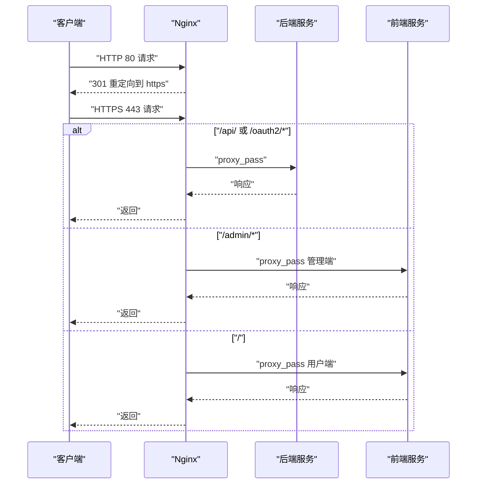
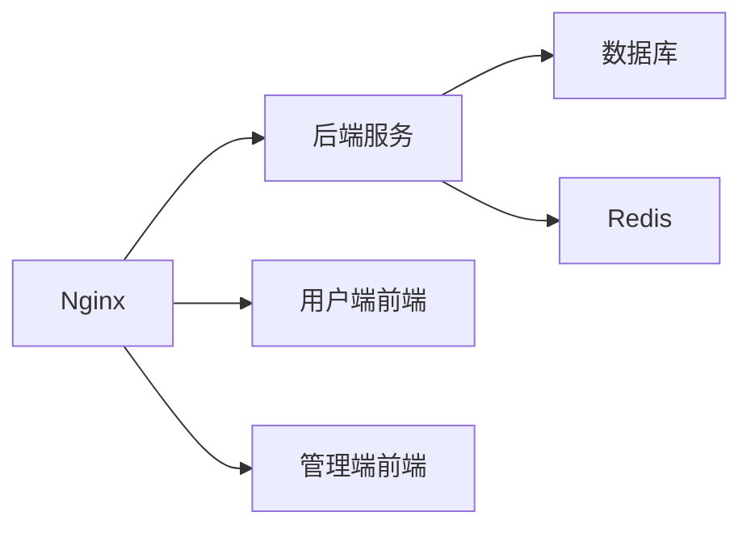

# Nginx配置

<cite>
**本文引用的文件**
- [deploy/nginx/nginx.conf](file://deploy/nginx/nginx.conf)
- [frontends/admin/nginx.conf](file://frontends/admin/nginx.conf)
- [frontends/user/nginx.conf](file://frontends/user/nginx.conf)
- [deploy/docker/docker-compose.prod.yml](file://deploy/docker/docker-compose.prod.yml)
- [scripts/generate-certs.sh](file://scripts/generate-certs.sh)
- [apps/server/src/bootstrap/SecurityHeaders.cc](file://apps/server/src/bootstrap/SecurityHeaders.cc)
</cite>

## 目录
1. [简介](#简介)
2. [项目结构](#项目结构)
3. [核心组件](#核心组件)
4. [架构总览](#架构总览)
5. [详细组件分析](#详细组件分析)
6. [依赖关系分析](#依赖关系分析)
7. [性能考量](#性能考量)
8. [故障排查指南](#故障排查指南)
9. [结论](#结论)
10. [附录](#附录)

## 简介
本指南面向在AuthForge生产与开发环境中部署Nginx反向代理的工程师，围绕以下目标提供可操作的配置说明：
- HTTP服务器、SSL/TLS证书与HTTPS重定向
- 静态资源服务（前端应用）缓存策略与CDN集成建议
- 负载均衡、健康检查与故障转移机制
- 安全最佳实践（安全头、请求限制、访问控制）
- WebSocket支持（用于实时通信）
- 性能优化（gzip压缩、连接池、缓存策略）
- SSL证书管理与自动续期

## 项目结构
仓库中包含多份Nginx相关配置：
- 顶层反向代理入口：deploy/nginx/nginx.conf
- 管理端前端独立Nginx：frontends/admin/nginx.conf
- 用户端前端独立Nginx：frontends/user/nginx.conf
- 生产编排：deploy/docker/docker-compose.prod.yml（将nginx作为入口，挂载配置文件与证书）
- 开发自签证书脚本：scripts/generate-certs.sh
- 后端安全头实现：apps/server/src/bootstrap/SecurityHeaders.cc

```mermaid
graph TB
Client["客户端"] --> Nginx["Nginx(入口)"]
Nginx --> |/api/, /oauth2/*, /.well-known/*| Backend["OAuth2后端(5555)"]
Nginx --> |/admin/*| AdminFrontend["管理端前端(80)"]
Nginx --> |/ (默认)| UserFrontend["用户端前端(80)"]
subgraph "Docker网络"
Backend
AdminFrontend
UserFrontend
end
```

图表来源
- [deploy/nginx/nginx.conf:28-113](file://deploy/nginx/nginx.conf#L28-L113)
- [deploy/docker/docker-compose.prod.yml:13-31](file://deploy/docker/docker-compose.prod.yml#L13-L31)

章节来源
- [deploy/nginx/nginx.conf:1-116](file://deploy/nginx/nginx.conf#L1-L116)
- [deploy/docker/docker-compose.prod.yml:13-31](file://deploy/docker/docker-compose.prod.yml#L13-L31)

## 核心组件
- HTTP到HTTPS重定向：监听80端口并301跳转到HTTPS。
- HTTPS服务器：启用TLSv1.2/1.3、强密码套件、HSTS、会话缓存。
- 反向代理规则：
  - /api/、/oauth2/、/.well-known/、/health → 后端服务
  - /admin/ → 管理端前端
  - / → 用户端前端
- 限流：按IP对登录与API路径进行速率限制。
- 监控指标：/metrics仅允许内网访问。
- 日志：访问日志与错误日志输出至容器标准路径。

章节来源
- [deploy/nginx/nginx.conf:33-113](file://deploy/nginx/nginx.conf#L33-L113)

## 架构总览
Nginx作为统一入口，负责：
- TLS终止与安全头注入
- 路由分发到后端或前端
- 限流与访问控制
- 可选的静态资源缓存与CDN集成



图表来源
- [deploy/nginx/nginx.conf:33-113](file://deploy/nginx/nginx.conf#L33-L113)

## 详细组件分析

### HTTP服务器与HTTPS重定向
- 监听80端口，对所有主机名返回301跳转到https://$host$request_uri。
- 适用于所有通过Nginx暴露的服务，确保强制HTTPS。

章节来源
- [deploy/nginx/nginx.conf:33-38](file://deploy/nginx/nginx.conf#L33-L38)

### SSL/TLS证书设置
- 证书路径：fullchain.pem与privkey.pem位于/etc/nginx/ssl。
- 协议与套件：仅TLSv1.2/1.3，使用高强度密码套件并优先服务端选择。
- 会话缓存：共享内存缓存与超时时间已配置，提升握手性能。
- HSTS：全局添加Strict-Transport-Security，强制浏览器走HTTPS。

章节来源
- [deploy/nginx/nginx.conf:41-55](file://deploy/nginx/nginx.conf#L41-L55)

### 静态资源服务与缓存策略
- 用户端前端：/assets/启用长期缓存与immutable，适合带指纹的资源。
- 管理端前端：SPA路由回退到index.html，便于单页应用路由。
- CDN集成建议：
  - 将静态资源（JS/CSS/图片）迁移至对象存储+CDN，并在Nginx中通过alias或重写指向CDN域名。
  - 为CDN域名开启Cache-Control与ETag，配合版本化文件名避免缓存污染。
  - 若使用Cloudflare等CDN，可在其控制台开启“缓存级别”和“边缘缓存TTL”。

章节来源
- [frontends/user/nginx.conf:38-42](file://frontends/user/nginx.conf#L38-L42)
- [frontends/admin/nginx.conf:11-19](file://frontends/admin/nginx.conf#L11-L19)

### 负载均衡、健康检查与故障转移
- 当前upstream仅定义单一后端节点；可通过增加多个server实现轮询或加权。
- 健康检查：
  - 后端提供/health与/health/live、/health/ready端点，可用于外部探针或Nginx健康检查模块（如nginx-plus）。
  - Docker Compose中通过curl探测/health判断服务健康。
- 故障转移：
  - 当某后端不可用时，Nginx会尝试下一个upstream节点（需配置多个节点）。
  - 可结合max_fails与fail_timeout参数控制失败重试与恢复间隔。

章节来源
- [deploy/nginx/nginx.conf:28-31](file://deploy/nginx/nginx.conf#L28-L31)
- [deploy/docker/docker-compose.prod.yml:132-137](file://deploy/docker/docker-compose.prod.yml#L132-L137)

### 安全配置最佳实践
- 安全头：
  - X-Content-Type-Options: nosniff
  - X-Frame-Options: SAMEORIGIN
  - Referrer-Policy: strict-origin-when-cross-origin
  - HSTS: max-age=31536000; includeSubDomains
- 请求限制：
  - 登录接口：严格限流（低速率），防止暴力破解。
  - API接口：较高吞吐限流，保护后端稳定性。
- 访问控制：
  - /metrics仅允许内网段访问，其他地址拒绝。
- 后端安全头补充：
  - 后端在HTML响应上附加CSP，区分Swagger与主应用策略。
  - 仅在HTTPS下附加HSTS头（通过X-Forwarded-Proto判断）。

章节来源
- [deploy/nginx/nginx.conf:8-11](file://deploy/nginx/nginx.conf#L8-L11)
- [deploy/nginx/nginx.conf:24-26](file://deploy/nginx/nginx.conf#L24-L26)
- [deploy/nginx/nginx.conf:95-100](file://deploy/nginx/nginx.conf#L95-L100)
- [apps/server/src/bootstrap/SecurityHeaders.cc:8-60](file://apps/server/src/bootstrap/SecurityHeaders.cc#L8-L60)

### WebSocket支持配置
- 当前配置未显式包含WebSocket升级头；如需支持实时通信（例如聊天、通知），请在对应location中添加：
  - proxy_set_header Upgrade $http_upgrade;
  - proxy_set_header Connection "upgrade";
- 同时考虑：
  - 长连接超时：proxy_read_timeout与proxy_send_timeout适当调大。
  - 限流与并发：WebSocket连接数可能激增，需评估limit_conn与上游能力。
  - 鉴权与会话：确保后端能正确解析来自Nginx的X-Forwarded-*头。

[本节为概念性指导，不直接映射具体代码片段]

### 性能优化配置
- gzip压缩：已启用并对常见MIME类型压缩。
- 传输优化：sendfile、tcp_nopush、keepalive_timeout已配置。
- 缓存策略：
  - 静态资源：/assets/设置长期缓存与immutable。
  - 浏览器缓存：结合版本号与CDN缓存头。
- 连接池：
  - upstream保持空闲连接可减少握手开销（可结合keepalive指令）。
  - 合理设置worker_processes与worker_connections以匹配负载。

章节来源
- [deploy/nginx/nginx.conf:17-22](file://deploy/nginx/nginx.conf#L17-L22)
- [frontends/user/nginx.conf:38-42](file://frontends/user/nginx.conf#L38-L42)

### SSL证书管理与自动续期
- 开发环境：使用脚本生成自签名证书，便于本地调试。
- 生产环境：
  - 建议使用Let's Encrypt（certbot）获取与续期证书。
  - 将证书放置于/etc/nginx/ssl，并确保Nginx进程可读。
  - 自动化续期：通过systemd定时器或cron定期执行certbot renew，并在成功后重载Nginx。

章节来源
- [scripts/generate-certs.sh:1-24](file://scripts/generate-certs.sh#L1-L24)

## 依赖关系分析
- Nginx依赖后端服务（oauth2-backend）、前端服务（oauth2-frontend、oauth2-admin）。
- Docker Compose定义了服务间依赖与健康检查顺序。
- 安全头由后端在HTML响应中注入，Nginx也在全局层添加基础安全头。



图表来源
- [deploy/docker/docker-compose.prod.yml:13-31](file://deploy/docker/docker-compose.prod.yml#L13-L31)
- [deploy/docker/docker-compose.prod.yml:74-139](file://deploy/docker/docker-compose.prod.yml#L74-L139)

章节来源
- [deploy/docker/docker-compose.prod.yml:13-31](file://deploy/docker/docker-compose.prod.yml#L13-L31)
- [apps/server/src/bootstrap/SecurityHeaders.cc:8-60](file://apps/server/src/bootstrap/SecurityHeaders.cc#L8-L60)

## 性能考量
- 压缩与传输：
  - 启用gzip并限定MIME类型，减少带宽占用。
  - 使用sendfile与tcp_nopush提升静态文件传输效率。
- 缓存：
  - 静态资源设置长期缓存与immutable，降低重复请求。
  - 结合CDN缓存策略，进一步减少源站压力。
- 连接与并发：
  - 调整worker_processes为auto，根据CPU核数优化。
  - worker_connections根据预期并发量调整。
- 限流：
  - 针对敏感接口（登录）与高频接口（API）分别限流，保障系统稳定。

[本节提供通用指导，不直接分析具体文件]

## 故障排查指南
- 常见问题定位：
  - 证书问题：确认/etc/nginx/ssl下的证书与私钥存在且权限正确。
  - 重定向循环：检查HTTP→HTTPS重定向与后端是否返回正确的Location头。
  - 限流触发：查看error_log中的限流信息，必要时调整burst与rate。
  - 健康检查失败：检查后端/health端点响应码与内容。
- 日志与监控：
  - access.log与error.log用于追踪请求与错误。
  - /metrics仅限内网访问，用于采集系统指标。

章节来源
- [deploy/nginx/nginx.conf:13-15](file://deploy/nginx/nginx.conf#L13-L15)
- [deploy/nginx/nginx.conf:95-100](file://deploy/nginx/nginx.conf#L95-L100)

## 结论
本指南基于仓库中的Nginx配置与生产编排，提供了从HTTPS、安全、缓存到负载均衡与性能优化的完整方案。建议在上线前：
- 完成证书替换与自动续期流程
- 验证限流阈值与缓存策略是否符合业务需求
- 根据实际流量调整worker与连接参数
- 引入CDN并优化静态资源分发

[本节总结性内容，不直接分析具体文件]

## 附录
- 快速启动（开发）：
  - 生成自签名证书后，启动docker compose并挂载nginx配置与证书目录。
- 生产部署要点：
  - 使用正式CA证书，配置HSTS与严格的安全头。
  - 将静态资源迁移至CDN，并设置合适的缓存头。
  - 配置upstream多节点以实现负载均衡与故障转移。

[本节为操作提示，不直接分析具体文件]