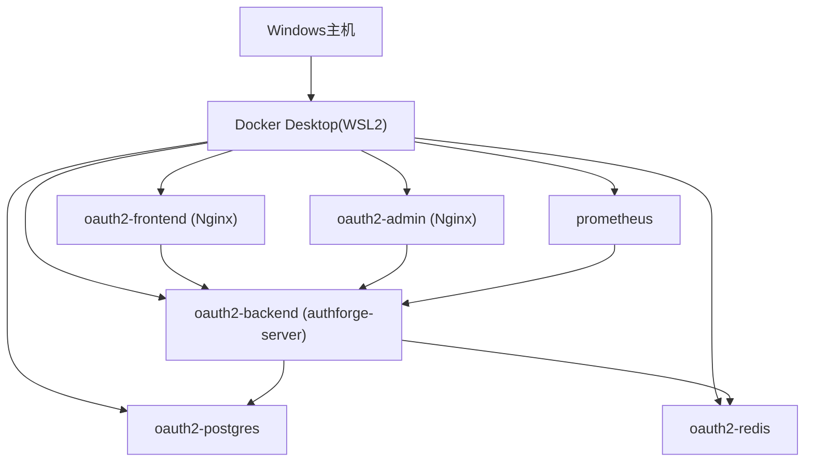
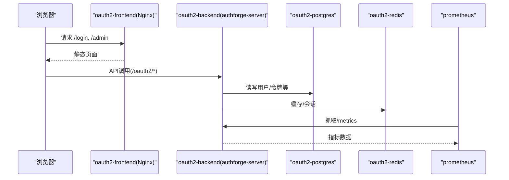
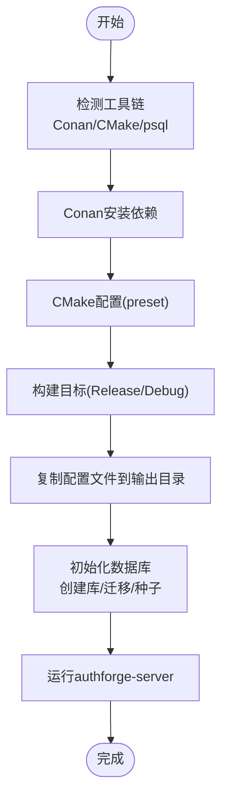
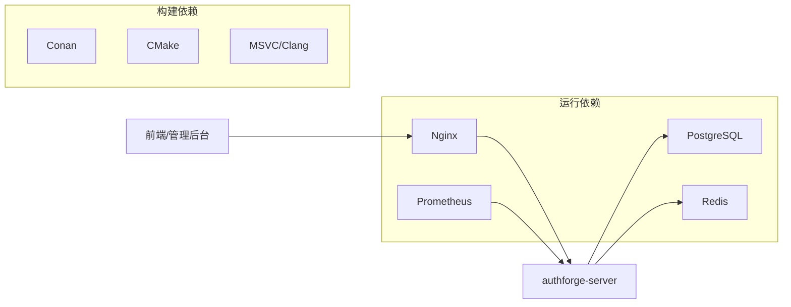

# Windows部署

<cite>
**本文引用的文件**
- [deploy/docker/Dockerfile](file://deploy/docker/Dockerfile)
- [deploy/docker/docker-compose.yml](file://deploy/docker/docker-compose.yml)
- [docs/ops/deployment-windows-docker-desktop.md](file://docs/ops/deployment-windows-docker-desktop.md)
- [scripts/backend/build.bat](file://scripts/backend/build.bat)
- [scripts/backend/env_setup.bat](file://scripts/backend/env_setup.bat)
- [scripts/backend/setup_database.bat](file://scripts/backend/setup_database.bat)
- [apps/server/CMakeLists.txt](file://apps/server/CMakeLists.txt)
- [CMakeLists.txt](file://CMakeLists.txt)
- [deploy/observability/prometheus.yml](file://deploy/observability/prometheus.yml)
- [docs/backend/observability.md](file://docs/backend/observability.md)
- [docs/backend/docker-deployment.md](file://docs/backend/docker-deployment.md)
</cite>

## 目录
1. [简介](#简介)
2. [项目结构](#项目结构)
3. [核心组件](#核心组件)
4. [架构总览](#架构总览)
5. [详细组件分析](#详细组件分析)
6. [依赖关系分析](#依赖关系分析)
7. [性能与资源限制](#性能与资源限制)
8. [故障排查指南](#故障排查指南)
9. [结论](#结论)
10. [附录](#附录)

## 简介
本指南面向在Windows环境下部署AuthForge的工程师，覆盖以下主题：
- Windows Docker Desktop安装与配置（WSL2后端、Docker引擎与资源限制）
- Windows原生构建与部署（Visual Studio + CMake + Conan依赖）
- 将AuthForge作为Windows系统服务运行（NSSM或任务计划程序）
- Windows环境问题处理（路径、权限、端口冲突）
- Windows下的数据库部署（PostgreSQL；如需要可参考容器化SQL Server方案）
- Windows防火墙与网络访问设置
- Windows监控与日志收集（Prometheus、结构化日志）

## 项目结构
AuthForge采用多模块C++工程，使用CMake与Conan管理依赖，提供Docker一键编排。Windows下既可通过Docker Desktop快速验证全栈，也可在本地编译为原生可执行文件进行部署。

图表来源
- [deploy/docker/docker-compose.yml:1-127](file://deploy/docker/docker-compose.yml#L1-L127)
- [deploy/docker/Dockerfile:1-99](file://deploy/docker/Dockerfile#L1-L99)

章节来源
- [deploy/docker/docker-compose.yml:1-127](file://deploy/docker/docker-compose.yml#L1-L127)
- [deploy/docker/Dockerfile:1-99](file://deploy/docker/Dockerfile#L1-L99)

## 核心组件
- 后端服务：authforge-server（基于Drogon），暴露API与健康检查端点，自动执行数据库迁移
- 前端与管理后台：静态站点由Nginx托管，反向代理到后端API
- 数据存储：PostgreSQL（持久化）、Redis（缓存/会话）
- 监控：Prometheus采集后端指标

章节来源
- [apps/server/CMakeLists.txt:1-82](file://apps/server/CMakeLists.txt#L1-L82)
- [CMakeLists.txt:1-171](file://CMakeLists.txt#L1-L171)
- [deploy/docker/docker-compose.yml:1-127](file://deploy/docker/docker-compose.yml#L1-L127)

## 架构总览
下图展示Windows Docker Desktop环境中的服务拓扑与数据流。

图表来源
- [deploy/docker/docker-compose.yml:1-127](file://deploy/docker/docker-compose.yml#L1-L127)
- [deploy/observability/prometheus.yml:1-8](file://deploy/observability/prometheus.yml#L1-L8)

## 详细组件分析

### Windows Docker Desktop 安装与配置
- 安装Docker Desktop for Windows并启用WSL2后端（推荐）或Hyper-V
- 验证docker与compose版本，确保能正常列出容器
- 通过脚本生成JWT密钥（可选，生产必须）
- 准备环境变量文件（例如.docker env示例），配置PostgreSQL、Redis、后端连接信息
- 启动Compose服务，验证健康检查、数据库迁移、前后端访问

关键要点
- 使用现有开发Compose配置即可在Windows上快速拉起全栈
- 本地无需HTTPS与域名，仅用localhost访问
- 邮件服务默认Console模式，便于本地调试

章节来源
- [docs/ops/deployment-windows-docker-desktop.md:1-250](file://docs/ops/deployment-windows-docker-desktop.md#L1-L250)
- [docs/ops/deployment-windows-docker-desktop.md:250-514](file://docs/ops/deployment-windows-docker-desktop.md#L250-L514)
- [deploy/docker/docker-compose.yml:1-127](file://deploy/docker/docker-compose.yml#L1-L127)

### Windows原生构建与部署（Visual Studio + CMake + Conan）
- 前置工具链：MSVC、CMake、Conan、PostgreSQL客户端（psql）
- 使用仓库提供的批处理脚本完成依赖安装、CMake配置与构建
- 构建产物包含可执行文件与配置文件，可直接运行
- 数据库初始化：使用脚本创建库、执行迁移与种子数据

步骤概览
- 运行环境检测与依赖安装（Conan profile检测、CMake预设）
- 构建Release/Debug目标
- 复制配置文件至输出目录
- 初始化数据库（删除旧库、创建新库、应用迁移与种子数据）

图表来源
- [scripts/backend/build.bat:1-92](file://scripts/backend/build.bat#L1-L92)
- [scripts/backend/env_setup.bat:1-22](file://scripts/backend/env_setup.bat#L1-L22)
- [scripts/backend/setup_database.bat:1-76](file://scripts/backend/setup_database.bat#L1-L76)

章节来源
- [scripts/backend/build.bat:1-92](file://scripts/backend/build.bat#L1-L92)
- [scripts/backend/env_setup.bat:1-22](file://scripts/backend/env_setup.bat#L1-L22)
- [scripts/backend/setup_database.bat:1-76](file://scripts/backend/setup_database.bat#L1-L76)
- [apps/server/CMakeLists.txt:1-82](file://apps/server/CMakeLists.txt#L1-L82)
- [CMakeLists.txt:1-171](file://CMakeLists.txt#L1-L171)

### 将AuthForge作为Windows系统服务运行
两种常用方式：
- 使用NSSM（Non-Sucking Service Manager）注册为Windows服务
  - 下载并安装NSSM
  - 使用nssm install将authforge-server注册为服务，设置工作目录、参数、日志输出
  - 启动服务并设置开机自启
- 使用Windows任务计划程序
  - 创建任务以“最高权限”运行，触发器设为“计算机启动时”
  - 操作指向authforge-server可执行文件，设置工作目录
  - 可将标准输出/错误重定向到日志文件以便排障

注意事项
- 确保服务账户对配置文件、迁移与种子目录有读取权限
- 若绑定低端口需管理员权限
- 建议配置日志轮转或使用外部日志收集

章节来源
- [apps/server/CMakeLists.txt:1-82](file://apps/server/CMakeLists.txt#L1-L82)
- [scripts/backend/setup_database.bat:1-76](file://scripts/backend/setup_database.bat#L1-L76)

### Windows环境问题解决方案
- 路径处理
  - Windows路径分隔符与Docker卷挂载差异，建议使用Git Bash或WSL2执行命令
  - 构建脚本已处理路径转换问题
- 权限设置
  - 服务运行账户需具备读取配置、迁移、种子目录的权限
  - 绑定特权端口需管理员权限
- 端口冲突
  - 使用netstat检查占用端口，必要时修改映射端口
  - 常见端口：5555(后端)、8080(前端)、8081(管理后台)、5433(Postgres)、6380(Redis)、9090(Prometheus)

章节来源
- [docs/ops/deployment-windows-docker-desktop.md:626-710](file://docs/ops/deployment-windows-docker-desktop.md#L626-L710)
- [deploy/docker/docker-compose.yml:1-127](file://deploy/docker/docker-compose.yml#L1-L127)

### Windows下的数据库部署
- PostgreSQL（推荐）
  - 容器化：通过Compose直接拉起PostgreSQL镜像，自动执行迁移与种子
  - 本地安装：安装PostgreSQL服务端，使用psql执行迁移与种子脚本
- SQL Server（可选）
  - 如需SQL Server，可在Windows上安装SQL Server实例并通过ODBC/驱动接入
  - 当前仓库主要围绕PostgreSQL，切换存储后端需评估ORM与迁移脚本适配

章节来源
- [deploy/docker/docker-compose.yml:67-91](file://deploy/docker/docker-compose.yml#L67-L91)
- [scripts/backend/setup_database.bat:1-76](file://scripts/backend/setup_database.bat#L1-L76)

### Windows防火墙与网络访问设置
- 开放必要端口供外部访问（如5555、8080、8081）
- 仅对内网或特定IP开放敏感端口（如数据库端口）
- 若使用反向代理（IIS/Apache/Nginx），将代理流量转发到后端服务端口
- 生产环境建议关闭对外暴露的/metrics端点

章节来源
- [docs/backend/docker-deployment.md:139-202](file://docs/backend/docker-deployment.md#L139-L202)

### 监控与日志收集（Windows）
- Prometheus
  - 通过Compose拉起Prometheus，采集后端/metrics端点
  - 访问http://localhost:9090查看指标
- 结构化日志
  - 后端通过统一观测模块发射指标与结构化日志，便于集中采集
- Grafana（可选）
  - 对接Prometheus，构建QPS、错误率、延迟等面板

章节来源
- [deploy/observability/prometheus.yml:1-8](file://deploy/observability/prometheus.yml#L1-L8)
- [docs/backend/observability.md:1-30](file://docs/backend/observability.md#L1-L30)
- [docs/backend/docker-deployment.md:139-202](file://docs/backend/docker-deployment.md#L139-L202)

## 依赖关系分析
- 构建期依赖
  - Conan管理C/C++依赖（Drogon、OpenSSL、libpq、hiredis等）
  - CMake预设用于跨平台一致构建
- 运行期依赖
  - PostgreSQL、Redis
  - Nginx（前端与管理后台）
  - Prometheus（监控）

图表来源
- [CMakeLists.txt:1-171](file://CMakeLists.txt#L1-L171)
- [deploy/docker/docker-compose.yml:1-127](file://deploy/docker/docker-compose.yml#L1-L127)

章节来源
- [CMakeLists.txt:1-171](file://CMakeLists.txt#L1-L171)
- [deploy/docker/docker-compose.yml:1-127](file://deploy/docker/docker-compose.yml#L1-L127)

## 性能与资源限制
- Docker Desktop资源限制
  - 在Docker Desktop设置中调整CPU、内存、磁盘大小，避免容器争用导致性能抖动
- 数据库连接池
  - 生产环境建议根据并发量调大数据库连接池大小
- 指标与容量规划
  - 通过Prometheus观察QPS、延迟、活跃Token数，结合业务峰值规划资源

章节来源
- [docs/backend/docker-deployment.md:197-202](file://docs/backend/docker-deployment.md#L197-L202)
- [docs/backend/observability.md:1-30](file://docs/backend/observability.md#L1-L30)

## 故障排查指南
常见问题与定位方法
- Docker Desktop无法连接
  - 确认Docker Desktop正在运行，重启服务
  - 检查WSL2/Hyper-V是否启用
- 端口冲突
  - 使用netstat查找占用进程，停止冲突服务或修改端口映射
- 数据库连接失败
  - 检查PostgreSQL容器状态与日志
  - 从后端容器测试网络连通性
- 构建失败
  - 清理构建缓存，重新执行Conan安装与CMake配置
  - 检查磁盘空间与网络

章节来源
- [docs/ops/deployment-windows-docker-desktop.md:626-710](file://docs/ops/deployment-windows-docker-desktop.md#L626-L710)

## 结论
- 在Windows环境下，优先推荐使用Docker Desktop快速验证与部署全栈，保证与Linux生产一致性
- 原生构建适合需要细粒度控制或集成到Windows服务的场景
- 通过Prometheus与结构化日志实现可观测性，配合合理的资源限制与防火墙策略，保障稳定运行

## 附录

### 快速命令参考（Windows PowerShell/Git Bash）
- 启动全栈
  - docker compose -f deploy/docker/docker-compose.yml --env-file .env.docker up -d --build
- 查看服务状态
  - docker compose -f deploy/docker/docker-compose.yml ps
- 健康检查
  - curl http://localhost:5555/health
- 访问前端与管理后台
  - http://localhost:8080
  - http://localhost:8081/admin/
- 监控
  - http://localhost:9090

章节来源
- [docs/ops/deployment-windows-docker-desktop.md:190-250](file://docs/ops/deployment-windows-docker-desktop.md#L190-L250)
- [deploy/docker/docker-compose.yml:1-127](file://deploy/docker/docker-compose.yml#L1-L127)