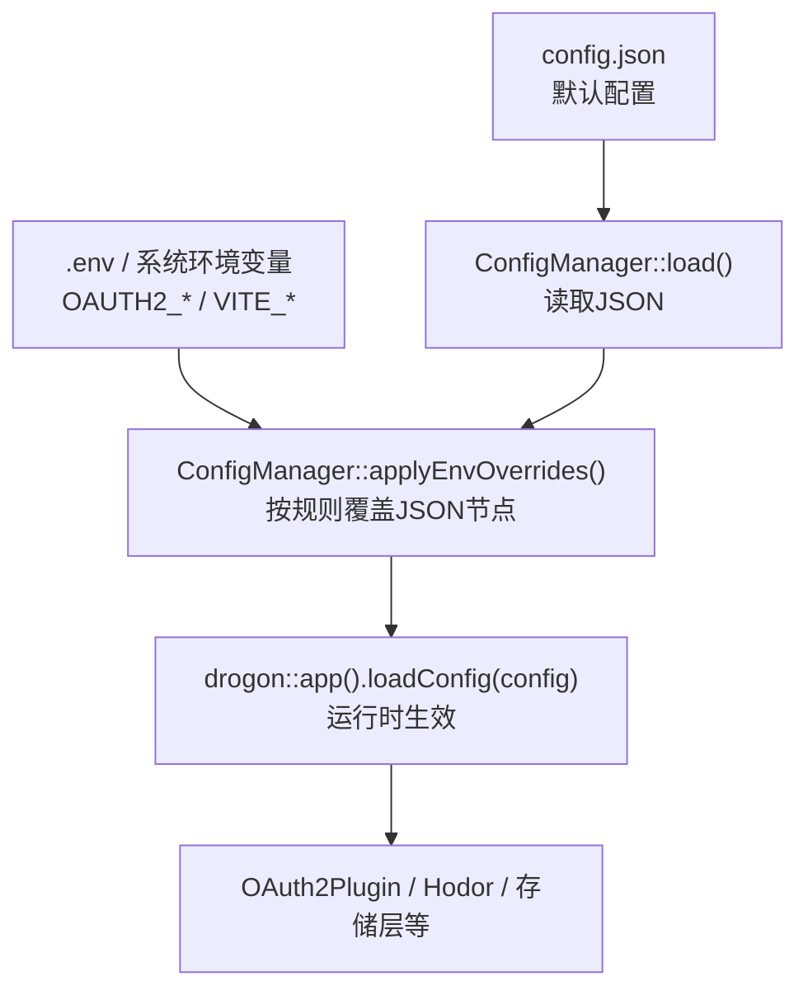
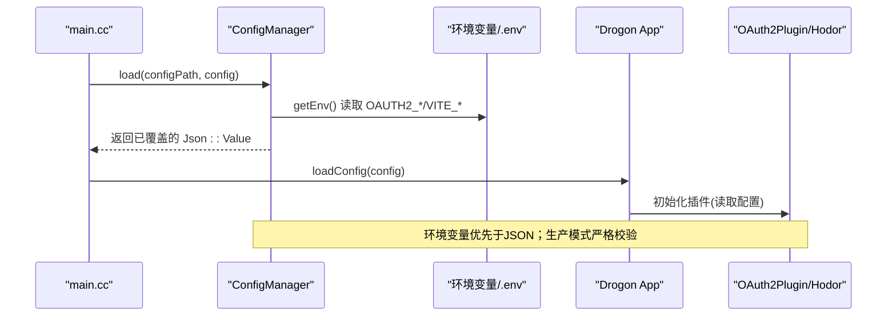
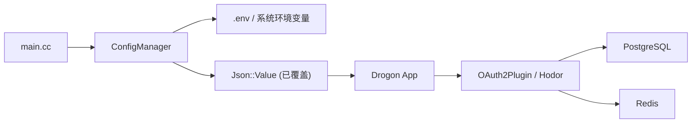

# 环境配置

<cite>
**本文引用的文件**
- [apps/server/config/config.json](file://apps/server/config/config.json)
- [apps/server/config/config.dev.json](file://apps/server/config/config.dev.json)
- [apps/server/config/config.prod.json](file://apps/server/config/config.prod.json)
- [deploy/env/server.env.example](file://deploy/env/server.env.example)
- [deploy/env/docker.env.example](file://deploy/env/docker.env.example)
- [docs/backend/configuration-guide.md](file://docs/backend/configuration-guide.md)
- [libs/common/src/config/ConfigManager.cc](file://libs/common/src/config/ConfigManager.cc)
- [libs/common/include/authforge/common/config/ConfigManager.h](file://libs/common/include/authforge/common/config/ConfigManager.h)
- [apps/server/src/main.cc](file://apps/server/src/main.cc)
- [scripts/generate-jwt-keys.sh](file://scripts/generate-jwt-keys.sh)
- [libs/oauth2/include/authforge/oauth2/jwk/JwkManager.h](file://libs/oauth2/include/authforge/oauth2/jwk/JwkManager.h)
- [tests/unit/config/EnvConfigTest.cc](file://tests/unit/config/EnvConfigTest.cc)
- [deploy/docker/docker-compose.prod.yml](file://deploy/docker/docker-compose.prod.yml)
- [docs/backend/security-hardening.md](file://docs/backend/security-hardening.md)
</cite>

## 目录
1. [简介](#简介)
2. [项目结构](#项目结构)
3. [核心组件](#核心组件)
4. [架构总览](#架构总览)
5. [详细组件分析](#详细组件分析)
6. [依赖关系分析](#依赖关系分析)
7. [性能与容量建议](#性能与容量建议)
8. [故障排查指南](#故障排查指南)
9. [结论](#结论)
10. [附录：各环境配置模板](#附录各环境配置模板)

## 简介
本指南面向部署与维护人员，提供 AuthForge 的完整环境配置说明。内容覆盖环境变量（server.env、docker.env）、配置文件层次与优先级、敏感信息管理（密钥轮换、隔离策略）、不同环境的配置示例、配置验证工具与错误排查方法，以及安全最佳实践。目标是帮助你在本地开发、测试和生产环境中快速、安全地启动并运行服务。

## 项目结构
AuthForge 的配置由“基础 JSON 配置 + 环境变量注入”组成：
- 基础配置：apps/server/config 下的 config.json（默认）、config.dev.json（开发）、config.prod.json（生产）
- 环境变量：deploy/env/server.env.example（本地/容器内通用）、deploy/env/docker.env.example（Docker Compose 专用）
- 加载机制：main.cc 调用 ConfigManager 加载 JSON 并应用环境变量覆盖，再交给 Drogon 使用

图表来源
- [apps/server/src/main.cc:75-95](file://apps/server/src/main.cc#L75-L95)
- [libs/common/src/config/ConfigManager.cc:126-136](file://libs/common/src/config/ConfigManager.cc#L126-L136)
- [docs/backend/configuration-guide.md:18-27](file://docs/backend/configuration-guide.md#L18-L27)

章节来源
- [apps/server/config/config.json:1-212](file://apps/server/config/config.json#L1-L212)
- [apps/server/config/config.dev.json:1-225](file://apps/server/config/config.dev.json#L1-L225)
- [apps/server/config/config.prod.json:1-264](file://apps/server/config/config.prod.json#L1-L264)
- [deploy/env/server.env.example:1-70](file://deploy/env/server.env.example#L1-L70)
- [deploy/env/docker.env.example:1-89](file://deploy/env/docker.env.example#L1-L89)
- [docs/backend/configuration-guide.md:1-85](file://docs/backend/configuration-guide.md#L1-L85)

## 核心组件
- 配置加载器：ConfigManager
  - 负责读取 JSON 配置、解析 .env、应用环境变量覆盖、类型安全的取值与校验
- 环境变量注入：OAUTH2_* 变量映射到 JSON 路径（如 db_clients[0].host）
- JWT 签名管理：JwkManager 支持从文件或环境变量加载 RSA 私钥，或回退为临时密钥
- 插件与扩展：OAuth2Plugin、Hodor（限流）、PromExporter（指标）

章节来源
- [libs/common/include/authforge/common/config/ConfigManager.h:11-32](file://libs/common/include/authforge/common/config/ConfigManager.h#L11-L32)
- [libs/common/src/config/ConfigManager.cc:13-124](file://libs/common/src/config/ConfigManager.cc#L13-L124)
- [libs/oauth2/include/authforge/oauth2/jwk/JwkManager.h:83-125](file://libs/oauth2/include/authforge/oauth2/jwk/JwkManager.h#L83-L125)

## 架构总览
下图展示了启动时配置加载与环境变量覆盖的关键流程，以及关键组件之间的交互。

图表来源
- [apps/server/src/main.cc:75-95](file://apps/server/src/main.cc#L75-L95)
- [libs/common/src/config/ConfigManager.cc:113-124](file://libs/common/src/config/ConfigManager.cc#L113-L124)
- [docs/backend/configuration-guide.md:18-27](file://docs/backend/configuration-guide.md#L18-L27)

## 详细组件分析

### 配置文件层次与优先级
- 基础配置（config.json）：包含监听器、数据库连接池、Redis 客户端、应用参数、插件、自定义配置等
- 开发配置（config.dev.json）：更宽松的日志、调试开关、较小的连接数、关闭部分压缩等
- 生产配置（config.prod.json）：更强的安全与性能设置（如 Hodor 限流、日志级别 INFO、启用 Brotli、复用端口等），并通过环境变量覆盖敏感项
- 环境变量优先级：.env 文件 > 系统环境变量 > config.json 默认值
- 环境变量覆盖范围：数据库、Redis、JWT 密钥、前端 URL、CORS、外部认证、SMTP、迁移开关、详细错误信息等

章节来源
- [apps/server/config/config.json:1-212](file://apps/server/config/config.json#L1-L212)
- [apps/server/config/config.dev.json:1-225](file://apps/server/config/config.dev.json#L1-L225)
- [apps/server/config/config.prod.json:1-264](file://apps/server/config/config.prod.json#L1-L264)
- [deploy/env/server.env.example:1-70](file://deploy/env/server.env.example#L1-L70)
- [deploy/env/docker.env.example:1-89](file://deploy/env/docker.env.example#L1-L89)
- [docs/backend/configuration-guide.md:1-27](file://docs/backend/configuration-guide.md#L1-L27)

### 环境变量详解（server.env / docker.env）
- 运行模式与 Issuer
  - OAUTH2_ENV：development/production；生产模式强制 HTTPS Issuer 与非默认密码
  - OAUTH2_ISSUER：发行者地址，生产必须 https://
- JWT 签名密钥
  - OAUTH2_JWT_KEY_PATH：RSA 私钥文件路径（推荐）
  - OAUTH2_SIGNING_KEY：PEM 私钥内容（二选一）
- 数据库（PostgreSQL）
  - OAUTH2_DB_HOST/OAUTH2_DB_PORT/OAUTH2_DB_NAME/OAUTH2_DB_USER/OAUTH2_DB_PASSWORD
- Redis
  - OAUTH2_REDIS_HOST/OAUTH2_REDIS_PORT/OAUTH2_REDIS_PASSWORD
- 服务与前端
  - OAUTH2_LISTEN_PORT：后端监听端口
  - OAUTH2_FRONTEND_URL：前端域名（用于 CORS、重定向）
- CORS 与 OAuth 回调
  - OAUTH2_CORS_ALLOW_ORIGINS：允许的浏览器源
  - OAUTH2_VUE_REDIRECT_URI、OAUTH2_GOOGLE_REDIRECT_URI：回调地址
- 迁移与错误信息
  - OAUTH2_AUTO_MIGRATE：是否自动执行迁移
  - DETAILED_VALIDATION_ERRORS：是否返回详细验证错误（生产建议 false）
- 客户端密钥
  - OAUTH2_VUE_CLIENT_SECRET：Vue 客户端密钥（机密型客户端）
- 邮件服务（SMTP）
  - OAUTH2_SMTP_HOST/PORT/USER/PASSWORD/FROM_NAME/SSL
- 第三方登录
  - OAUTH2_GITHUB_CLIENT_ID/SECRET、OAUTH2_GOOGLE_CLIENT_ID/SECRET
- Docker 构建期变量（仅前端）
  - VITE_API_BASE_URL、VITE_CLIENT_ID、VITE_REDIRECT_URI、VITE_GITHUB_CLIENT_ID

章节来源
- [deploy/env/server.env.example:1-70](file://deploy/env/server.env.example#L1-L70)
- [deploy/env/docker.env.example:1-89](file://deploy/env/docker.env.example#L1-L89)
- [docs/backend/configuration-guide.md:1-27](file://docs/backend/configuration-guide.md#L1-L27)

### 数据库与 Redis 配置
- 数据库连接
  - 通过 OAUTH2_DB_* 覆盖 db_clients[0] 的连接信息
  - 生产建议使用独立库名与强密码，合理设置 number_of_connections 与 timeout
- Redis 缓存
  - 通过 OAUTH2_REDIS_* 覆盖 redis_clients[0] 的连接信息
  - 生产建议启用密码保护，限制连接数与超时

章节来源
- [apps/server/config/config.json:9-39](file://apps/server/config/config.json#L9-L39)
- [apps/server/config/config.prod.json:9-39](file://apps/server/config/config.prod.json#L9-L39)
- [deploy/env/server.env.example:22-32](file://deploy/env/server.env.example#L22-L32)
- [deploy/env/docker.env.example:25-41](file://deploy/env/docker.env.example#L25-L41)

### JWT 密钥管理与轮换
- 密钥来源
  - 优先从 OAUTH2_JWT_KEY_PATH 读取 PEM 私钥
  - 其次从 OAUTH2_SIGNING_KEY 读取 PEM 内容
  - 若均不可用，则生成临时密钥（重启后失效，仅适合开发）
- 密钥生成
  - 使用 scripts/generate-jwt-keys.sh 生成 RSA-2048 密钥对
- 轮换策略
  - 生产环境应固定私钥路径并妥善保管
  - 轮换时更新 OAUTH2_JWT_KEY_PATH 指向新私钥；旧公钥仍可通过 JWKS 获取以验证历史 token
- 验证
  - JwkManager 在初始化时加载密钥并暴露 kid；signJwt/getJwks 保证一致性

章节来源
- [scripts/generate-jwt-keys.sh:1-27](file://scripts/generate-jwt-keys.sh#L1-L27)
- [libs/oauth2/include/authforge/oauth2/jwk/JwkManager.h:83-125](file://libs/oauth2/include/authforge/oauth2/jwk/JwkManager.h#L83-L125)
- [deploy/env/server.env.example:13-20](file://deploy/env/server.env.example#L13-L20)
- [deploy/env/docker.env.example:15-23](file://deploy/env/docker.env.example#L15-L23)

### 邮件服务（SMTP）配置
- 未配置 SMTP：邮件发送走控制台模式（仅输出日志）
- 配置 SMTP：设置 host/port/user/password/from_name/ssl
- 生产环境建议启用 SSL（端口 465）并使用授权码而非登录密码

章节来源
- [deploy/env/server.env.example:54-61](file://deploy/env/server.env.example#L54-L61)
- [deploy/env/docker.env.example:68-76](file://deploy/env/docker.env.example#L68-L76)

### 安全与限流（Hodor）
- 生产配置启用 Hodor 限流插件，针对登录、令牌、注册等接口进行细粒度限制
- 安全响应头：X-Content-Type-Options、X-Frame-Options、CSP、HSTS 等
- 建议：生产模式开启严格校验，关闭详细错误信息，限制 CORS 白名单

章节来源
- [apps/server/config/config.prod.json:141-188](file://apps/server/config/config.prod.json#L141-L188)
- [docs/backend/security-hardening.md:1-120](file://docs/backend/security-hardening.md#L1-L120)

## 依赖关系分析
- main.cc 负责启动流程与配置加载
- ConfigManager 负责 JSON 解析与 .env 合并
- 环境变量通过规则映射到 JSON 节点，最终被 Drogon 应用与插件消费
- 生产环境通过 docker-compose 将环境变量注入到后端容器，并挂载密钥卷

图表来源
- [apps/server/src/main.cc:75-95](file://apps/server/src/main.cc#L75-L95)
- [libs/common/src/config/ConfigManager.cc:126-136](file://libs/common/src/config/ConfigManager.cc#L126-L136)
- [deploy/docker/docker-compose.prod.yml:94-127](file://deploy/docker/docker-compose.prod.yml#L94-L127)

章节来源
- [apps/server/src/main.cc:75-113](file://apps/server/src/main.cc#L75-L113)
- [libs/common/src/config/ConfigManager.cc:13-124](file://libs/common/src/config/ConfigManager.cc#L13-L124)
- [deploy/docker/docker-compose.prod.yml:74-139](file://deploy/docker/docker-compose.prod.yml#L74-L139)

## 性能与容量建议
- 数据库连接池
  - 开发：较小连接数（如 5），长超时便于调试
  - 生产：适度连接数（如 4-10），设置合理的 timeout 与 statement_timeout
- Redis 连接池
  - 生产建议启用密码，限制连接数与超时，避免资源耗尽
- 压缩与静态资源
  - 生产启用 gzip/brotli，静态资源缓存时间适当延长
- 线程与并发
  - number_of_threads=0 表示使用 CPU 核数；根据负载调整 keepalive/pipelining
- 限流
  - 生产启用 Hodor，针对敏感接口设置更严格的 per-IP/per-user 限制

章节来源
- [apps/server/config/config.dev.json:10-39](file://apps/server/config/config.dev.json#L10-L39)
- [apps/server/config/config.prod.json:10-39](file://apps/server/config/config.prod.json#L10-L39)
- [apps/server/config/config.prod.json:101-131](file://apps/server/config/config.prod.json#L101-L131)
- [apps/server/config/config.prod.json:141-188](file://apps/server/config/config.prod.json#L141-L188)

## 故障排查指南
- 配置加载失败
  - 检查 config.json 是否存在且可解析
  - 查看 main.cc 中的加载与校验日志
- 环境变量未生效
  - 确认 .env 文件位置与键名正确
  - 使用 tests/unit/config/EnvConfigTest.cc 的思路验证覆盖结果
- 数据库/Redis 连接失败
  - 核对 OAUTH2_DB_* / OAUTH2_REDIS_* 与网络可达性
  - 检查密码与权限
- JWT 签名问题
  - 确认 OAUTH2_JWT_KEY_PATH 或 OAUTH2_SIGNING_KEY 有效
  - 使用 generate-jwt-keys.sh 重新生成密钥
- 生产模式启动失败
  - 确保 OAUTH2_ENV=production 时 OAUTH2_ISSUER 为 https://
  - 关闭详细错误信息（DETAILED_VALIDATION_ERRORS=false）

章节来源
- [apps/server/src/main.cc:75-95](file://apps/server/src/main.cc#L75-L95)
- [tests/unit/config/EnvConfigTest.cc:19-82](file://tests/unit/config/EnvConfigTest.cc#L19-L82)
- [scripts/generate-jwt-keys.sh:1-27](file://scripts/generate-jwt-keys.sh#L1-L27)
- [deploy/env/server.env.example:5-11](file://deploy/env/server.env.example#L5-L11)
- [deploy/env/docker.env.example:8-13](file://deploy/env/docker.env.example#L8-L13)

## 结论
AuthForge 采用“JSON 默认配置 + 环境变量覆盖”的分层配置模型，既保证了可移植性与安全性，又提供了灵活的部署能力。通过严格的生产模式校验、限流与安全头、以及完善的密钥管理机制，可在多环境下稳定运行。建议在生产中始终使用环境变量注入敏感信息，并定期轮换密钥、最小化权限与暴露面。

## 附录：各环境配置模板

### 本地开发（Docker Compose 开发）
- 复制 deploy/env/server.env.example 为 .env 并填写本地数据库、Redis、前端 URL、CORS、回调等
- 使用 docker-compose.yml 启动全栈；后端通过环境变量覆盖 config.json 默认值
- 如需调试，保持 DETAILED_VALIDATION_ERRORS=true，必要时开启详细日志

章节来源
- [deploy/env/server.env.example:1-70](file://deploy/env/server.env.example#L1-L70)
- [docs/backend/configuration-guide.md:29-57](file://docs/backend/configuration-guide.md#L29-L57)

### 测试环境
- 基于 config.dev.json 的宽松设置，但使用独立的测试数据库与 Redis
- 设置 OAUTH2_ENV=development，Issuer 可为 http://localhost:5555
- 启用必要的外部认证（GitHub/Google）用于集成测试

章节来源
- [apps/server/config/config.dev.json:1-225](file://apps/server/config/config.dev.json#L1-L225)
- [deploy/env/server.env.example:1-70](file://deploy/env/server.env.example#L1-L70)

### 生产环境（Docker Compose 生产）
- 复制 deploy/env/docker.env.example 为 .env.docker 并填写真实域名、密钥、数据库与 Redis 密码
- 使用 docker-compose.prod.yml 启动；后端通过 environment 注入所有敏感配置
- 确保 OAUTH2_ENV=production 且 OAUTH2_ISSUER=https://...；关闭详细错误信息
- 挂载密钥卷 ../../deploy/keys 到 /app/keys:ro，并设置 OAUTH2_JWT_KEY_PATH=/app/keys/signing.pem

章节来源
- [deploy/env/docker.env.example:1-89](file://deploy/env/docker.env.example#L1-L89)
- [deploy/docker/docker-compose.prod.yml:74-139](file://deploy/docker/docker-compose.prod.yml#L74-L139)
- [docs/backend/configuration-guide.md:55-57](file://docs/backend/configuration-guide.md#L55-L57)