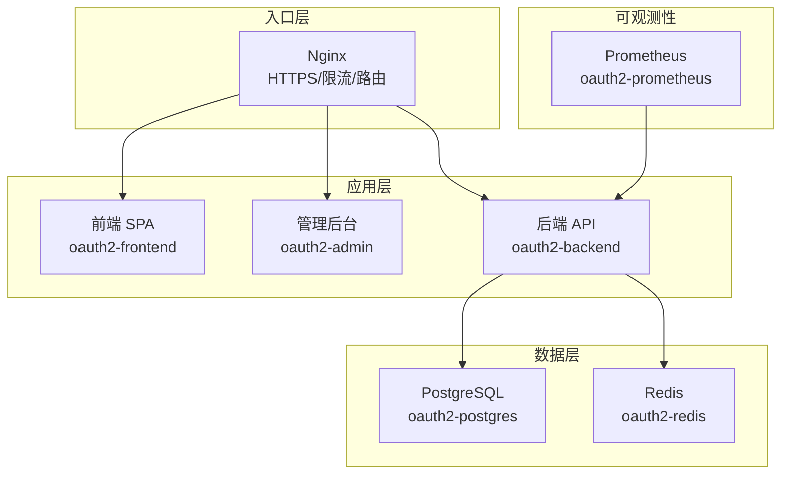
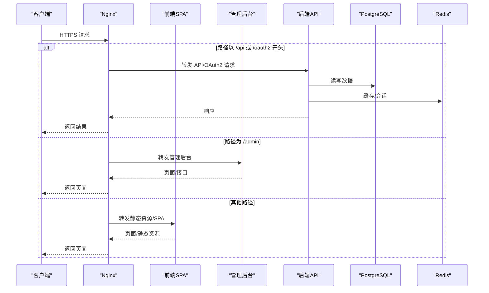
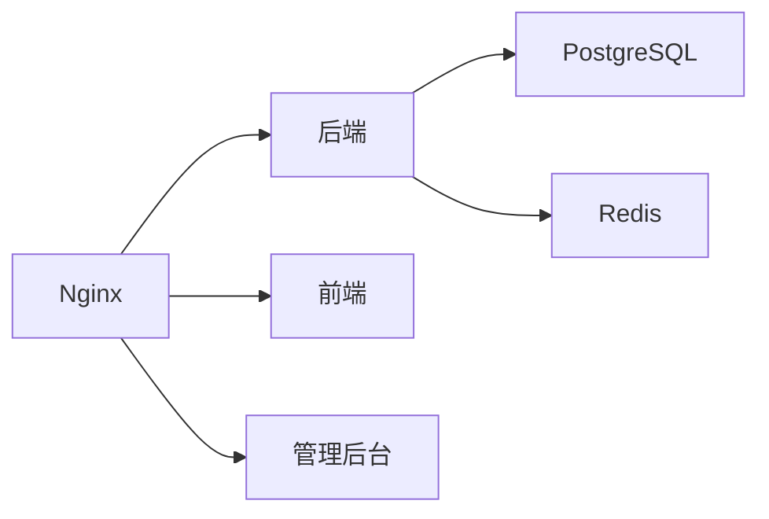

# 部署指南

<cite>
**本文引用的文件**
- [docker-compose.yml](file://deploy/docker/docker-compose.yml)
- [docker-compose.prod.yml](file://deploy/docker/docker-compose.prod.yml)
- [nginx.conf](file://deploy/nginx/nginx.conf)
- [server.env.example](file://deploy/env/server.env.example)
- [docker.env.example](file://deploy/env/docker.env.example)
- [values.yaml](file://deploy/helm/authforge/values.yaml)
- [Chart.yaml](file://deploy/helm/authforge/Chart.yaml)
- [backend.yaml](file://deploy/helm/authforge/templates/backend.yaml)
- [ingress.yaml](file://deploy/helm/authforge/templates/ingress.yaml)
- [configmap.yaml](file://deploy/helm/authforge/templates/configmap.yaml)
- [deployment-windows-docker-desktop.md](file://docs/ops/deployment-windows-docker-desktop.md)
- [docker-deployment.md](file://docs/backend/docker-deployment.md)
</cite>

## 目录
1. [简介](#简介)
2. [项目结构](#项目结构)
3. [核心组件](#核心组件)
4. [架构总览](#架构总览)
5. [详细组件分析](#详细组件分析)
6. [依赖关系分析](#依赖关系分析)
7. [性能考虑](#性能考虑)
8. [故障排查指南](#故障排查指南)
9. [结论](#结论)
10. [附录](#附录)

## 简介
本指南面向运维与平台工程师，提供 AuthForge 在多种环境下的完整部署说明，包括：
- Docker Compose（开发、生产）
- Kubernetes Helm Chart（含 Ingress、资源限制、服务发现）
- Nginx 反向代理（SSL、静态资源、限流、负载均衡）
- 环境变量与敏感信息管理（数据库、Redis、JWT、SMTP、第三方登录）
- Windows Docker Desktop 部署与验证
- 生产安全加固与性能调优建议
- 部署验证与健康检查方法

## 项目结构
AuthForge 的部署相关资产集中在 deploy 目录，包含：
- docker：Docker Compose 编排（开发/生产）、镜像构建目标、健康检查
- nginx：Nginx 反向代理配置（HTTPS、限流、路径路由）
- helm：Helm Chart（后端、前端、管理后台、迁移 Job、Ingress、Secret/ConfigMap）
- env：环境变量模板（服务器直启与 Docker Compose 生产）

图表来源
- [docker-compose.yml:1-127](file://deploy/docker/docker-compose.yml#L1-L127)
- [docker-compose.prod.yml:13-221](file://deploy/docker/docker-compose.prod.yml#L13-L221)
- [nginx.conf:1-116](file://deploy/nginx/nginx.conf#L1-L116)

章节来源
- [docker-compose.yml:1-127](file://deploy/docker/docker-compose.yml#L1-L127)
- [docker-compose.prod.yml:13-221](file://deploy/docker/docker-compose.prod.yml#L13-L221)
- [nginx.conf:1-116](file://deploy/nginx/nginx.conf#L1-L116)

## 核心组件
- 后端服务（oauth2-backend）：OAuth2/OIDC 认证授权核心，暴露 /api、/oauth2、/.well-known、/health、/metrics 等端点。
- 前端 SPA（oauth2-frontend）：用户侧单页应用，通过 Nginx 或 Ingress 暴露。
- 管理后台（oauth2-admin）：管理员控制台，通常挂载于 /admin。
- 数据库（PostgreSQL）：持久化存储，支持迁移与种子数据。
- 缓存（Redis）：会话、令牌、速率限制等缓存能力。
- 监控（Prometheus）：采集后端指标。
- 反向代理（Nginx）：统一入口、TLS 终结、限流、静态资源与路由转发。

章节来源
- [docker-compose.yml:30-66](file://deploy/docker/docker-compose.yml#L30-L66)
- [docker-compose.prod.yml:74-139](file://deploy/docker/docker-compose.prod.yml#L74-L139)
- [nginx.conf:28-113](file://deploy/nginx/nginx.conf#L28-L113)

## 架构总览
下图展示了生产环境下请求从 Nginx 进入，按路径分发到后端、前端与管理后台，并访问数据库与 Redis 的整体流程。

图表来源
- [nginx.conf:57-113](file://deploy/nginx/nginx.conf#L57-L113)
- [docker-compose.prod.yml:13-32](file://deploy/docker/docker-compose.prod.yml#L13-L32)

## 详细组件分析

### Docker Compose 部署（开发/生产）
- 开发环境
  - 使用默认 compose 文件启动前后端、数据库、Redis、Prometheus。
  - 端口映射：前端 8080、管理后台 8081、后端 5555、数据库 5433、Redis 6380、Prometheus 9090。
  - 环境变量通过 environment 注入，支持 SMTP 可选配置；自动迁移开启便于快速体验。
- 生产环境
  - 使用生产 compose 文件，引入 Nginx 作为统一入口，启用 HTTPS。
  - 后端通过 healthcheck 探测 /health，确保依赖就绪后再对外提供服务。
  - 提供一次性迁移 Job（profile migrate），避免应用启动时执行迁移。
  - 资源限制：对前端、后端、管理后台设置 CPU/内存限制。
  - 外部依赖：PostgreSQL/Redis 可通过环境变量配置，支持外部实例。

关键要点
- 敏感信息通过 .env.docker 注入，不直接写入 compose 文件。
- 生产环境要求 OAUTH2_ENV=production 且 OAUTH2_ISSUER 为 https。
- JWT 密钥通过卷挂载到 /app/keys，保证重启后签名一致性。

章节来源
- [docker-compose.yml:1-127](file://deploy/docker/docker-compose.yml#L1-L127)
- [docker-compose.prod.yml:1-221](file://deploy/docker/docker-compose.prod.yml#L1-L221)
- [docker-deployment.md:49-137](file://docs/backend/docker-deployment.md#L49-L137)

### Kubernetes Helm Chart 部署
- Chart 组成
  - 后端 Deployment + Service（含固定别名 oauth2-backend，兼容前端硬编码）。
  - 前端与服务发现 Service。
  - 管理后台 Service。
  - Ingress（可选）：将 /api、/oauth2、/.well-known、/health、/metrics 指向后端；/admin 指向管理后台；其余指向前端。
  - ConfigMap/Secret：集中管理非敏感与敏感配置。
  - 迁移 Job：安装/升级前执行 schema 迁移。
  - 内置 PostgreSQL/Redis（本地/演示用），生产建议使用外部数据库/缓存。
- 资源配置
  - 通过 values.yaml 控制副本数、资源请求/限制、Ingress 主机名与 TLS。
  - 敏感项（DB/Redis/客户端密钥/SMTP 密码）通过 secrets 或 existingSecret 注入。
- 服务发现
  - 后端 Service 名称同时生成命名空间内唯一名称与固定别名，确保前端/管理后台可解析。

章节来源
- [values.yaml:1-145](file://deploy/helm/authforge/values.yaml#L1-L145)
- [Chart.yaml:1-17](file://deploy/helm/authforge/Chart.yaml#L1-L17)
- [backend.yaml:1-114](file://deploy/helm/authforge/templates/backend.yaml#L1-L114)
- [ingress.yaml:1-52](file://deploy/helm/authforge/templates/ingress.yaml#L1-L52)
- [configmap.yaml:1-9](file://deploy/helm/authforge/templates/configmap.yaml#L1-L9)

### Nginx 反向代理配置
- 功能
  - HTTP 强制跳转 HTTPS。
  - 基于路径的路由：/api、/oauth2、/.well-known、/health、/metrics 转发至后端；/admin 转发至管理后台；其余转发至前端。
  - 限流：登录与 API 分别定义不同速率与突发策略。
  - 安全头：X-Content-Type-Options、X-Frame-Options、Referrer-Policy、HSTS。
  - 静态资源：前端 SPA 由上游容器托管，Nginx 负责路由与压缩。
- SSL/TLS
  - 证书与私钥通过卷挂载到 /etc/nginx/ssl。
  - 仅启用 TLSv1.2/1.3，禁用不安全套件，启用会话缓存与超时优化。
- 监控暴露
  - /metrics 仅允许内网访问（10.0.0.0/8、172.16.0.0/12），拒绝其他来源。

章节来源
- [nginx.conf:1-116](file://deploy/nginx/nginx.conf#L1-L116)

### 环境变量与敏感信息管理
- 服务器直启（本地/裸机）
  - 参考 server.env.example，覆盖 config.json 默认值。
  - 关键字段：运行模式、Issuer、JWT 密钥路径或内联密钥、数据库连接、Redis 连接、监听端口、前端 URL、CORS、Vue 重定向 URI、迁移开关、错误详情开关、SMTP、第三方登录。
- Docker Compose 生产
  - 参考 docker.env.example，所有 OAUTH2_* 透传到后端；VITE_* 作为构建参数注入前端镜像。
  - 生产必须设置强密码（DB/Redis/客户端密钥），并确保 Issuer 为 https。
- 敏感信息最佳实践
  - 禁止将明文密码提交到版本库；使用 .env 文件或外部密钥管理。
  - Helm 中通过 Secret 或 existingSecret 注入敏感键。
  - 生产环境关闭详细验证错误输出，避免泄露字段级提示。

章节来源
- [server.env.example:1-70](file://deploy/env/server.env.example#L1-L70)
- [docker.env.example:1-89](file://deploy/env/docker.env.example#L1-L89)
- [values.yaml:83-95](file://deploy/helm/authforge/values.yaml#L83-L95)

### Windows Docker Desktop 部署
- 前置条件
  - Windows 10/11 专业版/企业版，启用 WSL2 或 Hyper-V。
  - 安装 Docker Desktop、Git，可选 OpenSSL。
- 快速步骤
  - 克隆仓库、生成 JWT 密钥（或使用脚本）、复制并编辑 .env.docker。
  - 使用开发 compose 启动服务，或通过自定义 compose 简化 TLS。
  - 验证容器状态、后端健康、数据库迁移、前端与管理后台访问。
  - 执行端点测试脚本（推荐 Git Bash），确认 OAuth2 与管理后台 API。
- 常见问题
  - Docker 守护进程不可用、端口冲突、数据库连接失败、构建失败、Windows 路径问题等均有对应排查步骤。

章节来源
- [deployment-windows-docker-desktop.md:1-800](file://docs/ops/deployment-windows-docker-desktop.md#L1-L800)

## 依赖关系分析
- 运行时依赖
  - 后端依赖 PostgreSQL 与 Redis，Compose 中通过 depends_on 与 healthcheck 保障启动顺序。
  - Nginx 依赖后端、前端、管理后台就绪。
- 配置依赖
  - 环境变量优先级：.env > 系统环境变量 > 配置文件默认值。
  - Helm 中 ConfigMap/Secret 渲染为 Pod 环境变量或卷挂载。
- 网络拓扑
  - Docker 网络 oauth2-net 隔离内部通信。
  - K8s 通过 Service 与 Ingress 暴露服务。

图表来源
- [docker-compose.yml:30-66](file://deploy/docker/docker-compose.yml#L30-L66)
- [docker-compose.prod.yml:13-32](file://deploy/docker/docker-compose.prod.yml#L13-L32)
- [nginx.conf:28-113](file://deploy/nginx/nginx.conf#L28-L113)

章节来源
- [docker-compose.yml:30-66](file://deploy/docker/docker-compose.yml#L30-L66)
- [docker-compose.prod.yml:74-139](file://deploy/docker/docker-compose.prod.yml#L74-L139)
- [nginx.conf:28-113](file://deploy/nginx/nginx.conf#L28-L113)

## 性能考虑
- Nginx
  - 启用 gzip、keepalive、sendfile、tcp_nopush。
  - 针对登录与 API 路径实施独立限流策略，防止暴力破解与滥用。
  - 仅暴露必要端点到公网，/metrics 限制内网访问。
- 后端
  - 生产环境合理设置数据库连接池大小（参考文档建议调整至 10-50，视并发而定）。
  - 使用固定 JWT 密钥避免重启导致令牌失效。
  - 关闭详细验证错误，减少日志体积与潜在信息泄露。
- 资源限制
  - Helm/Compose 中为各组件设置 requests/limits，避免资源争抢。
- 监控
  - Prometheus 采集 /metrics，结合告警规则识别异常峰值。

章节来源
- [nginx.conf:17-26](file://deploy/nginx/nginx.conf#L17-L26)
- [docker-deployment.md:197-200](file://docs/backend/docker-deployment.md#L197-L200)
- [docker-compose.prod.yml:49-89](file://deploy/docker/docker-compose.prod.yml#L49-L89)

## 故障排查指南
- 服务健康检查
  - 后端健康端点：/health（Compose 与 K8s 均使用）。
  - Liveness/Readiness：K8s 中分别探测 /health/live 与 /health/ready。
- 常见症状与处理
  - 容器无法启动：检查端口占用、环境变量、卷挂载权限。
  - 数据库连接失败：确认 Postgres 容器健康、账号密码一致、网络连通。
  - Redis 认证失败：核对 REDIS_PASSWORD 与 OAUTH2_REDIS_PASSWORD。
  - 构建失败：清理构建缓存、检查磁盘空间与镜像源。
  - Windows 路径问题：使用 Git Bash 或 WSL2 执行命令。
- 日志与诊断
  - 查看后端日志定位启动错误与迁移问题。
  - 通过 Prometheus 观察指标趋势，辅助定位瓶颈。

章节来源
- [docker-compose.prod.yml:132-137](file://deploy/docker/docker-compose.prod.yml#L132-L137)
- [backend.yaml:42-57](file://deploy/helm/authforge/templates/backend.yaml#L42-L57)
- [deployment-windows-docker-desktop.md:626-709](file://docs/ops/deployment-windows-docker-desktop.md#L626-L709)

## 结论
AuthForge 提供了完善的容器化与云原生部署方案：
- Docker Compose 适合开发与快速验证，生产推荐使用带 Nginx 的生产编排。
- Helm Chart 提供一致的发布模型，支持 Ingress、资源限制与迁移 Job。
- Nginx 作为统一入口，实现 HTTPS、限流与安全头。
- 环境变量与密钥管理遵循最小权限与外置原则，保障生产安全。
- 通过健康检查与监控，确保可观测性与稳定性。

## 附录

### 环境变量速查（节选）
- 运行模式与发行者
  - OAUTH2_ENV、OAUTH2_ISSUER
- JWT 密钥
  - OAUTH2_JWT_KEY_PATH 或 OAUTH2_SIGNING_KEY
- 数据库
  - OAUTH2_DB_HOST、OAUTH2_DB_PORT、OAUTH2_DB_NAME、OAUTH2_DB_USER、OAUTH2_DB_PASSWORD
- Redis
  - OAUTH2_REDIS_HOST、OAUTH2_REDIS_PORT、OAUTH2_REDIS_PASSWORD
- 服务与前端
  - OAUTH2_LISTEN_PORT、OAUTH2_FRONTEND_URL
- CORS 与重定向
  - OAUTH2_CORS_ALLOW_ORIGINS、OAUTH2_VUE_REDIRECT_URI、OAUTH2_GOOGLE_REDIRECT_URI
- 迁移与错误
  - OAUTH2_AUTO_MIGRATE、DETAILED_VALIDATION_ERRORS
- 客户端密钥
  - OAUTH2_VUE_CLIENT_SECRET
- 邮件
  - OAUTH2_SMTP_HOST、OAUTH2_SMTP_PORT、OAUTH2_SMTP_USER、OAUTH2_SMTP_PASSWORD、OAUTH2_SMTP_FROM_NAME、OAUTH2_SMTP_SSL
- 第三方登录
  - OAUTH2_GITHUB_CLIENT_ID/SECRET、OAUTH2_GOOGLE_CLIENT_ID/SECRET

章节来源
- [server.env.example:1-70](file://deploy/env/server.env.example#L1-L70)
- [docker.env.example:1-89](file://deploy/env/docker.env.example#L1-L89)

### 部署验证清单
- 容器状态：全部 Up
- 后端健康：curl http://localhost:5555/health 返回正常
- 数据库表：psql 查看已创建 OAuth2 相关表
- 前端与管理后台：浏览器访问 8080/8081 成功加载
- 端点测试：执行 OAuth2 与管理后台测试脚本，通过率达标
- Prometheus：http://localhost:9090 可访问并抓取指标

章节来源
- [deployment-windows-docker-desktop.md:250-353](file://docs/ops/deployment-windows-docker-desktop.md#L250-L353)
- [docker-deployment.md:203-222](file://docs/backend/docker-deployment.md#L203-L222)