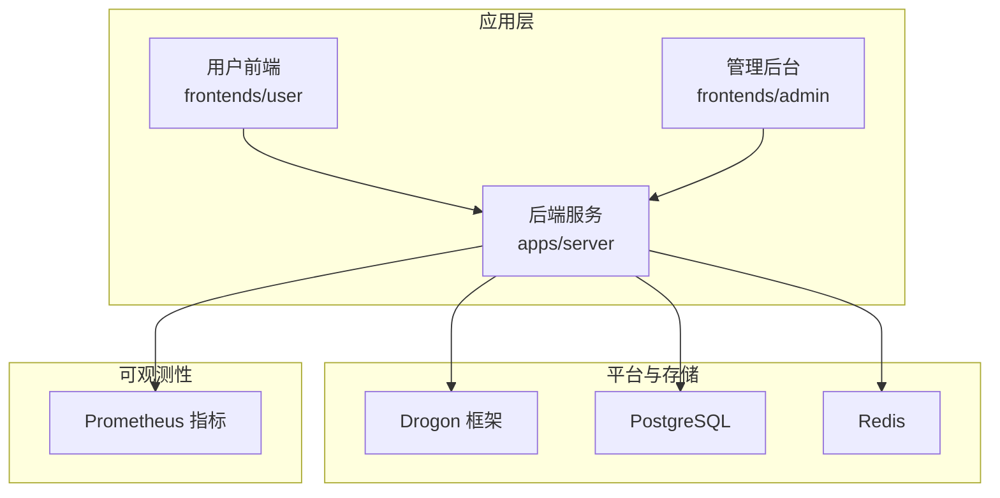
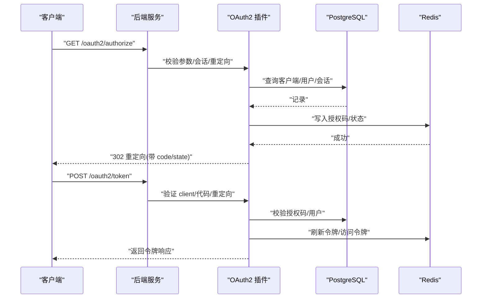
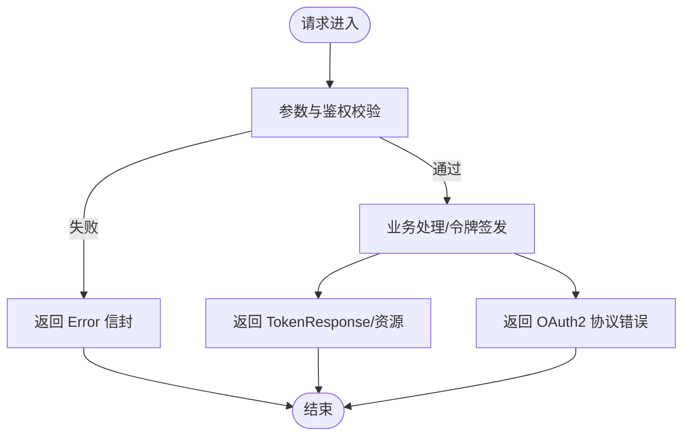
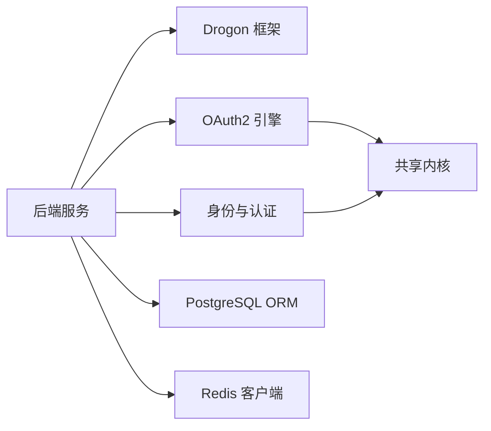

# 附录

<cite>
**本文引用的文件**
- [apps/server/config/config.json](file://apps/server/config/config.json)
- [deploy/env/server.env.example](file://deploy/env/server.env.example)
- [deploy/env/docker.env.example](file://deploy/env/docker.env.example)
- [deploy/helm/authforge/values.yaml](file://deploy/helm/authforge/values.yaml)
- [apps/server/openapi.yaml](file://apps/server/openapi.yaml)
- [apps/server/docs/api/openapi.json](file://apps/server/docs/api/openapi.json)
- [docs/backend/configuration-guide.md](file://docs/backend/configuration-guide.md)
- [docs/backend/api-reference.md](file://docs/backend/api-reference.md)
- [conanfile.py](file://conanfile.py)
- [CMakeLists.txt](file://CMakeLists.txt)
- [libs/common/src/error/ErrorCatalog.cc](file://libs/common/src/error/ErrorCatalog.cc)
- [libs/drogon/include/authforge/drogon/error/ErrorHandler.h](file://libs/drogon/include/authforge/drogon/error/ErrorHandler.h)
- [tests/performance/benchmark/PerformanceBenchmark.cc](file://tests/performance/benchmark/PerformanceBenchmark.cc)
- [README.zh-CN.md](file://README.zh-CN.md)
</cite>

## 目录
1. [简介](#简介)
2. [项目结构](#项目结构)
3. [核心组件](#核心组件)
4. [架构总览](#架构总览)
5. [详细组件分析](#详细组件分析)
6. [依赖关系分析](#依赖关系分析)
7. [性能考量](#性能考量)
8. [故障排除指南](#故障排除指南)
9. [结论](#结论)
10. [附录](#附录)

## 简介
本附录为 AuthForge 的完整参考文档，覆盖配置项、API 规范、术语表、版本兼容与升级路径、第三方依赖与许可证、故障排除案例以及性能基准与优化建议。读者可据此快速完成部署、集成与运维排障。

## 项目结构
AuthForge 采用分层与模块化组织：后端服务基于 Drogon 框架，OAuth2/OIDC 能力通过插件化方式提供；前端包含用户端与管理后台；部署支持 Docker Compose 与 Helm；测试与基准覆盖单元、集成与性能场景。

图表来源
- [CMakeLists.txt:72-95](file://CMakeLists.txt#L72-L95)
- [README.zh-CN.md:31-67](file://README.zh-CN.md#L31-L67)

章节来源
- [CMakeLists.txt:72-95](file://CMakeLists.txt#L72-L95)
- [README.zh-CN.md:31-67](file://README.zh-CN.md#L31-L67)

## 核心组件
- 配置加载与环境变量注入：启动时读取 config.json，并通过环境变量覆盖关键配置（数据库、Redis、监听端口、前端 URL、CORS、迁移开关等）。
- OAuth2/OIDC 插件：负责授权码、令牌签发、发现元数据、JWKS、设备码、刷新令牌等流程。
- 存储适配层：PostgreSQL（持久化）、Redis（缓存与会话）、内存（开发/测试）。
- 管理 API 与用户自助 API：RBAC 保护的管理接口与用户自我服务接口。
- 可观测性：Prometheus 指标导出、审计日志、结构化错误响应。

章节来源
- [docs/backend/configuration-guide.md:1-58](file://docs/backend/configuration-guide.md#L1-L58)
- [apps/server/config/config.json:1-212](file://apps/server/config/config.json#L1-L212)

## 架构总览
下图展示请求从客户端到后端控制器、OAuth2 插件、存储层的调用链路与数据流。

图表来源
- [apps/server/openapi.yaml:41-120](file://apps/server/openapi.yaml#L41-L120)
- [apps/server/docs/api/openapi.json:79-141](file://apps/server/docs/api/openapi.json#L79-L141)

## 详细组件分析

### 配置系统与环境变量
- 配置文件：位于 apps/server/config/config.json，包含监听器、数据库连接池、Redis 连接、应用运行时选项、插件配置（OAuth2Plugin）与自定义配置（RBAC、CORS、前端 URL、外部认证）。
- 环境变量：通过 server.env.example 与 docker.env.example 提供，优先级高于配置文件，用于注入敏感信息与运行期差异配置。
- Helm 值：values.yaml 提供 Kubernetes 部署时的默认值与密钥注入策略。

章节来源
- [apps/server/config/config.json:1-212](file://apps/server/config/config.json#L1-L212)
- [deploy/env/server.env.example:1-70](file://deploy/env/server.env.example#L1-L70)
- [deploy/env/docker.env.example:1-89](file://deploy/env/docker.env.example#L1-L89)
- [deploy/helm/authforge/values.yaml:1-145](file://deploy/helm/authforge/values.yaml#L1-L145)
- [docs/backend/configuration-guide.md:1-58](file://docs/backend/configuration-guide.md#L1-L58)

### API 规范与错误格式
- OpenAPI 定义：apps/server/openapi.yaml 与 docs/api/openapi.json 描述所有 REST 端点、安全方案与响应模型。
- 统一错误信封：Error 模型包含 category、code、details、message、request_id。
- 应用错误码：按类别划分（网络、数据库、校验、认证、授权、内部），并映射 HTTP 状态码。
- OAuth2 协议错误码：遵循 RFC 6749/7009/8628，返回 error、error_description、error_uri。

图表来源
- [apps/server/openapi.yaml:1-40](file://apps/server/openapi.yaml#L1-L40)
- [apps/server/docs/api/openapi.json:1-71](file://apps/server/docs/api/openapi.json#L1-L71)
- [docs/backend/api-reference.md:218-283](file://docs/backend/api-reference.md#L218-L283)

章节来源
- [apps/server/openapi.yaml:1-800](file://apps/server/openapi.yaml#L1-L800)
- [apps/server/docs/api/openapi.json:1-800](file://apps/server/docs/api/openapi.json#L1-L800)
- [docs/backend/api-reference.md:1-312](file://docs/backend/api-reference.md#L1-L312)
- [libs/common/src/error/ErrorCatalog.cc:212-242](file://libs/common/src/error/ErrorCatalog.cc#L212-L242)

### 错误处理与异常封装
- 错误分类与消息：ErrorCatalog 集中维护应用错误码与 OAuth2 协议错误码，确保前后端一致。
- 异常处理器：ErrorHandler 提供数据库异常、校验异常的标准化处理与日志记录。

章节来源
- [libs/common/src/error/ErrorCatalog.cc:212-242](file://libs/common/src/error/ErrorCatalog.cc#L212-L242)
- [libs/drogon/include/authforge/drogon/error/ErrorHandler.h:1-32](file://libs/drogon/include/authforge/drogon/error/ErrorHandler.h#L1-L32)

### 部署与容器化
- Docker Compose：一键拉起后端、前端、管理后台、PostgreSQL、Redis、Prometheus。
- Helm Chart：提供生产级部署模板，支持密钥注入、迁移 Job、Ingress 与资源限制。
- 环境变量注入：在容器内通过 .env 或编排环境注入，覆盖配置文件中的敏感项。

章节来源
- [docs/backend/configuration-guide.md:29-58](file://docs/backend/configuration-guide.md#L29-L58)
- [deploy/env/docker.env.example:1-89](file://deploy/env/docker.env.example#L1-L89)
- [deploy/helm/authforge/values.yaml:1-145](file://deploy/helm/authforge/values.yaml#L1-L145)

## 依赖关系分析
- 构建与依赖管理：Conan 统一管理 C++ 依赖，固定 Drogon、OpenSSL、jsoncpp、hiredis、libcurl、brotli、zlib 等版本。
- 模块依赖：Domain 层（oauth2、identity）不依赖框架层（drogon），由 CI 的 arch-guard 强制约束。
- 可选特性：with_identity、with_social、with_webauthn 控制编译范围，收缩依赖面。

图表来源
- [conanfile.py:27-83](file://conanfile.py#L27-L83)
- [CMakeLists.txt:72-95](file://CMakeLists.txt#L72-L95)
- [README.zh-CN.md:31-67](file://README.zh-CN.md#L31-L67)

章节来源
- [conanfile.py:1-83](file://conanfile.py#L1-L83)
- [CMakeLists.txt:72-95](file://CMakeLists.txt#L72-L95)
- [README.zh-CN.md:31-67](file://README.zh-CN.md#L31-L67)

## 性能考量
- 基准测试：Subject 生成与解析的性能压测，统计平均延迟与 P95 延迟，确保满足低开销要求。
- 目标性能：在高并发下保持稳定的延迟与吞吐，结合缓存命中率与 Redis 操作时延优化整体性能。
- 优化建议：
  - 合理设置连接池大小与超时，避免数据库与 Redis 成为瓶颈。
  - 启用压缩与静态资源缓存，降低带宽与 I/O 压力。
  - 使用 Prometheus 监控关键指标（QPS、延迟、错误率、缓存命中率）。

章节来源
- [tests/performance/benchmark/PerformanceBenchmark.cc:1-78](file://tests/performance/benchmark/PerformanceBenchmark.cc#L1-L78)
- [apps/server/config/config.json:102-131](file://apps/server/config/config.json#L102-L131)

## 故障排除指南
- 启动失败：检查 OAUTH2_ENV 与 OAUTH2_ISSUER 是否匹配（生产模式需 HTTPS Issuer）。
- 数据库连接失败：确认 OAUTH2_DB_* 环境变量与 PostgreSQL 服务可达。
- Redis 连接失败：确认 OAUTH2_REDIS_* 环境变量与 Redis 服务可达。
- CORS 与重定向错误：核对 OAUTH2_CORS_ALLOW_ORIGINS 与 OAUTH2_VUE_REDIRECT_URI。
- 邮件发送失败：检查 SMTP 相关环境变量，未设置时走控制台模式。
- 权限不足：确认 RBAC 规则与角色分配，必要时重置管理员密码。

章节来源
- [deploy/env/server.env.example:1-70](file://deploy/env/server.env.example#L1-L70)
- [deploy/env/docker.env.example:1-89](file://deploy/env/docker.env.example#L1-L89)
- [apps/server/config/config.json:172-210](file://apps/server/config/config.json#L172-L210)

## 结论
本附录提供了 AuthForge 的配置、API、术语、依赖、部署与排障的完整参考。建议在生产环境中严格使用环境变量管理敏感信息，结合 Helm 与 Docker Compose 进行部署，并通过 Prometheus 与审计日志实现可观测性。

## 附录

### 配置项参考
- 监听器：address、port、https
- 数据库客户端：name、rdbms、host、port、dbname、user、passwd、number_of_connections、timeout、auto_batch、connect_options
- Redis 客户端：name、host、port、username、passwd、db、number_of_connections、timeout
- 应用运行时：线程数、会话、静态资源、日志、压缩、连接数、请求体大小等
- 插件配置：OAuth2Plugin 的 storage_type、redis/postgres 客户端名、clients、admin_users、tokens TTL、清理间隔
- 自定义配置：RBAC 规则、CORS、前端 URL、外部认证（GitHub/Google/微信）

章节来源
- [apps/server/config/config.json:1-212](file://apps/server/config/config.json#L1-L212)

### 环境变量清单
- 运行模式与 Issuer：OAUTH2_ENV、OAUTH2_ISSUER
- JWT 签名密钥：OAUTH2_JWT_KEY_PATH、OAUTH2_SIGNING_KEY
- 数据库：OAUTH2_DB_HOST、OAUTH2_DB_PORT、OAUTH2_DB_NAME、OAUTH2_DB_USER、OAUTH2_DB_PASSWORD
- Redis：OAUTH2_REDIS_HOST、OAUTH2_REDIS_PORT、OAUTH2_REDIS_PASSWORD
- 服务器：OAUTH2_LISTEN_PORT
- 前端与 CORS：OAUTH2_FRONTEND_URL、OAUTH2_CORS_ALLOW_ORIGINS、OAUTH2_VUE_REDIRECT_URI、OAUTH2_GOOGLE_REDIRECT_URI
- 迁移与错误：OAUTH2_AUTO_MIGRATE、DETAILED_VALIDATION_ERRORS
- Vue 客户端密钥：OAUTH2_VUE_CLIENT_SECRET
- 邮件 SMTP：OAUTH2_SMTP_HOST、OAUTH2_SMTP_PORT、OAUTH2_SMTP_USER、OAUTH2_SMTP_PASSWORD、OAUTH2_SMTP_FROM_NAME、OAUTH2_SMTP_SSL
- 外部认证：OAUTH2_GITHUB_CLIENT_ID、OAUTH2_GITHUB_CLIENT_SECRET、OAUTH2_GOOGLE_CLIENT_ID、OAUTH2_GOOGLE_CLIENT_SECRET

章节来源
- [deploy/env/server.env.example:1-70](file://deploy/env/server.env.example#L1-L70)
- [deploy/env/docker.env.example:1-89](file://deploy/env/docker.env.example#L1-L89)

### API 规范参考
- 发现与 JWKS：/.well-known/openid-configuration、/.well-known/jwks.json
- 管理 API：/api/admin/*（客户端、角色、作用域、令牌、用户、日志、仪表盘）
- 用户自助：/api/user/*（个人资料、密码修改、会话管理）
- 辅助接口：/api/password-reset、/api/email/verify、/api/mfa、/api/wechat/login、/google/login
- 安全方案：Bearer Token、OAuth2 Client Credentials（Basic 或 POST body）

章节来源
- [apps/server/openapi.yaml:41-800](file://apps/server/openapi.yaml#L41-L800)
- [apps/server/docs/api/openapi.json:79-800](file://apps/server/docs/api/openapi.json#L79-L800)

### 错误码与响应格式
- 应用错误码：NETWORK、DATABASE、VALIDATION、AUTHENTICATION、AUTHORIZATION、INTERNAL，映射 HTTP 状态码
- OAuth2 协议错误码：invalid_request、invalid_client、invalid_grant、unauthorized_client、unsupported_grant_type、invalid_scope、server_error、temporarily_unavailable、access_denied、unsupported_token_type、authorization_pending、slow_down、expired_token
- 响应格式：Error Envelope（category、code、details、message、request_id）；TokenResponse（access_token、token_type、expires_in、refresh_token）

章节来源
- [docs/backend/api-reference.md:218-283](file://docs/backend/api-reference.md#L218-L283)
- [libs/common/src/error/ErrorCatalog.cc:212-242](file://libs/common/src/error/ErrorCatalog.cc#L212-L242)
- [apps/server/openapi.yaml:1-40](file://apps/server/openapi.yaml#L1-L40)

### 术语表
- OAuth2：开放授权标准，定义授权码、隐式、密码、客户端凭证、刷新令牌等授权类型
- OIDC：基于 OAuth2 的身份层，扩展 id_token、UserInfo、Discovery、JWKS 等
- Access Token：访问资源的短期凭证
- Refresh Token：换取新 Access Token 的长期凭证
- Scope：权限范围，限定令牌可访问的资源与操作
- Client ID/Secret：客户端标识与密钥，用于客户端认证
- JWK/JWKS：JSON Web Key/集合，用于公钥分发与令牌验证
- RBAC：基于角色的访问控制，通过角色与权限管理资源访问
- MFA：多因素认证，增强登录安全性
- Device Code：设备授权流程，适用于无浏览器输入的设备
- Backchannel Logout：服务端发起的登出通知机制

### 版本兼容性与升级路径
- 数据库迁移：migrations/V*.sql 按序执行，确保 schema 演进一致性
- 环境变量变更：新增或废弃变量需在示例文件中同步更新，并在 Helm values.yaml 中提供默认值
- 依赖升级：通过 Conan 锁定版本，升级前评估兼容性并回归测试
- 前端构建：VITE_* 变量在构建时内联，生产环境不应设置 VITE_API_BASE_URL

章节来源
- [apps/server/migrations](file://apps/server/migrations)
- [deploy/env/docker.env.example:78-89](file://deploy/env/docker.env.example#L78-L89)
- [conanfile.py:54-66](file://conanfile.py#L54-L66)

### 第三方依赖与许可证
- 核心依赖：Drogon、OpenSSL、jsoncpp、hiredis、libcurl、brotli、zlib、gtest
- 版本锁定：通过 conan.lock 与 conanfile.py 固定版本，确保跨平台一致性
- 许可证：各依赖遵循其自身许可证，项目应遵守上游许可条款并在发布说明中披露

章节来源
- [conanfile.py:54-68](file://conanfile.py#L54-L68)

### 性能基准与优化建议
- 基准场景：Subject 生成与解析的高频调用，统计平均与 P95 延迟
- 目标指标：平均延迟 < 10ms，P95 延迟满足高并发需求
- 优化方向：连接池调优、缓存命中提升、压缩与静态资源缓存、监控告警

章节来源
- [tests/performance/benchmark/PerformanceBenchmark.cc:1-78](file://tests/performance/benchmark/PerformanceBenchmark.cc#L1-L78)
- [apps/server/config/config.json:102-131](file://apps/server/config/config.json#L102-L131)