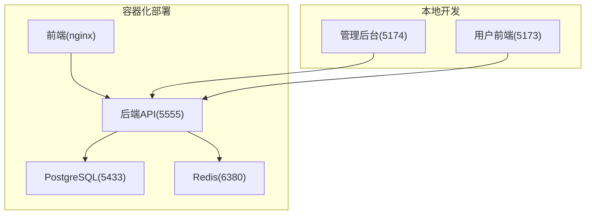
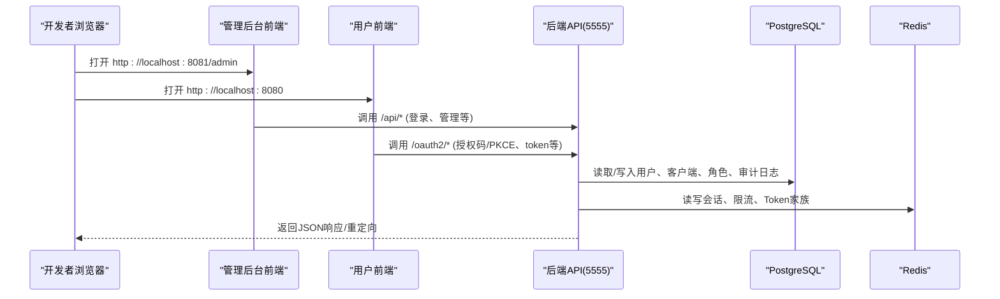
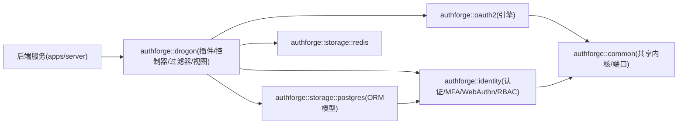

# 快速开始指南

<cite>
**本文引用的文件**
- [README.zh-CN.md](file://README.zh-CN.md)
- [docker-compose.yml](file://deploy/docker/docker-compose.yml)
- [Dockerfile](file://deploy/docker/Dockerfile)
- [config.json](file://apps/server/config/config.json)
- [docker.env.example](file://deploy/env/docker.env.example)
- [CMakePresets.json](file://CMakePresets.json)
- [build.sh](file://scripts/backend/build.sh)
- [setup-database.sh](file://scripts/backend/setup-database.sh)
- [V001__schema_migrations.sql](file://apps/server/migrations/V001__schema_migrations.sql)
- [dev_admin_user.sql](file://apps/server/seed/dev_admin_user.sql)
- [admin/package.json](file://frontends/admin/package.json)
- [user/package.json](file://frontends/user/package.json)
</cite>

## 目录
1. [简介](#简介)
2. [项目结构](#项目结构)
3. [核心组件](#核心组件)
4. [架构总览](#架构总览)
5. [详细部署路径](#详细部署路径)
6. [依赖关系分析](#依赖关系分析)
7. [性能与配置建议](#性能与配置建议)
8. [故障排查指南](#故障排查指南)
9. [结论](#结论)
10. [附录：验证清单](#附录验证清单)

## 简介
本指南面向首次接触 AuthForge 的用户，提供三种部署路径的完整步骤、环境要求与注意事项，帮助你在最短时间内成功运行并体验核心功能。AuthForge 是一个生产级 OAuth2/OIDC 授权服务器，支持 Docker Compose 一键部署、源码构建以及以 SDK 方式集成到你的 C++ 宿主中。默认管理员账户为 admin/admin。

## 项目结构
- apps/server：后端服务（基于 Drogon 的 C++ 实现）
- frontends/admin：管理后台前端（Vue 3 + Vite）
- frontends/user：用户端前端（Vue 3 + Vite）
- deploy：Docker Compose、Helm、Nginx、可观测性配置
- scripts：构建、测试、运维脚本
- libs：SDK 库包（oauth2、identity、storage-*、drogon 插件等）
- tests：后端测试套件（单元/集成/契约）
- docs：文档与指南

图表来源
- [docker-compose.yml:1-127](file://deploy/docker/docker-compose.yml#L1-L127)
- [Dockerfile:48-99](file://deploy/docker/Dockerfile#L48-L99)

章节来源
- [README.zh-CN.md:16-65](file://README.zh-CN.md#L16-L65)

## 核心组件
- 后端服务：监听 5555 端口，加载配置 config.json，连接 PostgreSQL 与 Redis，启用迁移与种子数据，暴露健康检查与指标端点。
- 数据库：PostgreSQL 14+，使用 migrations 进行版本化迁移，seed 初始化默认数据（如管理员）。
- 缓存：Redis 7+，用于会话、限流、Token 家族等。
- 前端：管理后台与用户前端通过 Nginx 或 Vite 开发服务器访问。

章节来源
- [config.json:1-212](file://apps/server/config/config.json#L1-L212)
- [docker-compose.yml:30-66](file://deploy/docker/docker-compose.yml#L30-L66)
- [docker-compose.yml:67-103](file://deploy/docker/docker-compose.yml#L67-L103)
- [V001__schema_migrations.sql:1-10](file://apps/server/migrations/V001__schema_migrations.sql#L1-L10)
- [dev_admin_user.sql:1-21](file://apps/server/seed/dev_admin_user.sql#L1-L21)

## 架构总览

图表来源
- [docker-compose.yml:1-127](file://deploy/docker/docker-compose.yml#L1-L127)
- [config.json:133-171](file://apps/server/config/config.json#L133-L171)

## 详细部署路径

### Path A — Docker Compose 部署（推荐用于评估）
适用场景：快速评估、演示、本地联调。无需安装编译工具链，一条命令拉起全栈。

环境要求
- Docker 24+
- 操作系统：任意支持 Docker 的系统

步骤
1. 启动全栈服务（包含后端、管理后台、用户前端、PostgreSQL、Redis、Prometheus）：
   - 在仓库根目录执行：docker compose -f deploy/docker/docker-compose.yml up -d --build
2. 等待服务就绪后访问：
   - 用户前端：http://localhost:8080
   - 管理后台：http://localhost:8081
   - 后端 API：http://localhost:5555
3. 默认管理员账户：用户名 admin，密码 admin（仅开发/评估环境使用）

注意事项
- 数据库与缓存凭据已在 compose 中预设；如需自定义，请修改 docker-compose.yml 中的环境变量或使用 .env 文件。
- 生产环境建议使用 docker-compose.prod.yml 并通过 env 文件注入密钥（见下方“Path B”的环境变量说明）。

验证
- 健康检查：curl http://localhost:5555/health
- 指标导出：curl http://localhost:5555/metrics
- 管理后台登录：使用 admin/admin 登录 http://localhost:8081/admin

章节来源
- [docker-compose.yml:1-127](file://deploy/docker/docker-compose.yml#L1-L127)
- [README.zh-CN.md:137-148](file://README.zh-CN.md#L137-L148)

### Path B — 从源码构建
适用场景：二次开发、定制功能、本地调试。需要完整的 C++ 构建环境与依赖。

系统要求
- C++ 编译器：C++17（MSVC 2019+ / GCC 9+ / Clang 10+）
- CMake 3.21+
- Conan 2.x
- PostgreSQL 14+
- Redis 7+
- Node.js 18+（前端开发）
- Docker（可选，用于数据库/缓存容器）

步骤
1. 准备依赖与环境
   - Linux/macOS：确保已安装 gcc/g++、cmake、git、pkg-config、python3-pip 等基础工具。
   - Windows：安装 MSVC 工具链、CMake、Git、Conan。
2. 解析依赖并构建后端
   - 使用 CMake Preset 与 Conan 的标准流程（与 CI 一致）：
     - conan install . --output-folder=build/linux-release -s build_type=Release -s compiler.cppstd=17 --build=missing
     - cmake --preset linux-release
     - cmake --build --preset linux-release
   - 也可使用脚本简化：scripts/backend/build.sh（Linux/macOS）或 manage.ps1/manage.sh（封装相同流程）
3. 启动数据库与缓存
   - 推荐使用 Docker 启动 PostgreSQL 与 Redis（端口映射到 5433 与 6380），或在宿主机安装对应服务。
4. 初始化数据库
   - 自动迁移：设置 OAUTH2_AUTO_MIGRATE=true（Compose 已启用）
   - 手动迁移：使用 scripts/backend/setup-database.sh 按顺序执行 migrations/*.sql 与 seed/*.sql
5. 启动后端服务
   - 将配置文件复制到构建输出目录（脚本会自动处理），然后运行后端二进制（例如 apps/server/authforge-server）
6. 启动前端应用（开发模式）
   - 管理后台：cd frontends/admin && npm install && npm run dev（默认 http://localhost:5174/admin/）
   - 用户前端：cd frontends/user && npm install && npm run dev（默认 http://localhost:5173）
7. 环境变量与配置
   - 参考 deploy/env/docker.env.example 配置生产相关变量（如 OAUTH2_ISSUER、JWT 签名密钥、CORS、SMTP 等）
   - 开发时可通过 apps/server/config/config.json 调整监听端口、数据库/Redis 连接、CORS、外部认证等

验证
- 健康检查：curl http://localhost:5555/health
- 指标导出：curl http://localhost:5555/metrics
- 管理后台登录：使用 admin/admin 登录 http://localhost:5174/admin/
- 用户前端登录：访问 http://localhost:5173，尝试注册/登录流程

章节来源
- [README.zh-CN.md:149-181](file://README.zh-CN.md#L149-L181)
- [CMakePresets.json:1-234](file://CMakePresets.json#L1-L234)
- [build.sh:1-168](file://scripts/backend/build.sh#L1-L168)
- [setup-database.sh:41-65](file://scripts/backend/setup-database.sh#L41-L65)
- [docker.env.example:1-89](file://deploy/env/docker.env.example#L1-L89)
- [config.json:1-212](file://apps/server/config/config.json#L1-L212)
- [admin/package.json:1-35](file://frontends/admin/package.json#L1-L35)
- [user/package.json:1-33](file://frontends/user/package.json#L1-L33)

### Path C — 作为 SDK 消费
适用场景：将 AuthForge 嵌入你的 C++ 宿主程序，复用其 OAuth2/OIDC 引擎与存储适配器。

步骤
1. 获取 SDK
   - 从 Releases 下载 SDK tarball，或从源码执行 cmake --install 安装到本地
2. 在你的项目中引入 SDK
   - 全栈包（含 Drogon 插件/控制器）：find_package(authforge-drogon CONFIG REQUIRED)
   - 仅引擎包（无 Drogon 依赖）：find_package(authforge-oauth2 CONFIG REQUIRED) 与 find_package(authforge-storage-memory CONFIG REQUIRED)
3. 链接目标
   - target_link_libraries(my-host PRIVATE authforge::drogon) 或 engine-only 组合
4. 运行时要求
   - 根据所选存储适配器准备 PostgreSQL/Redis 等依赖
   - 遵循 SDK 运行时契约与集成指南

验证
- 在你的宿主程序中调用 SDK 提供的接口，完成授权码/PKCE 流程，确认 Token 签发与校验正常。

章节来源
- [README.zh-CN.md:183-198](file://README.zh-CN.md#L183-L198)

## 依赖关系分析

图表来源
- [README.zh-CN.md:31-51](file://README.zh-CN.md#L31-L51)

章节来源
- [README.zh-CN.md:31-51](file://README.zh-CN.md#L31-L51)

## 性能与配置建议
- 线程数与连接池：在 config.json 中合理设置 number_of_threads、db_clients.number_of_connections、redis_clients.number_of_connections。
- 静态资源压缩：启用 gzip/brotli（config.json 已默认开启）。
- 会话与安全：session_same_site、session_timeout 可根据业务调整；生产环境务必设置强口令与 HTTPS Issuer。
- 外部认证：按需配置 GitHub/Google/微信等第三方登录参数。
- 可观测性：启用 Prometheus 指标导出（/metrics），结合 Grafana 监控。

章节来源
- [config.json:41-131](file://apps/server/config/config.json#L41-L131)
- [config.json:133-212](file://apps/server/config/config.json#L133-L212)

## 故障排查指南
常见问题与解决思路
- 无法连接数据库
  - 检查 PostgreSQL 是否启动且端口可达（默认 5433）
  - 核对 OAUTH2_DB_* 环境变量与 config.json 中的 db_clients 配置一致
  - 确认 migrations 已正确执行（查看 schema_migrations 表）
- 无法连接 Redis
  - 检查 Redis 是否启动且密码匹配（compose 中默认 requirepass redis_secret_pass）
  - 核对 OAUTH2_REDIS_* 环境变量与 redis_clients 配置
- 前端无法访问后端
  - 确认 CORS 允许的来源包含前端地址（config.json custom_config.cors.allow_origins）
  - 开发模式下确保前后端分别运行在预期端口（5173/5174/8080/8081）
- 管理后台登录失败
  - 确认种子数据已导入（dev_admin_user.sql），默认 admin/admin
  - 若账号被锁定，可使用脚本重置锁定状态（scripts/backend/reset-account-lockout.*）
- 健康检查不通过
  - 检查后端进程是否正常运行，查看日志目录 logs
  - 检查依赖服务（PostgreSQL/Redis）健康状态

章节来源
- [docker-compose.yml:30-103](file://deploy/docker/docker-compose.yml#L30-L103)
- [config.json:1-212](file://apps/server/config/config.json#L1-L212)
- [dev_admin_user.sql:1-21](file://apps/server/seed/dev_admin_user.sql#L1-L21)

## 结论
通过 Path A（Docker Compose）可在几分钟内运行完整栈；Path B（源码构建）适合深度定制与本地开发；Path C（SDK 集成）便于将 AuthForge 能力嵌入自有系统。按照本文步骤与环境要求操作，配合验证清单，可快速确认部署成功并体验核心功能。

## 附录：验证清单
- 服务可用性
  - 后端健康：curl http://localhost:5555/health
  - 指标导出：curl http://localhost:5555/metrics
- 数据库与缓存
  - 数据库表存在：psql -U oauth2_user -d oauth2_db -c "\dt"
  - 迁移记录：SELECT * FROM schema_migrations;
  - 种子数据：SELECT username FROM users WHERE username='admin';
- 前端与管理后台
  - 用户前端：http://localhost:8080（或本地开发 5173）
  - 管理后台：http://localhost:8081（或本地开发 5174/admin）
  - 登录：admin/admin
- 安全与合规
  - 生产环境设置 OAUTH2_ENV=production、OAUTH2_ISSUER、JWT 签名密钥
  - 配置强口令与 HTTPS，限制 CORS 来源

章节来源
- [docker-compose.yml:1-127](file://deploy/docker/docker-compose.yml#L1-L127)
- [docker.env.example:1-89](file://deploy/env/docker.env.example#L1-L89)
- [V001__schema_migrations.sql:1-10](file://apps/server/migrations/V001__schema_migrations.sql#L1-L10)
- [dev_admin_user.sql:1-21](file://apps/server/seed/dev_admin_user.sql#L1-L21)