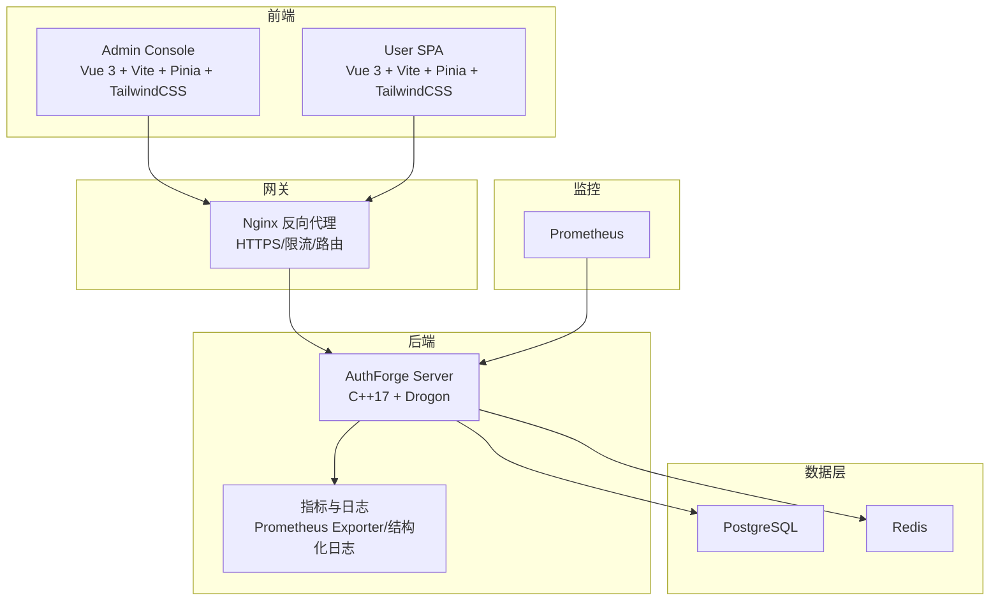
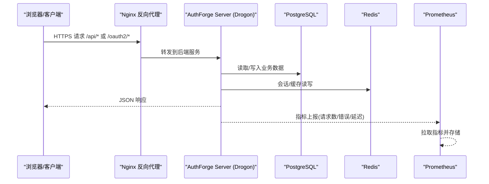
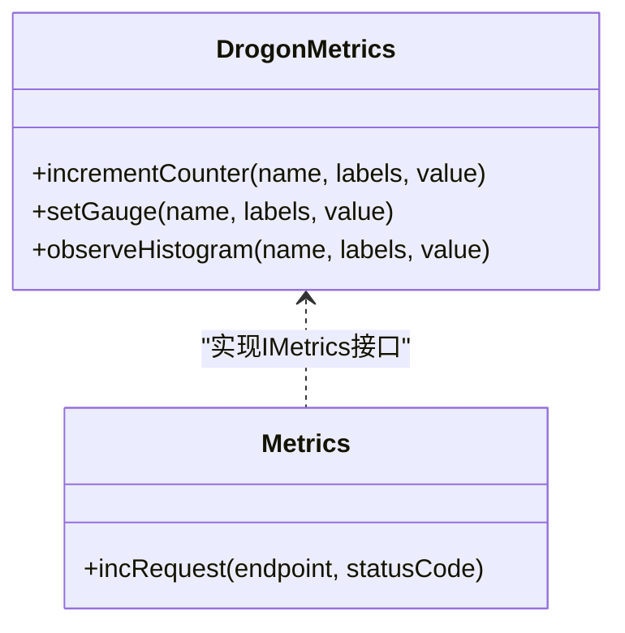
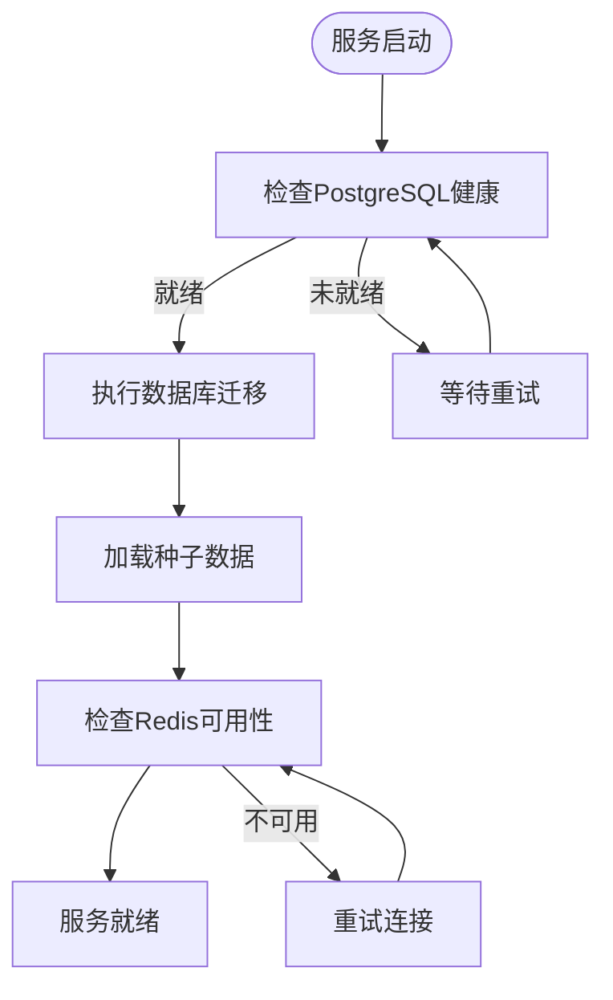
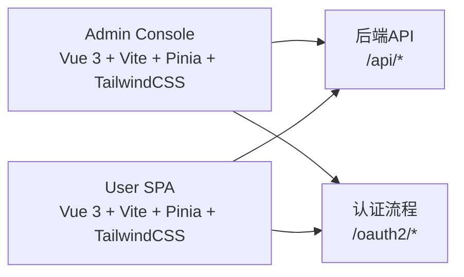
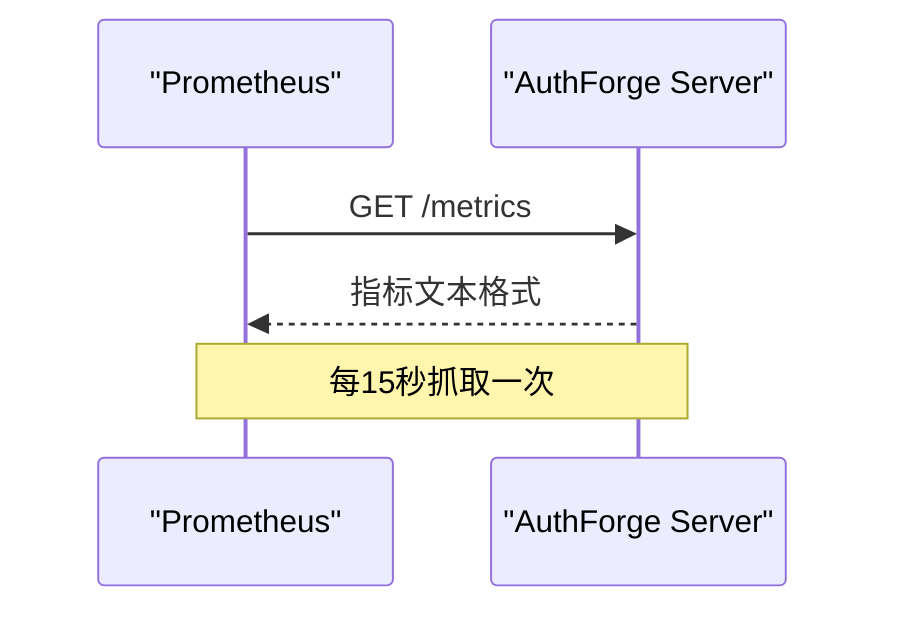
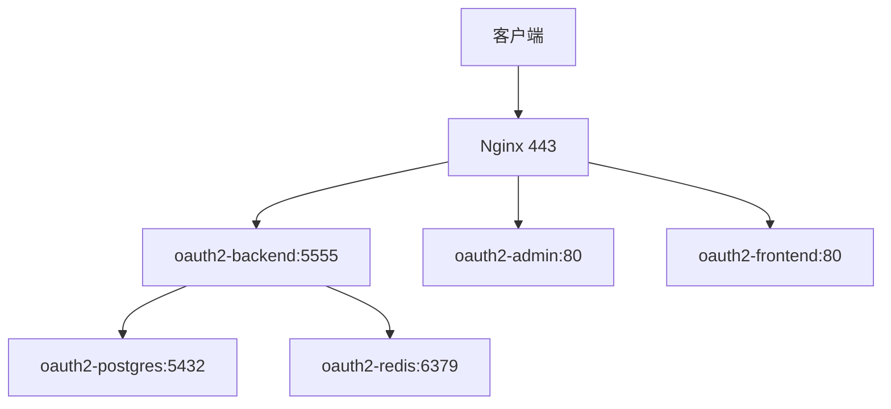
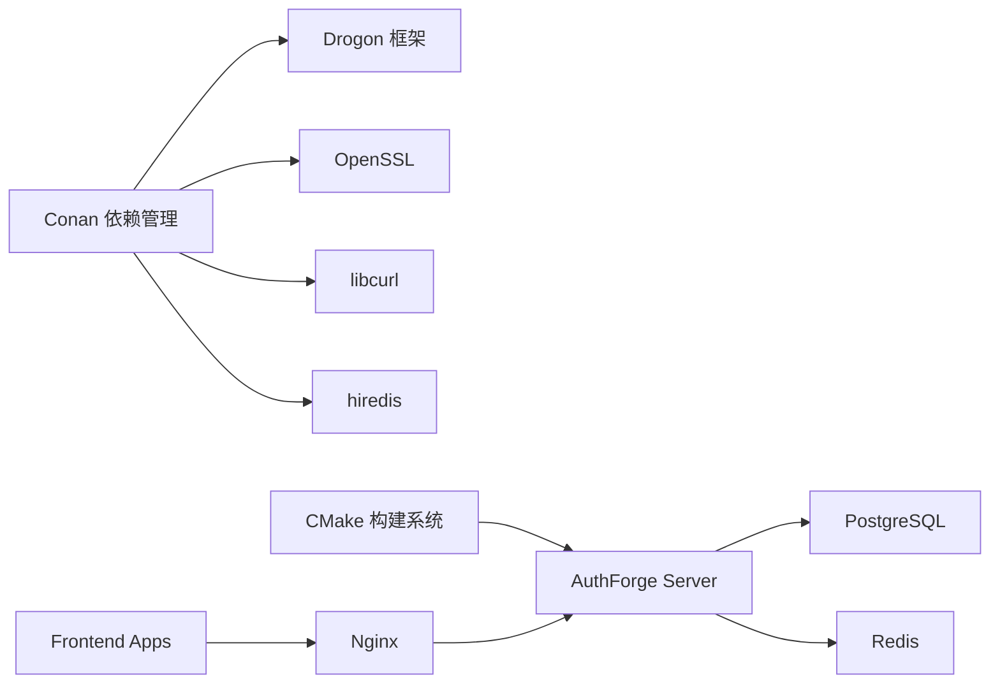

# 技术栈说明

<cite>
**本文引用的文件**
- [conanfile.py](file://conanfile.py)
- [CMakeLists.txt](file://CMakeLists.txt)
- [apps/server/CMakeLists.txt](file://apps/server/CMakeLists.txt)
- [frontends/admin/package.json](file://frontends/admin/package.json)
- [frontends/user/package.json](file://frontends/user/package.json)
- [deploy/docker/docker-compose.yml](file://deploy/docker/docker-compose.yml)
- [deploy/helm/authforge/Chart.yaml](file://deploy/helm/authforge/Chart.yaml)
- [deploy/nginx/nginx.conf](file://deploy/nginx/nginx.conf)
- [deploy/observability/prometheus.yml](file://deploy/observability/prometheus.yml)
- [libs/drogon/include/authforge/drogon/adapters/DrogonMetrics.h](file://libs/drogon/include/authforge/drogon/adapters/DrogonMetrics.h)
- [libs/drogon/src/observability/Metrics.cc](file://libs/drogon/src/observability/Metrics.cc)
- [tests/integration/controllers/HealthEndpointHttpTest.cc](file://tests/integration/controllers/HealthEndpointHttpTest.cc)
</cite>

## 目录
1. [简介](#简介)
2. [项目结构](#项目结构)
3. [核心组件](#核心组件)
4. [架构总览](#架构总览)
5. [详细组件分析](#详细组件分析)
6. [依赖关系分析](#依赖关系分析)
7. [性能考量](#性能考量)
8. [故障排查指南](#故障排查指南)
9. [结论](#结论)
10. [附录](#附录)

## 简介
本技术栈说明文档面向AuthForge项目的后端、前端、构建与测试工具链、监控可观测性以及部署方案，系统性地梳理了各组件的版本要求、兼容性说明与技术选型理由。整体目标是为研发、运维与产品团队提供一份权威且易于理解的技术参考。

## 项目结构
AuthForge采用多语言、多模块的工程组织方式：
- 后端服务：基于C++17与Drogon框架的高性能Web服务，使用Conan管理依赖、CMake构建、CTest运行测试。
- 数据库与缓存：PostgreSQL用于持久化存储，Redis用于缓存与会话等场景。
- 前端应用：Vue 3 + Vite + Pinia + TailwindCSS构建的管理控制台与用户界面。
- 部署编排：Docker Compose本地与CI环境一键拉起；Helm Chart用于Kubernetes部署；Nginx作为反向代理统一入口。
- 监控可观测性：Prometheus指标采集、结构化审计日志与健康检查端点。

图表来源
- [deploy/nginx/nginx.conf:28-113](file://deploy/nginx/nginx.conf#L28-L113)
- [deploy/docker/docker-compose.yml:30-65](file://deploy/docker/docker-compose.yml#L30-L65)
- [deploy/observability/prometheus.yml:4-8](file://deploy/observability/prometheus.yml#L4-L8)

章节来源
- [CMakeLists.txt:1-31](file://CMakeLists.txt#L1-L31)
- [apps/server/CMakeLists.txt:1-20](file://apps/server/CMakeLists.txt#L1-L20)

## 核心组件
- 后端技术栈
  - C++17标准与Drogon框架：高性能异步I/O、插件化控制器、OpenAPI集成。
  - 依赖管理：Conan锁定第三方库版本（如Drogon、OpenSSL、libcurl、hiredis、brotli、zlib）。
  - 构建与测试：CMake工程配置、CTest执行单元/集成/E2E测试。
- 数据存储
  - PostgreSQL：关系型数据库，承载OAuth2/OIDC核心实体、用户、RBAC、审计日志等。
  - Redis：缓存与会话存储，提升鉴权流程与令牌操作的性能。
- 前端技术栈
  - Vue 3 + Vite：快速开发与构建。
  - Pinia：状态管理。
  - TailwindCSS：原子化样式体系。
  - Playwright：端到端测试。
- 监控与可观测性
  - Prometheus指标：请求计数、错误率、延迟直方图等。
  - 健康检查：/health、/health/live、/health/ready。
  - 结构化日志：便于日志采集与告警。
- 部署技术
  - Docker Compose：一键启动前后端、数据库、缓存与Prometheus。
  - Helm Chart：Kubernetes应用打包与发布。
  - Nginx：HTTPS终止、限流、路径路由与静态资源代理。

章节来源
- [conanfile.py:27-83](file://conanfile.py#L27-L83)
- [CMakeLists.txt:27-31](file://CMakeLists.txt#L27-L31)
- [frontends/admin/package.json:15-33](file://frontends/admin/package.json#L15-L33)
- [frontends/user/package.json:15-31](file://frontends/user/package.json#L15-L31)
- [deploy/docker/docker-compose.yml:67-114](file://deploy/docker/docker-compose.yml#L67-L114)
- [deploy/observability/prometheus.yml:1-8](file://deploy/observability/prometheus.yml#L1-L8)

## 架构总览
后端以Drogon为核心，暴露RESTful与OAuth2/OIDC相关接口；通过ORM与存储适配器访问PostgreSQL与Redis；通过PromExporter或结构化日志输出指标；前端通过Nginx统一入口访问后端API与静态资源；Prometheus定期抓取后端指标进行可视化与告警。

图表来源
- [deploy/nginx/nginx.conf:57-101](file://deploy/nginx/nginx.conf#L57-L101)
- [deploy/docker/docker-compose.yml:30-65](file://deploy/docker/docker-compose.yml#L30-L65)
- [deploy/observability/prometheus.yml:4-8](file://deploy/observability/prometheus.yml#L4-L8)

## 详细组件分析

### 后端服务（C++17 + Drogon）
- 构建与依赖
  - 使用Conan锁定Drogon、OpenSSL、libcurl、hiredis、brotli、zlib等依赖版本，确保跨平台一致性。
  - CMake启用C++17标准，模块化组织libs与apps，支持条件编译可选特性。
- 运行时
  - 通过Drogon的插件机制注册控制器与过滤器，提供OpenAPI文档与视图渲染能力。
  - 通过存储抽象适配PostgreSQL与Redis，实现高可用与可扩展的数据访问层。
- 可观测性
  - 指标发射：通过DrogonMetrics与Metrics组件记录请求计数、错误与延迟等指标。
  - 健康检查：/health、/health/live、/health/ready分别提供服务可达性、轻量探测与依赖就绪检查。

图表来源
- [libs/drogon/include/authforge/drogon/adapters/DrogonMetrics.h:29-52](file://libs/drogon/include/authforge/drogon/adapters/DrogonMetrics.h#L29-L52)
- [libs/drogon/src/observability/Metrics.cc:1-36](file://libs/drogon/src/observability/Metrics.cc#L1-L36)

章节来源
- [conanfile.py:54-68](file://conanfile.py#L54-L68)
- [CMakeLists.txt:27-55](file://CMakeLists.txt#L27-L55)
- [apps/server/CMakeLists.txt:28-52](file://apps/server/CMakeLists.txt#L28-L52)
- [tests/integration/controllers/HealthEndpointHttpTest.cc:1-32](file://tests/integration/controllers/HealthEndpointHttpTest.cc#L1-L32)

### 数据库与缓存（PostgreSQL + Redis）
- PostgreSQL
  - 版本：docker-compose中使用postgres:15-alpine镜像，满足生产级稳定性与功能需求。
  - 初始化：通过migrations与seed脚本在容器启动时完成数据库结构与初始数据准备。
  - 连接信息：通过环境变量注入主机、端口、用户名、密码与数据库名。
- Redis
  - 版本：redis:7-alpine镜像，提供高性能键值存储与缓存能力。
  - 安全：启用requirepass保护访问。
  - 用途：会话、令牌缓存、速率限制等场景。

图表来源
- [deploy/docker/docker-compose.yml:67-102](file://deploy/docker/docker-compose.yml#L67-L102)

章节来源
- [deploy/docker/docker-compose.yml:67-102](file://deploy/docker/docker-compose.yml#L67-L102)

### 前端应用（Vue 3 + Vite + Pinia + TailwindCSS）
- 管理控制台（admin）
  - 开发服务器端口：5174，代理/api、/oauth2、/health、/.well-known至后端。
  - 构建产物：TypeScript + Vue单文件组件，TailwindCSS样式，Pinia状态管理。
  - 测试：Playwright E2E与Vitest单元测试。
- 用户界面（user）
  - 类似技术栈，提供登录、注册、账户管理等页面。
  - 构建与测试流程一致，便于统一维护与发布。

图表来源
- [frontends/admin/vite.config.ts:18-37](file://frontends/admin/vite.config.ts#L18-L37)
- [frontends/admin/package.json:15-33](file://frontends/admin/package.json#L15-L33)
- [frontends/user/package.json:15-31](file://frontends/user/package.json#L15-L31)

章节来源
- [frontends/admin/vite.config.ts:1-40](file://frontends/admin/vite.config.ts#L1-L40)
- [frontends/admin/package.json:1-35](file://frontends/admin/package.json#L1-L35)
- [frontends/user/package.json:1-33](file://frontends/user/package.json#L1-L33)

### 监控与可观测性（Prometheus + 健康检查）
- Prometheus
  - 抓取间隔：15秒。
  - 目标：oauth2-backend:5555，采集后端指标。
- 健康检查
  - /health：返回服务状态与存储类型信息。
  - /health/live：纯元数据，始终200，适合探针。
  - /health/ready：检查数据库与Redis可用性，内存模式下返回“not_configured”。
- 指标
  - 请求总数、登录失败次数、Introspection/Revocation请求与错误、延迟直方图、活跃Token估算等。

图表来源
- [deploy/observability/prometheus.yml:1-8](file://deploy/observability/prometheus.yml#L1-L8)
- [tests/integration/controllers/HealthEndpointHttpTest.cc:1-32](file://tests/integration/controllers/HealthEndpointHttpTest.cc#L1-L32)

章节来源
- [deploy/observability/prometheus.yml:1-8](file://deploy/observability/prometheus.yml#L1-L8)
- [libs/drogon/src/observability/Metrics.cc:1-36](file://libs/drogon/src/observability/Metrics.cc#L1-L36)
- [tests/integration/controllers/HealthEndpointHttpTest.cc:1-32](file://tests/integration/controllers/HealthEndpointHttpTest.cc#L1-L32)

### 部署技术（Docker Compose + Helm + Nginx）
- Docker Compose
  - 服务：oauth2-admin、oauth2-frontend、oauth2-backend、oauth2-postgres、oauth2-redis、oauth2-prometheus。
  - 网络：oauth2-net桥接网络，卷持久化pgdata、redisdata、promdata。
  - 环境变量：数据库与Redis连接信息、前端URL、SMTP配置等。
- Helm Chart
  - 应用包：authforge，包含Deployment、Service、ConfigMap、Secret、Migration Job等模板。
  - 版本：Chart与appVersion均为1.0.0。
- Nginx
  - HTTPS终止：TLSv1.2/1.3，强加密套件，HSTS。
  - 限流：登录与API路径分别设置rate与burst。
  - 路由：/api、/oauth2、/.well-known、/health、/metrics、/admin、/。

图表来源
- [deploy/docker/docker-compose.yml:3-65](file://deploy/docker/docker-compose.yml#L3-L65)
- [deploy/nginx/nginx.conf:34-113](file://deploy/nginx/nginx.conf#L34-L113)
- [deploy/helm/authforge/Chart.yaml:1-17](file://deploy/helm/authforge/Chart.yaml#L1-L17)

章节来源
- [deploy/docker/docker-compose.yml:1-127](file://deploy/docker/docker-compose.yml#L1-L127)
- [deploy/nginx/nginx.conf:1-116](file://deploy/nginx/nginx.conf#L1-L116)
- [deploy/helm/authforge/Chart.yaml:1-17](file://deploy/helm/authforge/Chart.yaml#L1-L17)

## 依赖关系分析
- 后端依赖
  - Conan管理的第三方库：Drogon、OpenSSL、libcurl、hiredis、brotli、zlib等，确保跨平台一致性与安全性。
  - CMake模块：Version、Compatibility、Sanitizers、Coverage、Warnings、Paths，统一构建策略。
- 前端依赖
  - Vue生态：Vue 3、Vue Router、Pinia。
  - 构建工具：Vite、TypeScript、TailwindCSS。
  - 测试：Playwright、Vitest。
- 部署依赖
  - Docker镜像：postgres:15-alpine、redis:7-alpine、prom/prometheus:latest。
  - Kubernetes：Helm Chart模板与values配置。

图表来源
- [conanfile.py:54-68](file://conanfile.py#L54-L68)
- [CMakeLists.txt:8-25](file://CMakeLists.txt#L8-L25)
- [deploy/docker/docker-compose.yml:67-114](file://deploy/docker/docker-compose.yml#L67-L114)

章节来源
- [conanfile.py:27-83](file://conanfile.py#L27-L83)
- [CMakeLists.txt:8-25](file://CMakeLists.txt#L8-L25)

## 性能考量
- 后端
  - 使用Drogon的异步I/O模型，提高并发处理能力。
  - 通过Redis缓存热点数据，降低数据库压力。
  - 指标监控帮助识别瓶颈与异常。
- 前端
  - Vite提供快速热更新与高效构建。
  - TailwindCSS减少样式体积与冲突。
- 部署
  - Nginx限流保护后端免受突发流量冲击。
  - Docker Compose与Helm简化扩缩容与滚动更新。

[本节为通用指导，不直接分析具体文件]

## 故障排查指南
- 健康检查
  - /health/live：确认服务是否存活。
  - /health/ready：检查数据库与Redis是否就绪。
- 指标与日志
  - 查看/metrics获取请求数、错误率与延迟分布。
  - 通过结构化日志定位问题根因。
- 常见问题
  - 数据库连接失败：检查环境变量与网络连通性。
  - Redis不可用：确认密码与端口配置。
  - 前端无法访问：检查Nginx路由与上游服务状态。

章节来源
- [tests/integration/controllers/HealthEndpointHttpTest.cc:1-32](file://tests/integration/controllers/HealthEndpointHttpTest.cc#L1-L32)
- [deploy/observability/prometheus.yml:4-8](file://deploy/observability/prometheus.yml#L4-L8)

## 结论
AuthForge采用成熟且高性能的技术栈组合：C++17与Drogon保障后端性能与扩展性，PostgreSQL与Redis提供稳定可靠的数据存储与缓存能力，Vue 3与Vite打造现代化的前端体验，Docker Compose与Helm实现便捷的容器化与云原生部署，Prometheus与结构化日志构建完整的可观测性体系。该架构兼顾性能、可维护性与可观测性，适用于生产环境的身份认证与授权服务。

[本节为总结性内容，不直接分析具体文件]

## 附录
- 版本要求与兼容性
  - 后端：C++17、Drogon 1.9.13、OpenSSL 3.5.7、libcurl 8.6.0、hiredis 1.2.0、brotli 1.1.0、zlib 1.3.1。
  - 数据库：PostgreSQL 15（Alpine镜像），Redis 7（Alpine镜像）。
  - 前端：Vue 3.5.x、Vite 6.x、Pinia 2.x/3.x、TailwindCSS 4.x、TypeScript 5.6.x、Playwright 1.60.x。
  - 构建工具：CMake 3.21+、Conan。
- 技术选型理由
  - Drogon：高性能、易用的C++ Web框架，支持插件化与OpenAPI。
  - PostgreSQL：成熟的RDBMS，支持复杂查询与事务。
  - Redis：高性能键值存储，适合缓存与会话。
  - Vue 3 + Vite：现代前端开发体验与高效构建。
  - Docker + Helm：标准化容器化与Kubernetes部署。
  - Prometheus：行业标准监控指标收集与可视化。

[本节为补充信息，不直接分析具体文件]