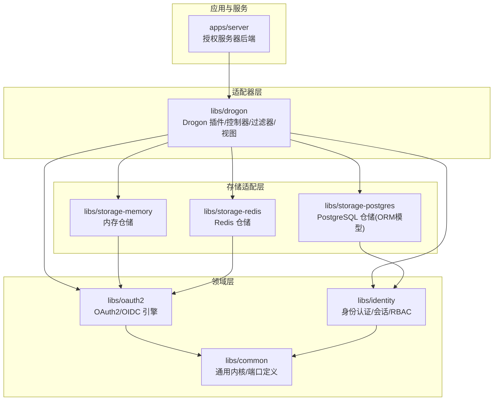
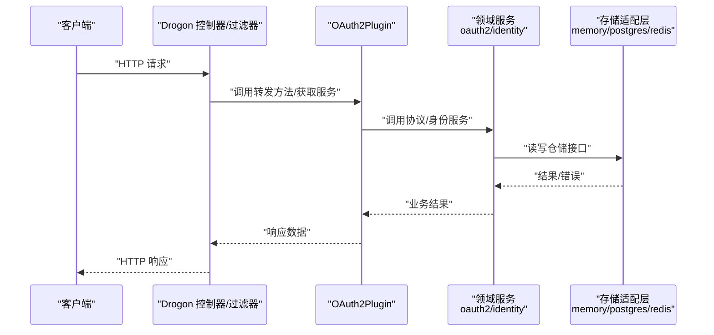
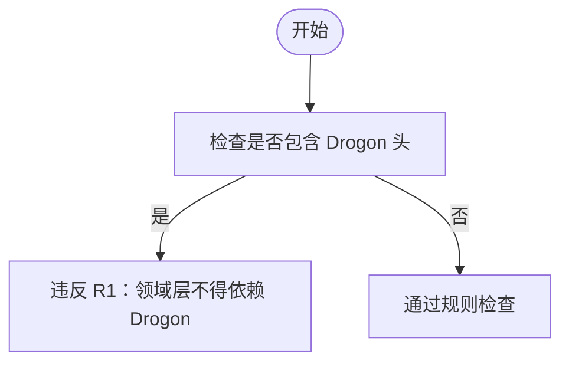
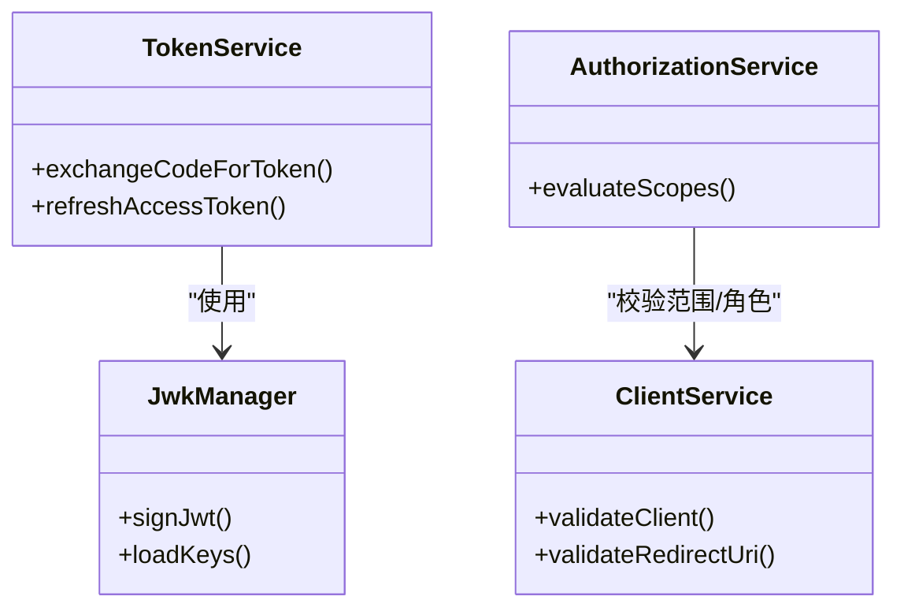
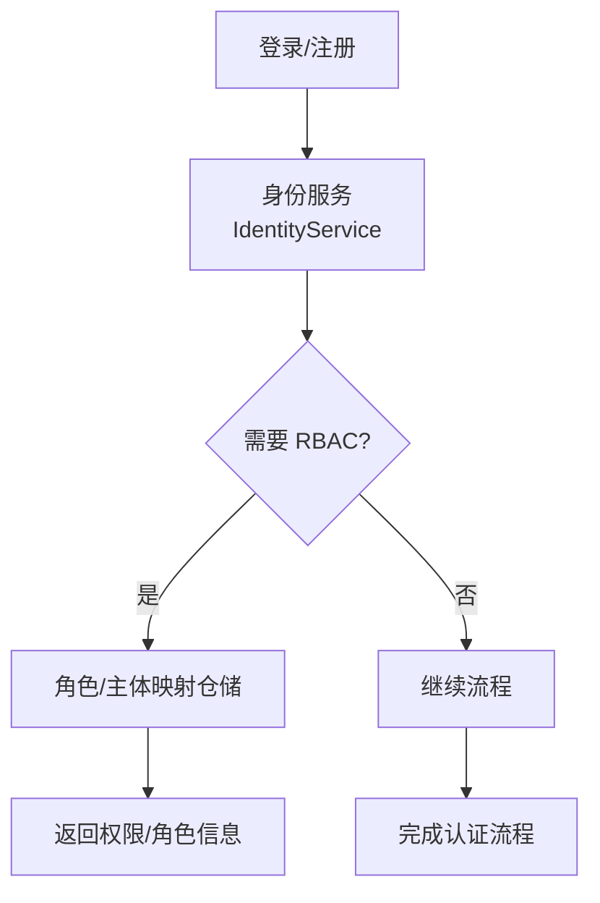
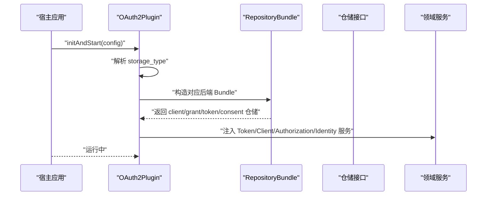
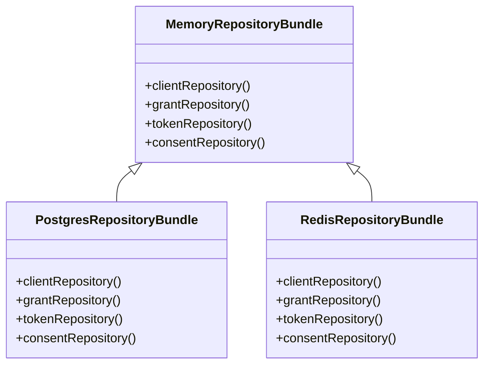
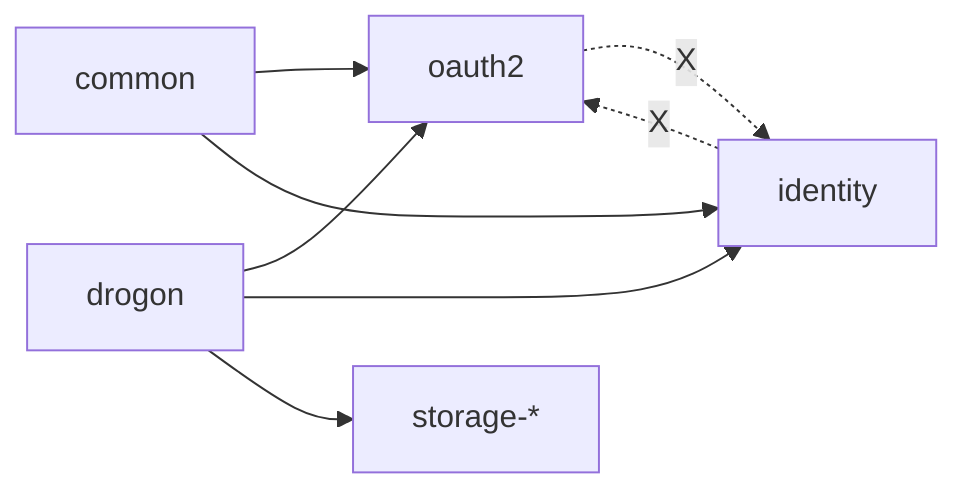

# 架构设计概览

<cite>
**本文引用的文件**
- [README.md](file://README.md)
- [CMakeLists.txt](file://CMakeLists.txt)
- [arch_guard.py](file://tools/arch-guard/arch_guard.py)
- [OAuth2Plugin.h](file://libs/drogon/include/authforge/drogon/plugin/OAuth2Plugin.h)
- [OAuth2Plugin.cc](file://libs/drogon/src/plugin/OAuth2Plugin.cc)
- [common/CMakeLists.txt](file://libs/common/CMakeLists.txt)
- [oauth2/CMakeLists.txt](file://libs/oauth2/CMakeLists.txt)
- [RedisRepositoryBundle.h](file://libs/storage-redis/include/authforge/storage/redis/RedisRepositoryBundle.h)
- [RedisRepositoryBundle.cc](file://libs/storage-redis/src/RedisRepositoryBundle.cc)
- [architecture-overview.md](file://docs/backend/architecture-overview.md)
- [sdk-runtime-contract.md](file://docs/backend/sdk-runtime-contract.md)
</cite>

## 目录
1. [引言](#引言)
2. [项目结构](#项目结构)
3. [核心组件](#核心组件)
4. [架构总览](#架构总览)
5. [详细组件分析](#详细组件分析)
6. [依赖关系分析](#依赖关系分析)
7. [性能与可扩展性](#性能与可扩展性)
8. [故障排查指南](#故障排查指南)
9. [结论](#结论)
10. [附录](#附录)

## 引言
本概览面向希望理解 AuthForge 整体设计与分层边界的开发者。文档聚焦 SDK 层分层结构、强制依赖方向约束、可选功能开关、插件化扩展机制，以及系统边界、组件交互模式和数据流向。通过架构图与组件关系图，帮助读者快速建立全局认知，并定位到具体实现位置。

## 项目结构
AuthForge 采用“领域层 + 适配器层”的分层组织：
- 领域层（Domain）：框架无关的协议与业务内核，位于 libs/common、libs/oauth2、libs/identity。
- 存储适配层（Storage Adapters）：针对不同后端的仓储实现，位于 libs/storage-memory、libs/storage-postgres、libs/storage-redis。
- 适配器层（Adapter/Drogon）：与 Web 框架耦合的插件、控制器、过滤器、视图等，位于 libs/drogon。
- 应用服务（Server）：基于 Drogon 的后端应用，位于 apps/server。

顶层 CMake 按顺序引入各子模块，确保依赖方向自下而上构建，并通过选项控制可选功能区域。

图表来源
- [CMakeLists.txt:57-118](file://CMakeLists.txt#L57-L118)
- [README.md:31-49](file://README.md#L31-L49)

章节来源
- [CMakeLists.txt:57-118](file://CMakeLists.txt#L57-L118)
- [README.md:31-49](file://README.md#L31-L49)

## 核心组件
- authforge::common（通用内核层）
  - 提供 Result/Error、值对象（Subject、Scope、ClientId 等）、端口接口（ISubjectResolver、IRoleProvider、ICryptoProvider、IMetrics 等）和审计事件模型。
  - 不依赖 Drogon；允许 jsoncpp 作为序列化依赖。
- authforge::oauth2（协议引擎层）
  - 纯协议逻辑：PKCE、授权码/令牌交换、同意与范围决策、聚合模型等。
  - 仅依赖 common；不得依赖 identity 或 Drogon。
- authforge::identity（身份认证层）
  - 用户认证、MFA、WebAuthn、社交登录、会话管理、RBAC。
  - 仅依赖 common；不得依赖 oauth2。
- authforge::drogon（适配器层）
  - Drogon 插件（OAuth2Plugin）、控制器、过滤器、视图；装配存储后端与领域服务。
  - 可链接 storage-* 包以选择后端；暴露领域服务给控制器使用。
- storage-*（存储适配层）
  - memory/postgres/redis 分别实现 OAuth2 与 Identity 的仓储接口，提供 RepositoryBundle 聚合构造。

章节来源
- [common/CMakeLists.txt:3-13](file://libs/common/CMakeLists.txt#L3-L13)
- [oauth2/CMakeLists.txt:3-21](file://libs/oauth2/CMakeLists.txt#L3-L21)
- [CMakeLists.txt:79-110](file://CMakeLists.txt#L79-L110)
- [OAuth2Plugin.h:50-448](file://libs/drogon/include/authforge/drogon/plugin/OAuth2Plugin.h#L50-L448)

## 架构总览
下图展示请求从 HTTP 入口进入，经 Drogon 插件与控制器路由到领域服务，再通过存储适配层访问持久化或缓存的过程。

图表来源
- [OAuth2Plugin.cc:1-23](file://libs/drogon/src/plugin/OAuth2Plugin.cc#L1-L23)
- [OAuth2Plugin.h:50-448](file://libs/drogon/include/authforge/drogon/plugin/OAuth2Plugin.h#L50-L448)

章节来源
- [architecture-overview.md:17-46](file://docs/backend/architecture-overview.md#L17-L46)
- [OAuth2Plugin.cc:1-23](file://libs/drogon/src/plugin/OAuth2Plugin.cc#L1-L23)

## 详细组件分析

### 通用内核层（authforge::common）
- 职责：定义跨层复用的值对象、错误模型、端口接口与审计事件。
- 依赖约束：禁止依赖 Drogon；允许 jsoncpp。
- 构建与打包：独立静态库，导出 find_package 配置，便于 SDK 消费者按需引入。

图表来源
- [arch_guard.py:49-55](file://tools/arch-guard/arch_guard.py#L49-L55)
- [common/CMakeLists.txt:11-13](file://libs/common/CMakeLists.txt#L11-L13)

章节来源
- [common/CMakeLists.txt:3-13](file://libs/common/CMakeLists.txt#L3-L13)
- [arch_guard.py:49-55](file://tools/arch-guard/arch_guard.py#L49-L55)

### 协议引擎层（authforge::oauth2）
- 职责：实现 OAuth2/OIDC 协议流程（PKCE、授权码/令牌交换、同意与范围决策、JWKS/JWT 签名等）。
- 依赖约束：仅依赖 common；禁止依赖 identity 与 Drogon。
- 构建与打包：静态库，导出 OpenSSL::Crypto 依赖。

图表来源
- [oauth2/CMakeLists.txt:36-56](file://libs/oauth2/CMakeLists.txt#L36-L56)
- [OAuth2Plugin.h:68-76](file://libs/drogon/include/authforge/drogon/plugin/OAuth2Plugin.h#L68-L76)

章节来源
- [oauth2/CMakeLists.txt:3-21](file://libs/oauth2/CMakeLists.txt#L3-L21)
- [oauth2/CMakeLists.txt:36-56](file://libs/oauth2/CMakeLists.txt#L36-L56)

### 身份认证层（authforge::identity）
- 职责：用户认证、MFA、WebAuthn、社交登录、会话管理、RBAC。
- 依赖约束：仅依赖 common；禁止依赖 oauth2。
- 与存储适配层协作：由 storage-postgres/memory 提供 IRoleRepository/IUserRepository/ISubjectMappingRepository 实现。

图表来源
- [CMakeLists.txt:79-87](file://CMakeLists.txt#L79-L87)
- [OAuth2Plugin.h:12-16](file://libs/drogon/include/authforge/drogon/plugin/OAuth2Plugin.h#L12-L16)

章节来源
- [CMakeLists.txt:79-87](file://CMakeLists.txt#L79-L87)
- [OAuth2Plugin.h:12-16](file://libs/drogon/include/authforge/drogon/plugin/OAuth2Plugin.h#L12-L16)

### 适配器层（authforge::drogon）
- 职责：Drogon 插件（OAuth2Plugin）负责生命周期管理、存储后端装配、领域服务注入；控制器/过滤器/视图处理 HTTP 路由与协议端点。
- 关键能力：
  - 根据配置选择 storage-* 后端（memory/postgres/redis），构造对应 RepositoryBundle 并提取仓储句柄。
  - 暴露领域服务（TokenService、ClientService、AuthorizationService、IdentityService）给控制器调用。
  - 暴露观察性端口（IAuditSink、IMetrics）供控制器记录审计与指标。

图表来源
- [OAuth2Plugin.cc:1-23](file://libs/drogon/src/plugin/OAuth2Plugin.cc#L1-L23)
- [OAuth2Plugin.h:412-448](file://libs/drogon/include/authforge/drogon/plugin/OAuth2Plugin.h#L412-L448)

章节来源
- [OAuth2Plugin.cc:1-23](file://libs/drogon/src/plugin/OAuth2Plugin.cc#L1-L23)
- [OAuth2Plugin.h:50-448](file://libs/drogon/include/authforge/drogon/plugin/OAuth2Plugin.h#L50-L448)

### 存储适配层（storage-*）
- memory：进程内存储，无外部依赖，适合测试与轻量部署。
- postgres：持久化存储，包含 ORM 模型（Oauth2*/Users/Roles 等），实现 OAuth2 与 Identity 仓储接口。
- redis：缓存/临时数据存储，提供 RedisRepositoryBundle 聚合构造。

图表来源
- [RedisRepositoryBundle.h:28-86](file://libs/storage-redis/include/authforge/storage/redis/RedisRepositoryBundle.h#L28-L86)
- [RedisRepositoryBundle.cc:1-14](file://libs/storage-redis/src/RedisRepositoryBundle.cc#L1-L14)
- [CMakeLists.txt:89-110](file://CMakeLists.txt#L89-L110)

章节来源
- [RedisRepositoryBundle.h:28-86](file://libs/storage-redis/include/authforge/storage/redis/RedisRepositoryBundle.h#L28-L86)
- [RedisRepositoryBundle.cc:1-14](file://libs/storage-redis/src/RedisRepositoryBundle.cc#L1-L14)
- [CMakeLists.txt:89-110](file://CMakeLists.txt#L89-L110)

## 依赖关系分析
- 强制依赖方向：
  - 领域层（common/oauth2/identity）不得依赖 Drogon 或 ORM。
  - oauth2 与 identity 互不依赖。
  - 适配器层（drogon）可依赖领域层与存储适配层。
- CI 验证：
  - 通过 tools/arch-guard 在 CI 中扫描 libs/common、libs/oauth2、libs/identity 的生产源码，检测违规 include 与命名空间使用。

图表来源
- [arch_guard.py:42-55](file://tools/arch-guard/arch_guard.py#L42-L55)
- [CMakeLists.txt:57-118](file://CMakeLists.txt#L57-L118)

章节来源
- [arch_guard.py:42-55](file://tools/arch-guard/arch_guard.py#L42-L55)
- [CMakeLists.txt:57-118](file://CMakeLists.txt#L57-L118)

## 性能与可扩展性
- 异步仓储与服务：仓储与服务方法普遍采用回调风格，避免阻塞；服务持有仓储句柄保证生命周期。
- 可观测性：通过 IAuditSink/IMetrics 统一输出审计与指标，便于接入 Prometheus 等监控体系。
- 可扩展点：
  - 存储后端插件：新增 storage-* 包实现仓储接口，并在 OAuth2Plugin 中按 storage_type 选择。
  - 认证提供商插件：通过 identity 层的 Provider 抽象扩展第三方登录（如 Google/WeChat/GitHub）。
  - 可选功能开关：WITH_IDENTITY/WITH_SOCIAL/WITH_WEBAUTHN 控制编译产物大小与依赖面。

章节来源
- [CLAUDE.md:22-44](file://CLAUDE.md#L22-L44)
- [CMakeLists.txt:33-55](file://CMakeLists.txt#L33-L55)

## 故障排查指南
- 架构守卫失败：
  - 现象：CI 报告 R1/R2/R3 违规。
  - 原因：领域层包含 Drogon 头、使用 drogon::orm，或 oauth2/identity 互相包含。
  - 解决：将相关代码迁移至 adapter/storage 层，或重构为端口/接口解耦。
- 插件未加载：
  - 现象：Drogon 反射找不到插件。
  - 原因：静态库裁剪导致自注册符号丢失。
  - 解决：确保以 OBJECT 库形式链接或引入 whole-archive（见运行时契约说明）。
- 存储后端不可用：
  - 现象：初始化失败或运行时仓储调用异常。
  - 原因：配置 storage_type 与实际后端不一致或未正确连接。
  - 解决：核对配置与连接参数，确认 RepositoryBundle 构造成功。

章节来源
- [arch_guard.py:164-208](file://tools/arch-guard/arch_guard.py#L164-L208)
- [sdk-runtime-contract.md:60-74](file://docs/backend/sdk-runtime-contract.md#L60-L74)

## 结论
AuthForge 通过清晰的领域/适配器分层、严格的依赖方向约束与 CI 工具保障，实现了高内聚、低耦合的可插拔架构。SDK 消费者可按需启用可选功能，缩小依赖面；同时通过存储与认证提供商的插件化机制，灵活扩展系统能力。建议在新功能开发时遵循现有分层与端口约定，优先通过接口与适配器扩展，避免破坏领域层独立性。

## 附录
- 可选功能开关（CMake/Conan 选项）：
  - WITH_IDENTITY：构建身份认证模块。
  - WITH_SOCIAL：构建社交登录控制器与服务。
  - WITH_WEBAUTHN：构建 WebAuthn/FIDO2 控制器与服务。
- 参考路径：
  - 顶层选项声明与默认值：[CMakeLists.txt:33-55](file://CMakeLists.txt#L33-L55)
  - 插件注册与配置契约：[sdk-runtime-contract.md:60-74](file://docs/backend/sdk-runtime-contract.md#L60-L74)