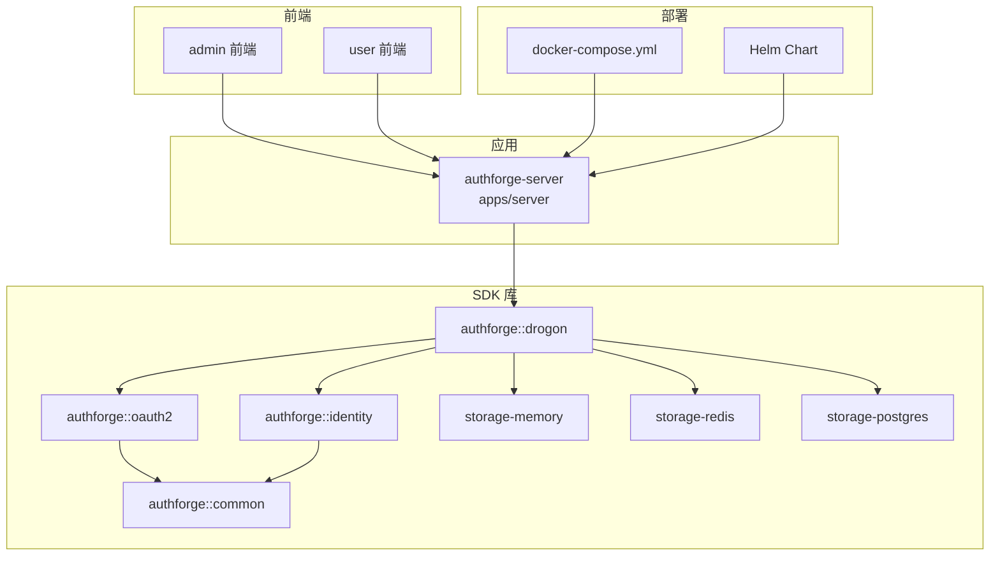
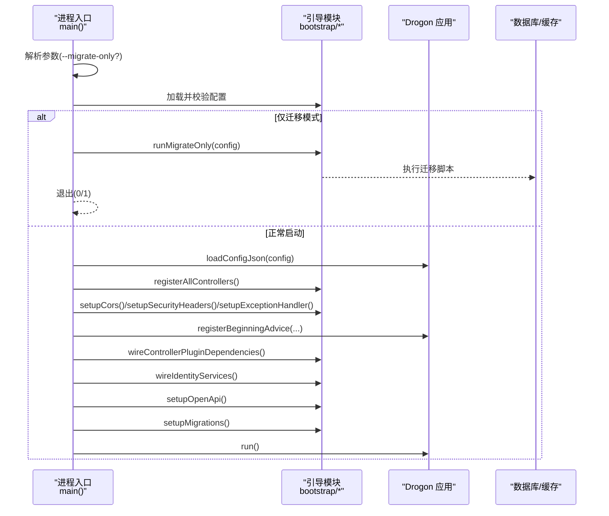
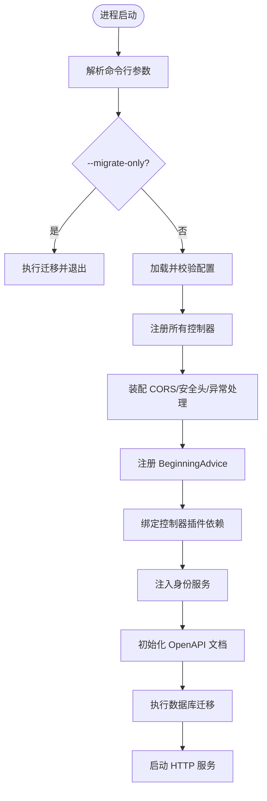
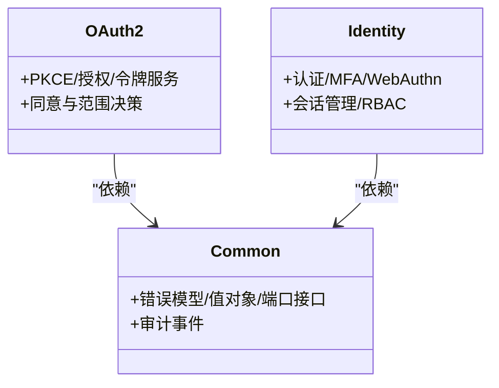
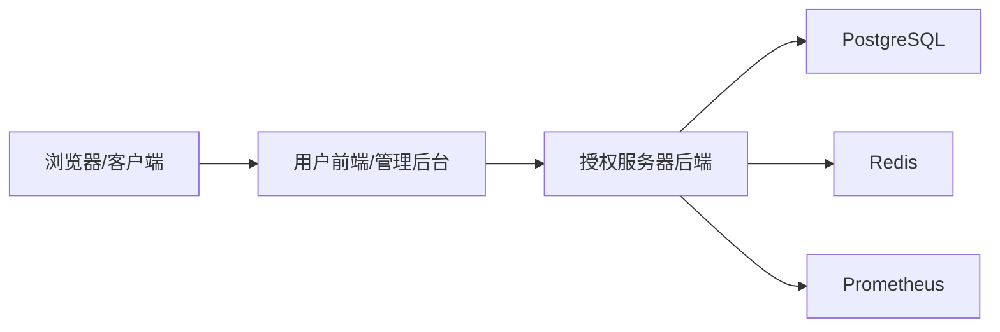
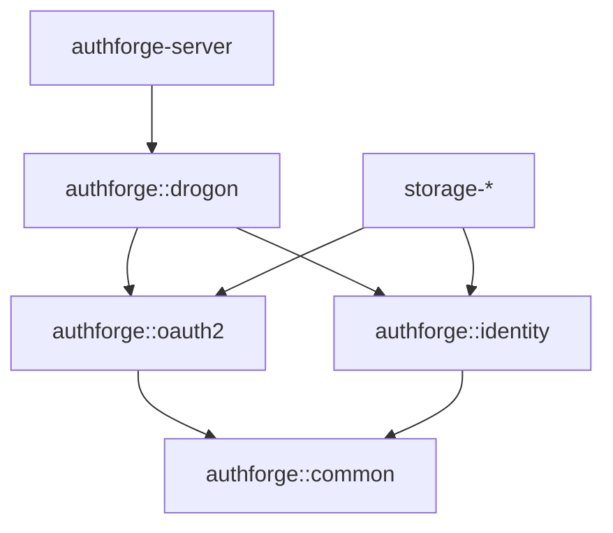

# 项目介绍与特性

<cite>
**本文引用的文件**
- [README.md](file://README.md)
- [README.zh-CN.md](file://README.zh-CN.md)
- [apps/server/src/main.cc](file://apps/server/src/main.cc)
- [apps/server/CMakeLists.txt](file://apps/server/CMakeLists.txt)
- [libs/common/CMakeLists.txt](file://libs/common/CMakeLists.txt)
- [libs/oauth2/CMakeLists.txt](file://libs/oauth2/CMakeLists.txt)
- [libs/identity/CMakeLists.txt](file://libs/identity/CMakeLists.txt)
- [deploy/docker/docker-compose.yml](file://deploy/docker/docker-compose.yml)
- [deploy/helm/authforge/Chart.yaml](file://deploy/helm/authforge/Chart.yaml)
- [docs/backend/rbac-guide.md](file://docs/backend/rbac-guide.md)
</cite>

## 目录
1. [简介](#简介)
2. [项目结构](#项目结构)
3. [核心组件](#核心组件)
4. [架构总览](#架构总览)
5. [详细组件分析](#详细组件分析)
6. [依赖关系分析](#依赖关系分析)
7. [性能与可观测性](#性能与可观测性)
8. [故障排查指南](#故障排查指南)
9. [结论](#结论)
10. [附录：功能清单与标准支持](#附录功能清单与标准支持)

## 简介
AuthForge 是一个生产级 OAuth2/OIDC 授权服务器，提供完整的身份认证、授权与用户管理能力。它既可作为开箱即用的产品（Docker/Helm）部署，也可作为可嵌入的 C++ SDK 集成到自有系统中。项目遵循主流协议标准，内置管理控制台与用户前端，并具备完善的测试体系与可观测能力。

- 目标与定位：为应用提供标准化、可扩展、高可用的身份与访问控制基础设施。
- 价值主张：以模块化 C++ SDK 为核心，结合成熟的前后端生态，兼顾“即插即用”的产品体验与“深度定制”的集成能力。
- 双模式使用：
  - 运行态产品：通过 Docker Compose 或 Helm 一键部署完整栈（后端 + 数据库 + 缓存 + 前端）。
  - 嵌入式 SDK：通过 find_package 将 authforge::oauth2 / authforge::identity / authforge::common 等库集成到宿主程序。

**章节来源**
- [README.md:12-28](file://README.md#L12-L28)
- [README.zh-CN.md:12-28](file://README.zh-CN.md#L12-L28)

## 项目结构
仓库采用多包分层组织，后端服务、SDK 库、前后端、部署与文档清晰分离：
- apps/server：授权服务器后端（基于 Drogon），包含启动装配、控制器注册、迁移执行等。
- libs：SDK 库层，按领域拆分 common/oauth2/identity/storage-* 等包，严格约束依赖方向。
- frontends/admin、frontends/user：管理后台与用户前端（Vue 3）。
- deploy：Docker Compose、Helm Chart、Nginx、可观测性配置。
- tests：单元、集成、契约与 E2E 测试。
- docs：架构、部署、安全、RBAC、SDK 集成等文档。

**图表来源**
- [apps/server/CMakeLists.txt:28-52](file://apps/server/CMakeLists.txt#L28-L52)
- [libs/common/CMakeLists.txt:34-46](file://libs/common/CMakeLists.txt#L34-L46)
- [libs/oauth2/CMakeLists.txt:44-56](file://libs/oauth2/CMakeLists.txt#L44-L56)
- [libs/identity/CMakeLists.txt:77-96](file://libs/identity/CMakeLists.txt#L77-L96)
- [deploy/docker/docker-compose.yml:30-65](file://deploy/docker/docker-compose.yml#L30-L65)
- [deploy/helm/authforge/Chart.yaml:1-17](file://deploy/helm/authforge/Chart.yaml#L1-L17)

**章节来源**
- [README.md:16-28](file://README.md#L16-L28)
- [README.zh-CN.md:16-28](file://README.zh-CN.md#L16-L28)

## 核心组件
- 授权服务器后端（apps/server）：负责 HTTP 服务启动、控制器注册、跨域与安全头、异常处理、OpenAPI 文档初始化、数据库迁移与运行。
- SDK 库层：
  - authforge::common：共享内核与端口接口（错误模型、值对象、审计事件、时钟/加密/日志等抽象）。
  - authforge::oauth2：OAuth2/OIDC 协议引擎（PKCE、授权/令牌服务、同意与范围决策、聚合等）。
  - authforge::identity：认证、MFA、WebAuthn、社交登录、会话管理与 RBAC 相关能力。
  - storage-*：存储适配器（内存、Redis、PostgreSQL ORM 模型）。
- 前端与管理后台：用户自助服务与管理控制台，覆盖应用、用户、角色、Scope、Token、组织、审计日志等。

**章节来源**
- [apps/server/src/main.cc:97-238](file://apps/server/src/main.cc#L97-L238)
- [libs/common/CMakeLists.txt:3-13](file://libs/common/CMakeLists.txt#L3-L13)
- [libs/oauth2/CMakeLists.txt:3-21](file://libs/oauth2/CMakeLists.txt#L3-L21)
- [libs/identity/CMakeLists.txt:16-54](file://libs/identity/CMakeLists.txt#L16-L54)

## 架构总览
AuthForge 采用“领域驱动 + 插件化控制器”的分层架构：
- 表现层（Drogon 控制器/过滤器/视图）仅负责请求路由与协议适配，不直接持有业务细节。
- 领域层（oauth2/identity）实现协议与身份逻辑，依赖 common 提供的通用能力与端口接口。
- 存储层（storage-*）实现具体持久化策略，对上层暴露统一接口。
- 启动流程由 main() 编排：加载配置 → 注册控制器 → 注入横切关注点（CORS、安全头、异常处理、OpenAPI）→ 运行服务；同时支持只执行迁移的模式。

**图表来源**
- [apps/server/src/main.cc:97-238](file://apps/server/src/main.cc#L97-L238)

**章节来源**
- [apps/server/src/main.cc:97-238](file://apps/server/src/main.cc#L97-L238)

## 详细组件分析

### 启动与装配（apps/server）
- 启动职责单一：读取配置、创建日志目录、注册控制器、装配横切关注点、初始化 OpenAPI、执行迁移、启动服务。
- 支持 --migrate-only 模式，便于在 Helm Hook Job 中先行完成数据库 Schema 迁移。
- 通过 registerBeginningAdvice 在应用生命周期早期注入错误目录不变量校验、控制器插件依赖绑定、身份服务注入与速率限制响应工厂。

**图表来源**
- [apps/server/src/main.cc:97-238](file://apps/server/src/main.cc#L97-L238)

**章节来源**
- [apps/server/src/main.cc:97-238](file://apps/server/src/main.cc#L97-L238)

### SDK 分层与边界（libs/common, oauth2, identity）
- 依赖方向受强制约束：Domain 层（oauth2/identity）不依赖 Drogon；oauth2 与 identity 互不依赖；二者均依赖 common。
- common 提供错误模型、值对象、端口接口与审计事件；oauth2 专注协议逻辑；identity 聚焦认证、MFA、WebAuthn、会话与 RBAC。
- 可选特性门控：WITH_WEBAUTHN/WITH_SOCIAL 可按需裁剪依赖面。

**图表来源**
- [libs/common/CMakeLists.txt:3-13](file://libs/common/CMakeLists.txt#L3-L13)
- [libs/oauth2/CMakeLists.txt:3-21](file://libs/oauth2/CMakeLists.txt#L3-L21)
- [libs/identity/CMakeLists.txt:16-54](file://libs/identity/CMakeLists.txt#L16-L54)

**章节来源**
- [libs/common/CMakeLists.txt:3-13](file://libs/common/CMakeLists.txt#L3-L13)
- [libs/oauth2/CMakeLists.txt:3-21](file://libs/oauth2/CMakeLists.txt#L3-L21)
- [libs/identity/CMakeLists.txt:16-54](file://libs/identity/CMakeLists.txt#L16-L54)

### 部署形态（Docker Compose / Helm）
- Docker Compose：一键拉起后端、用户前端、管理后台、PostgreSQL、Redis、Prometheus。
- Helm：values 驱动配置，Schema 迁移以 Hook Job 形式在 pre-install/pre-upgrade 阶段执行。

**图表来源**
- [deploy/docker/docker-compose.yml:3-65](file://deploy/docker/docker-compose.yml#L3-L65)
- [deploy/helm/authforge/Chart.yaml:1-17](file://deploy/helm/authforge/Chart.yaml#L1-L17)

**章节来源**
- [deploy/docker/docker-compose.yml:30-65](file://deploy/docker/docker-compose.yml#L30-L65)
- [deploy/helm/authforge/Chart.yaml:1-17](file://deploy/helm/authforge/Chart.yaml#L1-L17)

## 依赖关系分析
- 构建与链接：
  - 服务端二进制依赖 authforge::drogon（含控制器/过滤器/视图）与 libcurl。
  - SDK 库之间严格单向依赖：oauth2/identity → common；storage-* 根据实现选择依赖 oauth2/identity。
- 运行时依赖：
  - PostgreSQL（持久化）、Redis（缓存/限流）、可选 Prometheus（指标采集）。
- 外部协议与标准：
  - OAuth2/OIDC 协议族（RFC 6749、RFC 7662、RFC 7009、RFC 8414 等）。

**图表来源**
- [apps/server/CMakeLists.txt:28-52](file://apps/server/CMakeLists.txt#L28-L52)
- [libs/oauth2/CMakeLists.txt:44-56](file://libs/oauth2/CMakeLists.txt#L44-L56)
- [libs/identity/CMakeLists.txt:77-96](file://libs/identity/CMakeLists.txt#L77-L96)
- [libs/common/CMakeLists.txt:34-46](file://libs/common/CMakeLists.txt#L34-L46)

**章节来源**
- [apps/server/CMakeLists.txt:28-52](file://apps/server/CMakeLists.txt#L28-L52)
- [libs/oauth2/CMakeLists.txt:44-56](file://libs/oauth2/CMakeLists.txt#L44-L56)
- [libs/identity/CMakeLists.txt:77-96](file://libs/identity/CMakeLists.txt#L77-L96)
- [libs/common/CMakeLists.txt:34-46](file://libs/common/CMakeLists.txt#L34-L46)

## 性能与可观测性
- 速率限制：通过 Hodor 插件启用请求速率限制，并在被拒绝时返回统一错误信封（避免明文响应）。
- 指标与日志：暴露 /metrics 供 Prometheus 抓取；结构化审计日志记录登录、令牌签发/撤销、密码变更等关键事件。
- 健康检查：/health、/health/live、/health/ready 用于就绪与存活探测。

**章节来源**
- [apps/server/src/main.cc:190-219](file://apps/server/src/main.cc#L190-L219)
- [README.md:129-133](file://README.md#L129-L133)
- [README.zh-CN.md:129-133](file://README.zh-CN.md#L129-L133)

## 故障排查指南
- 启动失败：
  - 配置文件缺失或校验失败会终止启动；请检查 config.json 路径与环境变量覆盖。
  - 数据库连接信息不正确会导致迁移或服务启动失败；确认主机、端口、凭据。
- 迁移问题：
  - 使用 --migrate-only 单独执行迁移，便于在 CI/CD 或 Helm Hook 中验证。
- 速率限制：
  - 若启用 Hodor 但返回非标准响应，检查是否已设置拒绝响应工厂。
- 权限与鉴权：
  - 管理接口需要 admin 角色；可通过 SQL 或管理后台授予；URL 规则匹配失败会返回 403。

**章节来源**
- [apps/server/src/main.cc:75-95](file://apps/server/src/main.cc#L75-L95)
- [apps/server/src/main.cc:97-135](file://apps/server/src/main.cc#L97-L135)
- [apps/server/src/main.cc:190-219](file://apps/server/src/main.cc#L190-L219)
- [docs/backend/rbac-guide.md:41-69](file://docs/backend/rbac-guide.md#L41-L69)

## 结论
AuthForge 以清晰的领域分层与严格的依赖约束，提供了生产级的 OAuth2/OIDC 授权服务能力。其“产品 + SDK”的双模式设计，既能快速交付稳定可用的身份平台，又能灵活嵌入到复杂系统中。配合完善的前后端、部署方案与可观测能力，适合企业级场景落地。

## 附录：功能清单与标准支持
- 协议与端点：
  - 授权码流程 + PKCE、客户端凭证、刷新令牌、令牌内省、令牌撤销、OIDC Discovery、JWKS、UserInfo、用户同意、设备授权、动态客户端注册。
- 用户认证与安全：
  - 用户注册、密码重置、邮箱验证、MFA（TOTP）、WebAuthn（FIDO2）、Google/微信登录、渐进式账号锁定。
- 用户自助服务：
  - 个人资料、修改密码、已授权应用管理、注销账号。
- 管理控制台：
  - 仪表盘、应用/用户/角色/Scope/Token/组织管理、审计日志、OIDC 密钥查看、系统设置。
- 权限系统（RBAC）：
  - 基于角色的访问控制、URL 模式匹配、三重 Scope 权限控制（Client 限制 + Role 校验 + Consent 检查）。
- 可观测性：
  - Prometheus 指标、结构化审计日志、健康检查端点。

**章节来源**
- [README.md:68-133](file://README.md#L68-L133)
- [README.zh-CN.md:68-133](file://README.zh-CN.md#L68-L133)
- [docs/backend/rbac-guide.md:1-83](file://docs/backend/rbac-guide.md#L1-L83)