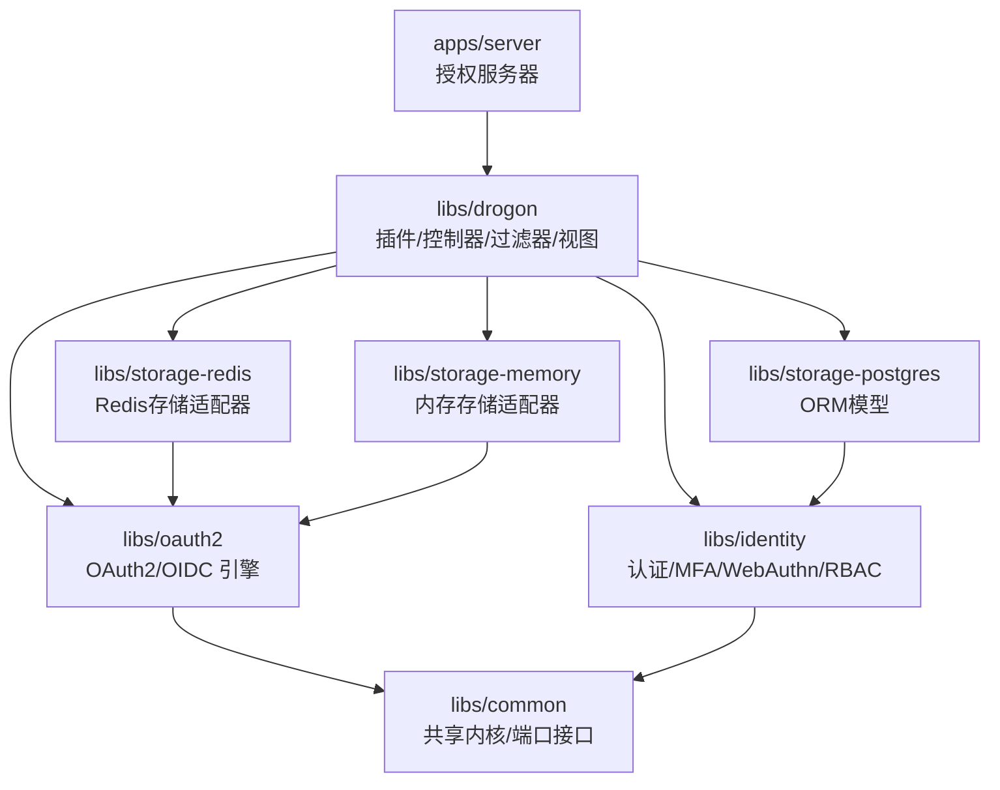
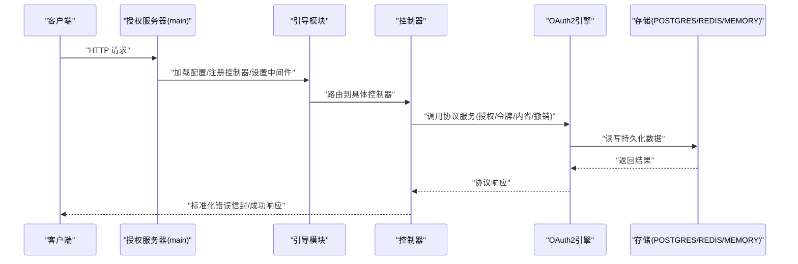
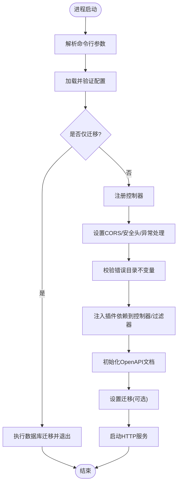
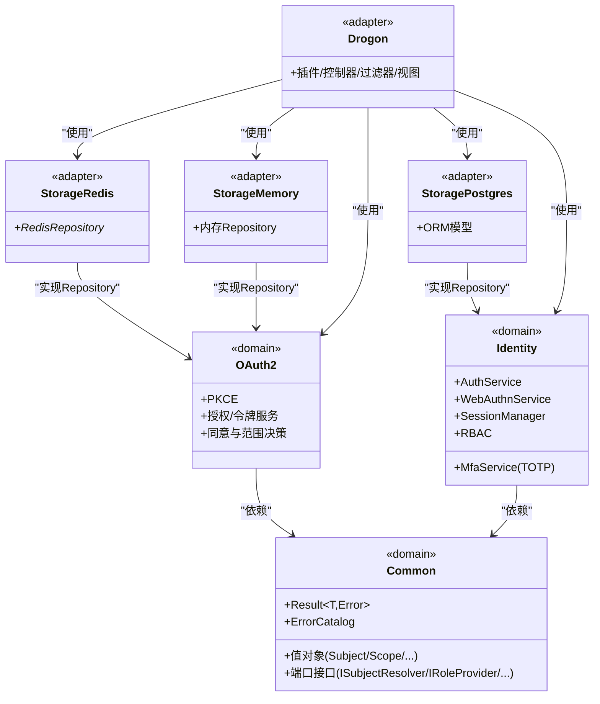
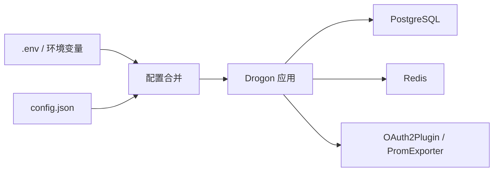
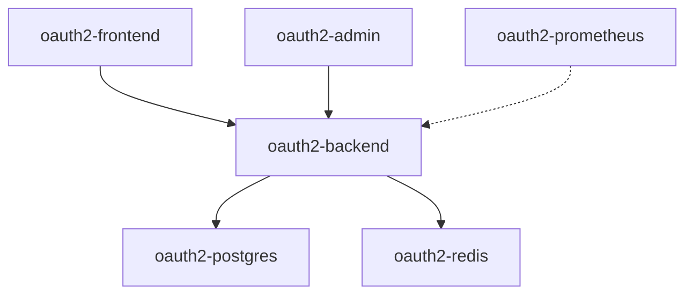
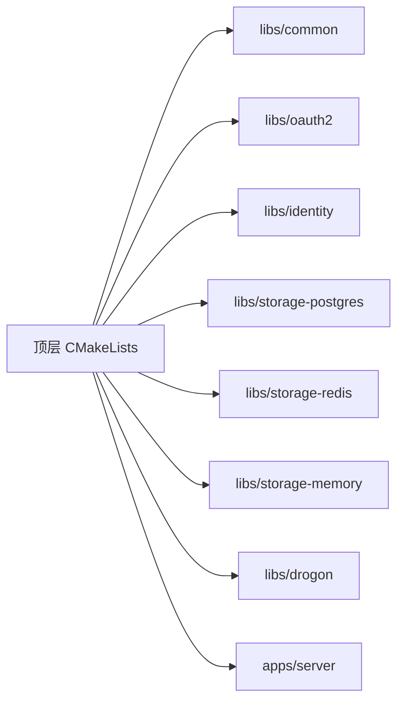

# 项目概览

<cite>
**本文引用的文件**
- [README.md](file://README.md)
- [README.zh-CN.md](file://README.zh-CN.md)
- [CMakeLists.txt](file://CMakeLists.txt)
- [apps/server/src/main.cc](file://apps/server/src/main.cc)
- [deploy/docker/docker-compose.yml](file://deploy/docker/docker-compose.yml)
- [apps/server/config/config.json](file://apps/server/config/config.json)
- [CMakePresets.json](file://CMakePresets.json)
- [libs/common/CMakeLists.txt](file://libs/common/CMakeLists.txt)
- [libs/oauth2/CMakeLists.txt](file://libs/oauth2/CMakeLists.txt)
- [libs/identity/CMakeLists.txt](file://libs/identity/CMakeLists.txt)
- [deploy/env/server.env.example](file://deploy/env/server.env.example)
</cite>

## 目录
1. [简介](#简介)
2. [项目结构](#项目结构)
3. [核心组件](#核心组件)
4. [架构总览](#架构总览)
5. [详细组件分析](#详细组件分析)
6. [依赖关系分析](#依赖关系分析)
7. [性能与可观测性](#性能与可观测性)
8. [故障排查指南](#故障排查指南)
9. [结论](#结论)
10. [附录：快速开始与环境要求](#附录快速开始与环境要求)

## 简介
AuthForge 是一个生产级 OAuth2.0/OIDC 授权服务器，完整支持 RFC 6749、RFC 7662、RFC 7009、RFC 8414 等标准。它既可作为开箱即用的产品（Docker/Helm）部署，也可作为可嵌入的 C++ SDK（通过 find_package 集成）。项目包含管理后台、用户前端、完整的测试套件以及完善的运维与发布流程。

技术栈与定位要点：
- 后端框架：基于 Drogon（C++17），提供高性能 HTTP 服务与插件体系
- 数据库：PostgreSQL 14+
- 缓存：Redis 7+
- 前端：Vue 3 + Vite（管理后台与用户端）
- 测试：CTest（C++）、Playwright（E2E）、PowerShell（API）
- 监控：Prometheus + 审计日志
- 部署：Docker Compose / Nginx / Helm

该文档面向初学者提供概念性概述，同时为有经验的开发者提供架构细节、SDK 分层结构与构建部署指引。

**章节来源**
- [README.md:16-65](file://README.md#L16-L65)
- [README.zh-CN.md:16-65](file://README.zh-CN.md#L16-L65)

## 项目结构
仓库采用“应用 + SDK 库 + 前端 + 部署 + 测试”的分层组织方式：
- apps/server：授权服务器后端（Drogon 控制器、插件、视图、启动装配）
- libs：SDK 库包（authforge::common、oauth2、identity、storage-*、drogon）
- frontends/admin、frontends/user：管理后台与用户端前端
- deploy：Docker Compose、Helm chart、Nginx、可观测性配置
- tests：单元、集成、契约、E2E、安全与性能测试
- scripts：构建、测试、运维脚本
- docs：架构、部署、SDK 集成等文档

**图表来源**
- [CMakeLists.txt:57-118](file://CMakeLists.txt#L57-L118)

**章节来源**
- [README.md:16-29](file://README.md#L16-L29)
- [CMakeLists.txt:57-118](file://CMakeLists.txt#L57-L118)

## 核心组件
- 授权服务器后端（apps/server）：负责请求路由、控制器注册、跨域与安全头、异常处理、OpenAPI 文档初始化、数据库迁移与运行期装配
- SDK 库层：
  - authforge::common：领域层共享内核（错误模型、值对象、端口接口、审计事件）
  - authforge::oauth2：协议引擎（PKCE、授权/令牌服务、同意与范围决策、聚合）
  - authforge::identity：身份与认证（用户认证、MFA、WebAuthn、社交登录、会话、RBAC）
  - storage-*：存储适配器（PostgreSQL ORM、Redis、Memory）
  - authforge::drogon：适配层（插件、控制器、过滤器、视图）
- 前端：管理后台与用户端，提供可视化操作与交互
- 部署与运维：Docker Compose、Helm、Nginx、Prometheus、健康检查与指标导出

**章节来源**
- [README.md:53-65](file://README.md#L53-L65)
- [README.zh-CN.md:53-65](file://README.zh-CN.md#L53-L65)
- [CMakeLists.txt:57-118](file://CMakeLists.txt#L57-L118)

## 架构总览
AuthForge 采用清晰的领域层与适配层分离设计：
- 领域层（Domain）：authforge::common、authforge::oauth2、authforge::identity，不依赖 Drogon，保证协议与业务逻辑的可移植性与可测试性
- 适配层（Adapter）：authforge::drogon 与各 storage-* 实现，将领域能力暴露为 HTTP API 并对接持久化与缓存
- 启动装配：main 仅做装配（加载配置、注册控制器、设置跨域/安全头/异常处理、初始化 OpenAPI、执行迁移、启动服务）

**图表来源**
- [apps/server/src/main.cc:97-238](file://apps/server/src/main.cc#L97-L238)
- [CMakeLists.txt:57-118](file://CMakeLists.txt#L57-L118)

**章节来源**
- [apps/server/src/main.cc:97-238](file://apps/server/src/main.cc#L97-L238)
- [CMakeLists.txt:57-118](file://CMakeLists.txt#L57-L118)

## 详细组件分析

### 启动与装配（apps/server/src/main.cc）
- 参数解析：支持 --migrate-only 模式用于独立执行数据库迁移
- 配置加载：从 config.json 或环境变量覆盖加载，并进行校验
- 控制器注册：集中注册所有 AutoCreation=false 的控制器
- 横切关注点：CORS、安全头、异常处理器、ErrorCatalog 不变量校验
- 插件依赖注入：在 run() 前完成 OAuth2Plugin 指针注入到控制器/过滤器
- OpenAPI 初始化：显式初始化各端点的 API 文档
- 迁移：可选自动迁移（OAUTH2_AUTO_MIGRATE=true）
- 启动：调用 drogon::app().run()

**图表来源**
- [apps/server/src/main.cc:97-238](file://apps/server/src/main.cc#L97-L238)

**章节来源**
- [apps/server/src/main.cc:97-238](file://apps/server/src/main.cc#L97-L238)

### SDK 库分层（libs/*）
- authforge::common：定义 Result<T,Error>、ErrorCatalog/ErrorEnvelope、值对象（Subject、Scope、ClientId、RedirectUri、PkceChallenge、TokenValue、TenantId）、端口接口（ISubjectResolver、IRoleProvider、IUserInfoProvider、IClock、ICryptoProvider、IUuidGenerator、IEmailSender、ILogger、IMetrics）与审计事件模型；禁止依赖 Drogon
- authforge::oauth2：纯协议逻辑（PKCE、授权/令牌服务、同意与范围决策、聚合），零 Drogon 依赖，且不与 identity 相互依赖；依赖 common 与 OpenSSL
- authforge::identity：用户认证、MFA（TOTP）、WebAuthn、社交登录、会话管理、RBAC；实现 IRoleProvider、ISubjectResolver、IUserInfoProvider 等端口；依赖 common 与 OpenSSL；可通过 WITH_WEBAUTHN/WITH_SOCIAL 裁剪
- storage-*：PostgreSQL ORM 模型、Redis 存储适配器、内存存储适配器；分别实现领域层的 Repository 接口
- authforge::drogon：适配层，承载插件、控制器、过滤器、视图，连接领域层与 HTTP 协议

**图表来源**
- [libs/common/CMakeLists.txt:3-13](file://libs/common/CMakeLists.txt#L3-L13)
- [libs/oauth2/CMakeLists.txt:3-21](file://libs/oauth2/CMakeLists.txt#L3-L21)
- [libs/identity/CMakeLists.txt:16-54](file://libs/identity/CMakeLists.txt#L16-L54)
- [CMakeLists.txt:57-118](file://CMakeLists.txt#L57-L118)

**章节来源**
- [libs/common/CMakeLists.txt:3-13](file://libs/common/CMakeLists.txt#L3-L13)
- [libs/oauth2/CMakeLists.txt:3-21](file://libs/oauth2/CMakeLists.txt#L3-L21)
- [libs/identity/CMakeLists.txt:16-54](file://libs/identity/CMakeLists.txt#L16-L54)
- [CMakeLists.txt:57-118](file://CMakeLists.txt#L57-L118)

### 配置与运行时（config.json 与环境变量）
- 监听器：默认端口 5555，可配置 HTTPS
- 数据库：PostgreSQL 连接池、超时、编码等
- Redis：连接池、密码、DB索引
- 应用：线程数、会话策略、静态资源、压缩、日志路径与级别
- 插件：PromExporter、OAuth2Plugin（存储类型、Redis/Postgres 客户端名、客户端配置、管理员用户、Token TTL、清理间隔）
- 自定义配置：RBAC 规则、CORS、前端 URL、外部认证（GitHub/WeChat/Google）
- 环境变量优先级：.env > 系统环境变量 > config.json 默认值

**图表来源**
- [apps/server/config/config.json:1-212](file://apps/server/config/config.json#L1-L212)
- [deploy/env/server.env.example:1-70](file://deploy/env/server.env.example#L1-L70)

**章节来源**
- [apps/server/config/config.json:1-212](file://apps/server/config/config.json#L1-L212)
- [deploy/env/server.env.example:1-70](file://deploy/env/server.env.example#L1-L70)

### 部署与容器编排（docker-compose）
- 服务组成：
  - oauth2-backend：后端服务，依赖 PostgreSQL 健康检查与 Redis 启动
  - oauth2-frontend：用户前端
  - oauth2-admin：管理后台
  - oauth2-postgres：PostgreSQL 15 Alpine，挂载 migrations/seed
  - oauth2-redis：Redis 7 Alpine，启用密码
  - oauth2-prometheus：指标采集
- 网络：统一桥接网络 oauth2-net
- 卷：pgdata、redisdata、promdata 持久化

**图表来源**
- [deploy/docker/docker-compose.yml:1-127](file://deploy/docker/docker-compose.yml#L1-L127)

**章节来源**
- [deploy/docker/docker-compose.yml:1-127](file://deploy/docker/docker-compose.yml#L1-L127)

## 依赖关系分析
- 构建系统：顶层 CMakeLists.txt 按顺序添加子目录，确保 Domain 层先于 Adapter 层构建
- 条件编译：WITH_IDENTITY、WITH_SOCIAL、WITH_WEBAUTHN 控制可选特性面，缩小依赖表面
- 包导出：每个 libs/* 通过 authforge_package 生成 install-tree 与 build-tree 的 find_package 配置，便于外部消费
- 示例宿主：examples/third-party-host 与 examples/full-stack-host 验证 SDK 可独立消费与全栈集成

**图表来源**
- [CMakeLists.txt:57-120](file://CMakeLists.txt#L57-L120)

**章节来源**
- [CMakeLists.txt:57-120](file://CMakeLists.txt#L57-L120)

## 性能与可观测性
- 性能相关配置：
  - 线程数、最大连接数、keepalive、管道化请求、压缩（gzip/brotli）
  - 数据库连接池大小与超时、Redis 连接池
  - 会话策略与 Cookie SameSite、超时时间
- 可观测性：
  - Prometheus 指标导出（/metrics）
  - 结构化审计日志（登录、Token 签发/撤销、密码变更等）
  - 健康检查端点（/health、/health/live、/health/ready）
  - 速率限制（Hodor 插件，拒绝响应统一为 Error Envelope）

**章节来源**
- [apps/server/config/config.json:41-170](file://apps/server/config/config.json#L41-L170)
- [apps/server/src/main.cc:190-219](file://apps/server/src/main.cc#L190-L219)

## 故障排查指南
- 启动失败常见原因：
  - 配置文件缺失或校验失败：检查 config.json 路径与内容，确认环境变量覆盖正确
  - 数据库不可用：确认 PostgreSQL 健康检查通过，迁移已执行（--migrate-only 或 OAUTH2_AUTO_MIGRATE=true）
  - Redis 未启动或密码不匹配：检查 redis_clients 配置与服务状态
- 速率限制触发：
  - 若启用 Hodor，被限流请求会返回 VALIDATION_RATE_LIMITED（HTTP 429）与标准错误信封
- 日志与指标：
  - 查看日志路径（app.log 或指定 log_path）
  - 访问 /metrics 获取 Prometheus 指标
- 前端与 CORS：
  - 确认 CORS 允许的来源列表包含前端地址
  - 检查 Vue 客户端重定向 URI 与前端 URL 配置一致

**章节来源**
- [apps/server/src/main.cc:75-95](file://apps/server/src/main.cc#L75-L95)
- [apps/server/src/main.cc:190-219](file://apps/server/src/main.cc#L190-L219)
- [apps/server/config/config.json:172-212](file://apps/server/config/config.json#L172-L212)

## 结论
AuthForge 以清晰的领域/适配分层、严格的依赖方向约束与完善的测试/发布流程，提供了生产级的 OAuth2.0/OIDC 授权服务器能力。其模块化 SDK 设计使得既可独立部署，又可灵活嵌入到自有系统中。通过 Docker Compose 与 Helm 的一键部署、丰富的前端管理与可观测性能力，能够快速落地并持续演进。

[本节为总结性内容，无需引用具体文件]

## 附录：快速开始与环境要求

### 快速开始
- Docker Compose（推荐评估）：
  - 命令：docker compose -f deploy/docker/docker-compose.yml up -d --build
  - 访问：
    - 用户前端：http://localhost:8080
    - 管理后台：http://localhost:8081
    - 后端 API：http://localhost:5555
- 源码构建（Conan 2 + CMake Presets）：
  - 安装依赖：conan install . --output-folder=build/linux-release --build=missing -s build_type=Release -s compiler.cppstd=17
  - 配置与构建：cmake --preset linux-release && cmake --build --preset linux-release
  - 运行测试：ctest --test-dir build/linux-release --output-on-failure
- 本地全栈运行：
  - 后端：apps/server 下构建产物运行
  - 管理后台：frontends/admin 下 npm install && npm run dev
  - 用户前端：frontends/user 下 npm install && npm run dev

### 系统要求
- C++ 编译器：C++17（MSVC 2019+ / GCC 9+ / Clang 10+）
- CMake：3.21+
- PostgreSQL：14+
- Redis：7+
- Node.js：18+
- Docker：24+（可选）

### 默认凭据
- 用户名：admin
- 密码：admin
- 角色：admin

**章节来源**
- [README.md:137-206](file://README.md#L137-L206)
- [README.zh-CN.md:137-206](file://README.zh-CN.md#L137-L206)
- [README.md:308-318](file://README.md#L308-L318)
- [README.zh-CN.md:308-318](file://README.zh-CN.md#L308-L318)
- [CMakePresets.json:8-177](file://CMakePresets.json#L8-L177)